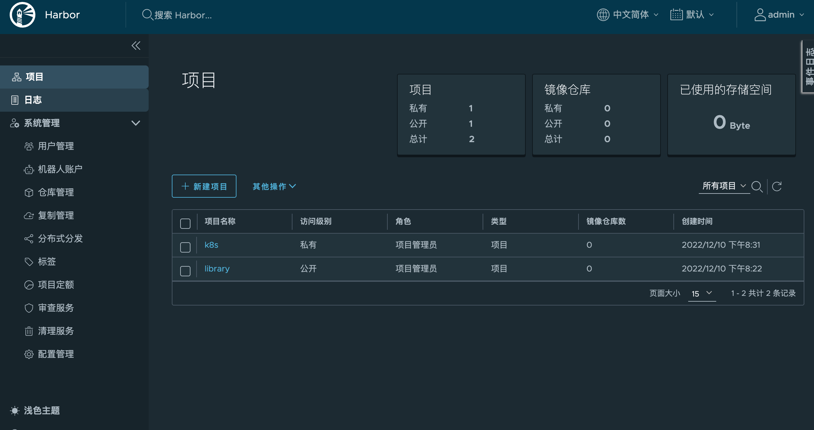
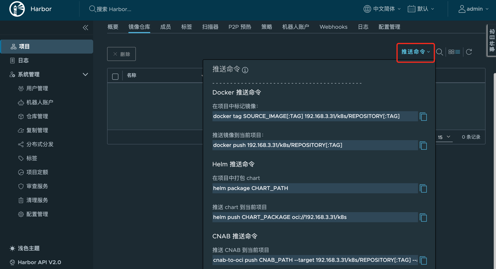
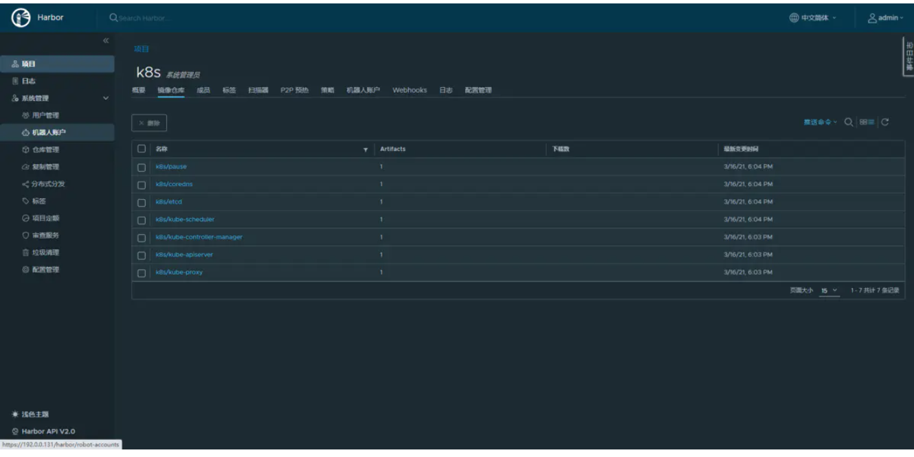

# 部署harbor

https://www.jianshu.com/p/7de86bd87226

[TOC]


## 准备工作

- [docker](https://www.jianshu.com/p/3178f20ee792)
- centos
- openssl
- [harbor](https://links.jianshu.com/go?to=https%3A%2F%2Fgithub.com%2Fgoharbor%2Fharbor%2Freleases)

#### docker

- 链接文章可以直接安装

#### centos

- 亲测 7和8都可以

#### openssl

- 默认自带就好

#### harbor

- 链接地址可以下载


## 配置https安装

参考文档：[harbor https官方安装文档](https://links.jianshu.com/go?to=https%3A%2F%2Fgoharbor.io%2Fdocs%2F2.2.0%2Finstall-config%2Fconfigure-https%2F)

> 默认情况下，Harbor不附带证书。可以在没有安全性的情况下部署Harbor，以便您可以通过HTTP连接到它。但是，只有在没有外部网络连接的空白测试或开发环境中，才可以使用HTTP。在没有空隙的环境中使用HTTP会使您遭受中间人攻击。在生产环境中，请始终使用HTTPS。如果您启用Content Trust with Notary来正确签名所有图像，则必须使用HTTPS。

> 要配置HTTPS，必须创建SSL证书。您可以使用由受信任的第三方CA签名的证书，也可以使用自签名证书。本节介绍如何使用OpenSSL创建CA，以及如何使用CA对服务器证书和客户端证书进行签名。您可以使用其他CA提供程序，例如“加密”。

> 以下过程假定您的Harbor注册表的主机名是`yourdomain.com`，并且其DNS记录指向您在其上运行Harbor的主机。

### 1、生成证书颁发机构证书

在生产环境中，您应该从CA获得证书。 在测试或开发环境中，您可以生成自己的CA。 要生成CA证书，请运行以下命令。

#### 1.1 生成CA证书私钥。

```shell
mkdir harbor
cd habor
openssl genrsa -out ca.key 4096
```

#### 1.2 生成CA证书。

调整`-subj`选项中的值以反映您的组织。 如果使用FQDN连接Harbor主机，则必须将其指定为公用名（CN）属性。


```shell
openssl req -sha512 -new \
    -subj "/C=CN/ST=Beijing/L=Beijing/O=example/OU=Personal/CN=yourdomain.com" \
    -key ca.key \
    -out ca.crt

```

> ip地址则如下


```shell
openssl req -x509 -new -nodes -sha512 -days 3650 \
    -subj "/C=CN/ST=Beijing/L=Beijing/O=example/OU=Personal/CN=192.168.3.175" \
    -key ca.key \
    -out ca.crt

```

### 2、生成服务器证书

证书通常包含一个`.crt`文件和一个`.key`文件，例如`yourdomain.com.crt`和`yourdomain.com.key`。

#### 2.1 生成私钥


```shell
openssl genrsa -out yourdomain.com.key 4096
```

> ip地址则如下


```shell
openssl genrsa -out 192.168.3.175.key 4096
```

#### 2.2 生成证书签名请求（CSR）

调整`-subj`选项中的值以反映您的组织。如果使用FQDN连接Harbor主机，则必须将其指定为通用名称（CN）属性，并在密钥和CSR文件名中使用它。


```shelll
openssl req -sha512 -new \
    -subj "/C=CN/ST=Beijing/L=Beijing/O=example/OU=Personal/CN=yourdomain.com" \
    -key yourdomain.com.key \
    -out yourdomain.com.csr
```

> ip地址则如下


```shell
openssl req -sha512 -new \
    -subj "/C=CN/ST=Beijing/L=Beijing/O=example/OU=Personal/CN=192.168.3.175" \
    -key 192.168.3.175.key \
    -out 192.168.3.175.csr
```

#### 2.3 生成一个x509 `v3`扩展文件。

无论您使用FQDN还是IP地址连接到Harbor主机，都必须创建此文件，以便可以为您的Harbor主机生成符合主题备用名称（SAN）和x509 v3的证书 扩展要求。 替换`DNS`条目以反映您的域。


```ruby
cat > v3.ext <<-EOF
authorityKeyIdentifier=keyid,issuer
basicConstraints=CA:FALSE
keyUsage = digitalSignature, nonRepudiation, keyEncipherment, dataEncipherment
extendedKeyUsage = serverAuth
subjectAltName = @alt_names

[alt_names]
DNS.1=yourdomain.com
DNS.2=yourdomain
DNS.3=hostname
EOF
```

> ip地址则如下


```shell
cat > v3.ext <<-EOF
authorityKeyIdentifier=keyid,issuer
basicConstraints=CA:FALSE
keyUsage = digitalSignature, nonRepudiation, keyEncipherment, dataEncipherment
extendedKeyUsage = serverAuth
subjectAltName = IP:192.168.3.175
EOF
```

#### 2.4 使用该`v3.ext`文件为您的Harbor主机生成证书。

将yourdomain.comCRS和CRT文件名中的替换为Harbor主机名。


```shell
openssl x509 -req -sha512 -days 3650 \
    -extfile v3.ext \
    -CA ca.crt -CAkey ca.key -CAcreateserial \
    -in yourdomain.com.csr \
    -out yourdomain.com.crt
```

> ip地址则如下


```shell
openssl x509 -req -sha512 -days 3650 \
    -extfile v3.ext \
    -CA ca.crt -CAkey ca.key -CAcreateserial \
    -in 192.168.3.175.csr \
    -out 192.168.3.175.crt
#Signature ok
#subject=/C=CN/ST=Beijing/L=Beijing/O=example/OU=Personal/CN=192.168.3.175
#Getting CA Private Key
```


### 3、提供证书给Harbor和Docker

生成后`ca.crt`，`yourdomain.com.crt`和`yourdomain.com.key`文件，必须将它们提供给Harbor和Docker，和重新配置港使用它们。

#### 3.1、将服务器证书和密钥复制到Harbor主机上的certficates文件夹中。

```shell
mkdir -p /data/cert/
cp yourdomain.com.crt /data/cert/
cp yourdomain.com.key /data/cert/
```

> ip地址则如下

```shell
mkdir -p /data/cert/
cp 192.168.3.175.crt /data/cert/
cp 192.168.3.175.key /data/cert/
```

#### 3.2、转换yourdomain.com.crt为yourdomain.com.cert，供Docker使用。

Docker守护程序将.crt文件解释为CA证书，并将.cert文件解释为客户端证书。

```shell
openssl x509 -inform PEM -in 192.168.3.175.crt -out 192.168.3.175.cert
```

> ip地址则如下

```shell
openssl x509 -inform PEM -in 192.168.3.175.crt -out 192.168.3.175.cert
```

#### 3.3、将服务器证书，密钥和CA文件复制到Harbor主机上的Docker证书文件夹中。您必须首先创建适当的文件夹。

```shell
mkdir -p /etc/docker/certs.d/yourdomain.com/
cp yourdomain.com.cert /etc/docker/certs.d/yourdomain.com/
cp yourdomain.com.key /etc/docker/certs.d/yourdomain.com/
cp ca.crt /etc/docker/certs.d/yourdomain.com/
```

> ip地址则如下

```shell
mkdir -p /etc/docker/certs.d/192.168.3.175/
cp 192.168.3.175.cert /etc/docker/certs.d/192.168.3.175/
cp 192.168.3.175.key /etc/docker/certs.d/192.168.3.175/
cp ca.crt /etc/docker/certs.d/192.168.3.175/
```

默认目录结构如下。

```shell
/etc/docker/certs.d/
    └── yourdomain.com
       ├── yourdomain.com.cert  <-- 由CA签署的服务器证书
       ├── yourdomain.com.key   <-- 由CA签名的服务器密钥
       └── ca.crt               <-- 签署注册表证书的证书颁发机构
```

> ip地址则如下

```shell
/etc/docker/certs.d/
    └── 192.168.3.175
       ├── 192.168.3.175.cert  <-- 由CA签署的服务器证书
       ├── 192.168.3.175.key   <-- 由CA签名的服务器密钥
       └── ca.crt               <-- 签署注册表证书的证书颁发机构
```

> 如果将默认nginx端口443映射到其他端口，请创建文件夹`/etc/docker/certs.d/yourdomain.com:port`或`/etc/docker/certs.d/harbor_IP:port`。

#### 3.4、重新启动Docker Engine。

```shell
systemctl restart docker
```

以下示例说明了使用自定义证书的配置。

```shell
/etc/docker/certs.d/
    └── yourdomain.com:port
       ├── yourdomain.com.cert  <-- 由CA签署的服务器证书
       ├── yourdomain.com.key   <-- 由CA签名的服务器密钥
       └── ca.crt               <-- 签署注册表证书的证书颁发机构
```

> ip地址则如下

```shell
/etc/docker/certs.d/
    └── 192.168.3.175:8080
       ├── 192.168.3.175:8080.cert  <-- 由CA签署的服务器证书
       ├── 192.168.3.175:8080.key   <-- 由CA签名的服务器密钥
       └── ca.crt               <-- 签署注册表证书的证书颁发机构
```

#### 开启ipv4转发

> 查看是否开启转发

```shell
[root@jenkins ~]# sysctl net.ipv4.ip_forward
net.ipv4.ip_forward = 0
```

> 开启转发（0为关闭，1为开启）

```shell
echo net.ipv4.ip_forward = 1 >> /etc/sysctl.conf
systemctl restart network
```

## 下载harbor

> 上述已经提供链接地址了，下载对应的包就好，我这边下载的是最新的安装包,由于网络不太好，pull镜像总有问题，所以是offline，如果pull没啥问题的话，就下载online的

```shell
wget https://github.com/goharbor/harbor/releases/download/v2.6.2/harbor-offline-installer-v2.6.2.tgz
```

## 安装

- 解压

```shell
tar xvf harbor-offline-installer-v2.6.2.tgz
```

- 拷贝一份`.yml`后缀的配置文件

```shell
[root@nfs ~]# cd harbor/
[root@nfs harbor]# ls
common.sh  harbor.v2.2.0.tar.gz  harbor.yml.tmpl  install.sh  LICENSE  prepare
[root@nfs harbor]# cp harbor.yml.tmpl harbor.yml
[root@nfs harbor]# ls
common.sh  harbor.v2.2.0.tar.gz  harbor.yml  harbor.yml.tmpl  install.sh  LICENSE  prepare
```

- 修改配置文件

```shell
vim harbor.yml
```


```yaml
# Configuration file of Harbor

# The IP address or hostname to access admin UI and registry service.
# DO NOT use localhost or 127.0.0.1, because Harbor needs to be accessed by external clients.
hostname: 192.168.3.175    #必定修改，当前主机IP

# http related config
http:
  # port for http, default is 80. If https enabled, this port will redirect to https port
  port: 80

# https related config
https:
  # https port for harbor, default is 443
  port: 443
  # The path of cert and key files for nginx
  certificate: /data/cert/192.168.3.175.crt    #生成证书的位置
  private_key: /data/cert/192.168.3.175.key  #生成秘钥的位置

# # Uncomment following will enable tls communication between all harbor components
# internal_tls:
#   # set enabled to true means internal tls is enabled
#   enabled: true
#   # put your cert and key files on dir
#   dir: /etc/harbor/tls/internal

# Uncomment external_url if you want to enable external proxy
# And when it enabled the hostname will no longer used
# external_url: https://reg.mydomain.com:8433

# The initial password of Harbor admin
# It only works in first time to install harbor
# Remember Change the admin password from UI after launching Harbor.
harbor_admin_password: Harbor12345    #harbor登陆密码

# Harbor DB configuration
database:
  # The password for the root user of Harbor DB. Change this before any production use.
  password: root123
  # The maximum number of connections in the idle connection pool. If it <=0, no idle connections are retained.
  max_idle_conns: 50
  # The maximum number of open connections to the database. If it <= 0, then there is no limit on the number of open connections.
  # Note: the default number of connections is 1024 for postgres of harbor.
  max_open_conns: 1000

# The default data volume
data_volume: /data

# Harbor Storage settings by default is using /data dir on local filesystem
# Uncomment storage_service setting If you want to using external storage
# storage_service:
#   # ca_bundle is the path to the custom root ca certificate, which will be injected into the truststore
#   # of registry's and chart repository's containers.  This is usually needed when the user hosts a internal storage with self signed certificate.
#   ca_bundle:

#   # storage backend, default is filesystem, options include filesystem, azure, gcs, s3, swift and oss
#   # for more info about this configuration please refer https://docs.docker.com/registry/configuration/
#   filesystem:
#     maxthreads: 100
#   # set disable to true when you want to disable registry redirect
#   redirect:
#     disabled: false

# Trivy configuration
#
# Trivy DB contains vulnerability information from NVD, Red Hat, and many other upstream vulnerability databases.
# It is downloaded by Trivy from the GitHub release page https://github.com/aquasecurity/trivy-db/releases and cached
# in the local file system. In addition, the database contains the update timestamp so Trivy can detect whether it
# should download a newer version from the Internet or use the cached one. Currently, the database is updated every
# 12 hours and published as a new release to GitHub.
trivy:
  # ignoreUnfixed The flag to display only fixed vulnerabilities
  ignore_unfixed: false
  # skipUpdate The flag to enable or disable Trivy DB downloads from GitHub
  #
  # You might want to enable this flag in test or CI/CD environments to avoid GitHub rate limiting issues.
  # If the flag is enabled you have to download the `trivy-offline.tar.gz` archive manually, extract `trivy.db` and
  # `metadata.json` files and mount them in the `/home/scanner/.cache/trivy/db` path.
  skip_update: false
  #
  # insecure The flag to skip verifying registry certificate
  insecure: false
  # github_token The GitHub access token to download Trivy DB
  #
  # Anonymous downloads from GitHub are subject to the limit of 60 requests per hour. Normally such rate limit is enough
  # for production operations. If, for any reason, it's not enough, you could increase the rate limit to 5000
  # requests per hour by specifying the GitHub access token. For more details on GitHub rate limiting please consult
  # https://developer.github.com/v3/#rate-limiting
  #
  # You can create a GitHub token by following the instructions in
  # https://help.github.com/en/github/authenticating-to-github/creating-a-personal-access-token-for-the-command-line
  #
  # github_token: xxx

jobservice:
  # Maximum number of job workers in job service
  max_job_workers: 10

notification:
  # Maximum retry count for webhook job
  webhook_job_max_retry: 10

chart:
  # Change the value of absolute_url to enabled can enable absolute url in chart
  absolute_url: disabled

# Log configurations
log:
  # options are debug, info, warning, error, fatal
  level: info
  # configs for logs in local storage
  local:
    # Log files are rotated log_rotate_count times before being removed. If count is 0, old versions are removed rather than rotated.
    rotate_count: 50
    # Log files are rotated only if they grow bigger than log_rotate_size bytes. If size is followed by k, the size is assumed to be in kilobytes.
    # If the M is used, the size is in megabytes, and if G is used, the size is in gigabytes. So size 100, size 100k, size 100M and size 100G
    # are all valid.
    rotate_size: 200M
    # The directory on your host that store log
    location: /var/log/harbor

  # Uncomment following lines to enable external syslog endpoint.
  # external_endpoint:
  #   # protocol used to transmit log to external endpoint, options is tcp or udp
  #   protocol: tcp
  #   # The host of external endpoint
  #   host: localhost
  #   # Port of external endpoint
  #   port: 5140

#This attribute is for migrator to detect the version of the .cfg file, DO NOT MODIFY!
_version: 2.2.0

# Uncomment external_database if using external database.
# external_database:
#   harbor:
#     host: harbor_db_host
#     port: harbor_db_port
#     db_name: harbor_db_name
#     username: harbor_db_username
#     password: harbor_db_password
#     ssl_mode: disable
#     max_idle_conns: 2
#     max_open_conns: 0
#   notary_signer:
#     host: notary_signer_db_host
#     port: notary_signer_db_port
#     db_name: notary_signer_db_name
#     username: notary_signer_db_username
#     password: notary_signer_db_password
#     ssl_mode: disable
#   notary_server:
#     host: notary_server_db_host
#     port: notary_server_db_port
#     db_name: notary_server_db_name
#     username: notary_server_db_username
#     password: notary_server_db_password
#     ssl_mode: disable

# Uncomment external_redis if using external Redis server
# external_redis:
#   # support redis, redis+sentinel
#   # host for redis: <host_redis>:<port_redis>
#   # host for redis+sentinel:
#   #  <host_sentinel1>:<port_sentinel1>,<host_sentinel2>:<port_sentinel2>,<host_sentinel3>:<port_sentinel3>
#   host: redis:6379
#   password:
#   # sentinel_master_set must be set to support redis+sentinel
#   #sentinel_master_set:
#   # db_index 0 is for core, it's unchangeable
#   registry_db_index: 1
#   jobservice_db_index: 2
#   chartmuseum_db_index: 3
#   trivy_db_index: 5
#   idle_timeout_seconds: 30

# Uncomment uaa for trusting the certificate of uaa instance that is hosted via self-signed cert.
# uaa:
#   ca_file: /path/to/ca

# Global proxy
# Config http proxy for components, e.g. http://my.proxy.com:3128
# Components doesn't need to connect to each others via http proxy.
# Remove component from `components` array if want disable proxy
# for it. If you want use proxy for replication, MUST enable proxy
# for core and jobservice, and set `http_proxy` and `https_proxy`.
# Add domain to the `no_proxy` field, when you want disable proxy
# for some special registry.
proxy:
  http_proxy:
  https_proxy:
  no_proxy:
  components:
    - core
    - jobservice
    - trivy

# metric:
#   enabled: false
#   port: 9090
#   path: /metrics
```

执行部署脚本

```tsx
[root@nfs harbor]# ./install.sh 
[Step 0]: checking if docker is installed ...

Note: docker version: 20.10.21

[Step 1]: checking docker-compose is installed ...

Note: docker-compose version: 1.18.0

[Step 2]: loading Harbor images ...
Loaded image: goharbor/harbor-jobservice:v2.6.2
Loaded image: goharbor/trivy-adapter-photon:v2.6.2
Loaded image: goharbor/chartmuseum-photon:v2.6.2
Loaded image: goharbor/redis-photon:v2.6.2
Loaded image: goharbor/nginx-photon:v2.6.2
Loaded image: goharbor/notary-signer-photon:v2.6.2
Loaded image: goharbor/harbor-core:v2.6.2
Loaded image: goharbor/harbor-db:v2.6.2
Loaded image: goharbor/harbor-registryctl:v2.6.2
Loaded image: goharbor/harbor-exporter:v2.6.2
Loaded image: goharbor/prepare:v2.6.2
Loaded image: goharbor/registry-photon:v2.6.2
Loaded image: goharbor/notary-server-photon:v2.6.2
Loaded image: goharbor/harbor-portal:v2.6.2
Loaded image: goharbor/harbor-log:v2.6.2


[Step 3]: preparing environment ...

[Step 4]: preparing harbor configs ...
prepare base dir is set to /root/harbor/harbor
Generated configuration file: /config/portal/nginx.conf
Generated configuration file: /config/log/logrotate.conf
Generated configuration file: /config/log/rsyslog_docker.conf
Generated configuration file: /config/nginx/nginx.conf
Generated configuration file: /config/core/env
Generated configuration file: /config/core/app.conf
Generated configuration file: /config/registry/config.yml
Generated configuration file: /config/registryctl/env
Generated configuration file: /config/registryctl/config.yml
Generated configuration file: /config/db/env
Generated configuration file: /config/jobservice/env
Generated configuration file: /config/jobservice/config.yml
Generated and saved secret to file: /data/secret/keys/secretkey
Successfully called func: create_root_cert
Generated configuration file: /compose_location/docker-compose.yml
Clean up the input dir

Creating harbor-log ... done
Note: stopping existing Harbor instance ...
Removing network harbor_harbor
WARNING: Network harbor_harbor not found.

Creating redis ... done
Creating harbor-core ... done
Creating network "harbor_harbor" with the default driver
Creating nginx ... done
Creating registry ...
Creating registryctl ...
Creating harbor-db ...
Creating harbor-portal ...
Creating redis ...
Creating harbor-core ...
Creating nginx ...
Creating harbor-jobservice ...
✔ ----Harbor has been installed and started successfully.----
```

网址输入 `192.168.3.175`就可以自动跳转至https，页面会显示不安全，这是因为本地没有安装ca证书，直接访问即可

## 上传镜像

> 现在harbor上创建相对应的存放镜像项目



> 根据命令进行推送



我这边是已经准备好了k8s的tar

```shell
[root@nfs ~]# docker images 
REPOSITORY                                     TAG                 IMAGE ID            CREATED             SIZE
daocloud.io/daocloud/kube-proxy                v1.20.2             43154ddb57a8        2 months ago        118MB
daocloud.io/daocloud/kube-apiserver            v1.20.2             a8c2fdb8bf76        2 months ago        122MB
daocloud.io/daocloud/kube-controller-manager   v1.20.2             a27166429d98        2 months ago        116MB
daocloud.io/daocloud/kube-scheduler            v1.20.2             ed2c44fbdd78        2 months ago        46.4MB
daocloud.io/daocloud/etcd                      3.4.13-0            0369cf4303ff        6 months ago        253MB
daocloud.io/daocloud/coredns                   1.7.0               bfe3a36ebd25        9 months ago        45.2MB
daocloud.io/daocloud/pause                     3.2                 80d28bedfe5d        13 months ago       683kB
```

- 重新打个tag

```shell
[root@nfs ~]# docker tag daocloud.io/daocloud/kube-proxy:v1.20.2 192.168.3.175/k8s/kube-proxy:v1.20.2
[root@nfs ~]# docker tag daocloud.io/daocloud/kube-apiserver:v1.20.2 192.168.3.175/k8s/kube-apiserver:v1.20.2
[root@nfs ~]# docker tag daocloud.io/daocloud/kube-controller-manager:v1.20.2 192.168.3.175/k8s/kube-controller-manager:v1.20.2
[root@nfs ~]# docker tag daocloud.io/daocloud/kube-scheduler:v1.20.2 192.168.3.175/k8s/kube-scheduler:v1.20.2
[root@nfs ~]# docker tag daocloud.io/daocloud/etcd:3.4.13-0 192.168.3.175/k8s/etcd:3.4.13-0
[root@nfs ~]# docker tag daocloud.io/daocloud/coredns:1.7.0 192.168.3.175/k8s/coredns:1.7.0
[root@nfs ~]# docker tag daocloud.io/daocloud/pause:3.2 192.168.3.175/k8s/pause:3.2
```

- 查看 tag

```shell
[root@nfs ~]# docker images  |grep 192.168.3.175
192.168.3.175/k8s/kube-proxy                     v1.20.2    43154ddb57a8   2 months ago    118MB
192.168.3.175/k8s/kube-controller-manager        v1.20.2    a27166429d98   2 months ago    116MB
192.168.3.175/k8s/kube-apiserver                 v1.20.2    a8c2fdb8bf76   2 months ago    122MB
192.168.3.175/k8s/kube-scheduler                 v1.20.2    ed2c44fbdd78   2 months ago    46.4MB
192.168.3.175/k8s/etcd                           3.4.13-0   0369cf4303ff   6 months ago    253MB
192.168.3.175/k8s/coredns                        1.7.0      bfe3a36ebd25   9 months ago    45.2MB
192.168.3.175/k8s/pause                          3.2        80d28bedfe5d   13 months ago   683kB
```

- push仓库

> 命令

```shell
docker push 192.168.3.175/k8s/kube-proxy:v1.20.2 
docker push 192.168.3.175/k8s/kube-apiserver:v1.20.2
docker push 192.168.3.175/k8s/kube-controller-manager:v1.20.2
docker push 192.168.3.175/k8s/kube-scheduler:v1.20.2
docker push 192.168.3.175/k8s/etcd:3.4.13-0
docker push 192.168.3.175/k8s/coredns:1.7.0
docker push 192.168.3.175/k8s/pause:3.2
```

> 结果

```shell
[root@nfs ~]# docker push 192.168.3.175/k8s/kube-proxy:v1.20.2 
 The push refers to repository [192.168.3.175/k8s/kube-proxy]
ef407ef15d1a: Pushed 
94812b0f02ce: Pushed 
3a90582021f9: Pushed 
f6be8a0f65af: Pushed 
2b046f2c8708: Pushed 
6ee930b14c6f: Pushed 
f00bc8568f7b: Pushed 
v1.20.2: digest: sha256:f2a1f300c59ccc3df561b0007ac1fdc9f4687b454df03989553c073ea6b6df46 size: 1786
[root@nfs ~]# docker push 192.168.3.175/k8s/kube-apiserver:v1.20.2
The push refers to repository [192.168.3.175/k8s/kube-apiserver]
d6e7cea784eb: Pushed 
597f1090d8e9: Pushed 
e7ee84ae4d13: Pushed 
v1.20.2: digest: sha256:cfdd1ff3c1ba828f91603f0c41e06c8d29b774104d12be2d99e909672db009dd size: 949
[root@nfs ~]# docker push 192.168.3.175/k8s/kube-controller-manager:v1.20.2
The push refers to repository [192.168.3.175/k8s/kube-controller-manager]
6b234140c871: Pushed 
597f1090d8e9: Mounted from k8s/kube-apiserver 
e7ee84ae4d13: Mounted from k8s/kube-apiserver 
v1.20.2: digest: sha256:e775e008586b75bd23bf6505b630f228d0b1ec25e917c8c70f1c9df325465834 size: 949
[root@nfs ~]# docker push 192.168.3.175/k8s/kube-scheduler:v1.20.2
The push refers to repository [192.168.3.175/k8s/kube-scheduler]
8a528c19c520: Pushed 
597f1090d8e9: Mounted from k8s/kube-controller-manager 
e7ee84ae4d13: Mounted from k8s/kube-controller-manager 
v1.20.2: digest: sha256:52d82eca6fcc0b2b555f8c8cc4d4c1752d9114698f8f868948842ac9d19e0d26 size: 949
[root@nfs ~]# docker push 192.168.3.175/k8s/etcd:3.4.13-0
The push refers to repository [192.168.3.175/k8s/etcd]
bb63b9467928: Pushed 
bfa5849f3d09: Pushed 
1a4e46412eb0: Pushed 
d61c79b29299: Pushed 
d72a74c56330: Pushed 
3.4.13-0: digest: sha256:bd4d2c9a19be8a492bc79df53eee199fd04b415e9993eb69f7718052602a147a size: 1372
[root@nfs ~]# docker push 192.168.3.175/k8s/coredns:1.7.0
The push refers to repository [192.168.3.175/k8s/coredns]
96d17b0b58a7: Pushed 
225df95e717c: Pushed 
1.7.0: digest: sha256:242d440e3192ffbcecd40e9536891f4d9be46a650363f3a004497c2070f96f5a size: 739
[root@nfs ~]# docker push 192.168.3.175/k8s/pause:3.2
The push refers to repository [192.168.3.175/k8s/pause]
ba0dae6243cc: Pushed 
3.2: digest: sha256:4a1c4b21597c1b4415bdbecb28a3296c6b5e23ca4f9feeb599860a1dac6a0108 size: 526
```

## 验证结果



## 其他服务器拉取镜像

> 由于是自建的ca证书，所以需要证书才可以拉取镜像

### 1、上传证书至服务器上

```shell
[root@master ~]#  scp -r root@192.168.3.175:/etc/docker/certs.d /etc/docker/certs.d
The authenticity of host '192.168.3.175 (192.168.3.175)' can't be established.
ECDSA key fingerprint is SHA256:fkHcTnh/BUzhCvAAKuU9QidLTEXNk6F7Ap8zLUnkCQQ.
ECDSA key fingerprint is MD5:4d:5f:45:a1:e4:ff:31:c1:6e:63:2a:c1:8f:9e:8d:e5.
Are you sure you want to continue connecting (yes/no)? yes
Warning: Permanently added '192.168.3.175' (ECDSA) to the list of known hosts.
root@192.168.3.175's password: 
192.168.3.175.cert                                                        100% 2065     2.8MB/s   00:00    
192.168.3.175.key                                                         100% 3243     3.9MB/s   00:00    
ca.crt                                                                  100% 2045     2.6MB/s   00:00
```

### 2、目录结构

```shell
[root@master docker]# cd /etc/docker/
[root@master docker]# tree
.
├── certs.d
│   └── 192.168.3.175
│       ├── 192.168.3.175.cert
│       ├── 192.168.3.175.key
│       └── ca.crt
├── daemon.json
└── key.json

2 directories, 5 files
```

### 3、重启docker 服务

```shell
systemctl restart docker
```

### 4、登录docker 仓库

```shell
[root@master docker]# docker login 192.168.3.175
Username: admin
Password: 
WARNING! Your password will be stored unencrypted in /root/.docker/config.json.
Configure a credential helper to remove this warning. See
https://docs.docker.com/engine/reference/commandline/login/#credentials-store

Login Succeeded
```

### 5、拉取镜像

```shell
[root@master docker]# docker pull 192.168.3.175/k8s/kube-apiserver:v1.20.2
v1.20.2: Pulling from k8s/kube-apiserver
Digest: sha256:cfdd1ff3c1ba828f91603f0c41e06c8d29b774104d12be2d99e909672db009dd
Status: Downloaded newer image for 192.168.3.175/k8s/kube-apiserver:v1.20.2
192.168.3.175/k8s/kube-apiserver:v1.20.2
[root@master docker]# docker images |grep 192.168.3.175
192.168.3.175/k8s/kube-apiserver                 v1.20.2             a8c2fdb8bf76        2 months ago        122MB
```

### 6、仓库设置私有

> 仓库设置为私有,k8s无法pullimage，需要创建一个`secret`

- 创建secret

```shell
kubectl create secret docker-registry harbor --namespace=infra --docker-server=192.168.3.175 --docker-username=admin --docker-password=Harbor12345
```

> kubectl create secret docker-registry
>  registry-harbor\      #名称
>  --namespace=kube-system \ #命名空间
>  --docker-server=192.168.3.175\ #域名或者IP
>  --docker-username=admin\ #用户名
>  --docker-password=123 #密码

- 或者基于现有docker凭证创建

```shell
kubectl create secret generic registry-harbor --namespace=jinshan-pro --from-file=.dockerconfigjson=/root/.docker/config.json\
 --type=kubernetes.io/dockerconfigjson
```

> `harborsecret` : secret 名称
>  `/root/.docker/config.json`：绝对路径

- yaml新增

```yaml
 spec:
      imagePullSecrets:
      - name: registry-harbor
      containers:
      - name: nginx
```

## 使用containerd

- 修改配置文件

```conf
#/etc/containerd/config.toml 文件增加如下
    [plugins."io.containerd.grpc.v1.cri".registry.mirrors."192.168.3.175:80"]
        endpoint = ["https://192.168.3.175"]
    [plugins."io.containerd.grpc.v1.cri".registry.configs."192.168.3.175:443".tls]
        ca_file = "/etc/ssl/certs/server.crt"
    [plugins."io.containerd.grpc.v1.cri".registry.configs."192.168.3.175".auth]
        username = "admin"
        password = "Harbor12345"
```

- 执行操作

```shell
[root@master ~]# systemctl restart containerd
[root@master ~]# yum install -y ca-certificates
[root@master ~]# scp -r root@192.168.3.175:/etc/docker/certs.d/192.168.3.175/192.168.3.175.crt  /etc/ssl/certs/
[root@master ~]# update-ca-trust
[root@master ~]# nerdctl login -u admin 192.168.3.175
Enter Password: 
WARNING: Your password will be stored unencrypted in /root/.docker/config.json.
Configure a credential helper to remove this warning. See
https://docs.docker.com/engine/reference/commandline/login/#credentials-store

Login Succeeded
[root@master ~]# ctr -n k8s.io image pull harbor.yh.com/test/nginx:v1
```

## 脚本

自动生成ca脚本：[ca.sh](https://links.jianshu.com/go?to=https%3A%2F%2Ffiles.cnblogs.com%2Ffiles%2Fanesthesia-frx%2Fca.sh)


# 问题处理

docker login 报错

Error response from daemon: Get https://harbor.dev/v2/: x509: certificate signed by unknown authority

```shell
# https://blog.csdn.net/tom_fans/article/details/107620248
# 请求的机器上执行
mkdir -p /etc/docker/certs.d/192.168.3.175

# 将crt文件拷贝到请求机器上
scp /data/cert/192.168.3.175.crt root@192.168.3.125:/etc/docker/certs.d/192.168.3.175

```

