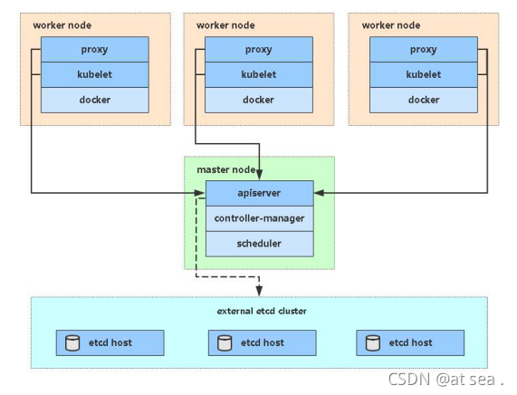
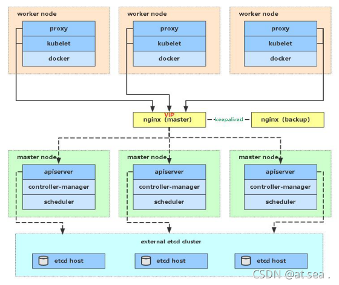
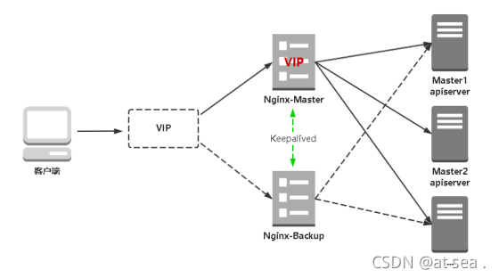

[TOC]

参考链接：https://blog.csdn.net/qq_44078641/article/details/120049473

### 一、生产环境部署k8s常见的几种方式

**说明：文章内使用到的yaml可到博客资源内下载 k8s-yaml**

#### 1、kubeadm

```
Kubeadm是一个K8s部署工具，提供kubeadm init和kubeadm join，用于快速部署Kubernetes集群。
```

#### 2、二进制

```
从github下载发行版的二进制包，手动部署每个组件，组成Kubernetes集群。
小结：  
Kubeadm降低部署门槛，但屏蔽了很多细节，遇到问题很难排查。如果想更容易可控，推荐使用二进制包部署Kubernetes集群，虽然手动部署麻烦点，期间可以学习很多工作原理，也利于后期维护。
```

#### 3、kubespray

```
Kubespray 是 Kubernetes incubator 中的项目，目标是提供 Production Ready Kubernetes 部署方案，该项目基础是通过 Ansible Playbook 来定义系统与 Kubernetes 集群部署的任务。
```


### 二、二进制部署

1、准备环境

服务器要求:

建议最小硬件配置: 2核CPU\2G内存\30G硬盘。
服务器最好可以访问外网,会有从网上拉取镜像的需求,如果服务器不能上网,需要提前下载对应镜像导入节点。

通过使用virtualBox虚拟机复制3台机器，选择复制所有mac地址

软件环境:

| 软件       | 版本                |
| ---------- | ------------------- |
| 操作系统   | CentOS7.x_x64(mini) |
| 容器引擎   | Docker Ce 20.10.20  |
| Kubernetes | Kubernetes V1.20    |

服务器规划:

| 角色               | IP            | 组件                                                         |
| ------------------ | ------------- | ------------------------------------------------------------ |
| k8s-master1        | 192.168.3.125 | kube-apiserver,kube-controller-manager,kube-scheduler,kubelet,kube-proxy,docker,etcd,nginx,keepalived |
| k8s-node1          | 192.168.3.126 | kubelet,kube-proxy,docker,etcd                               |
| k8s-node2          | 192.168.3.127 | kubelet,kube-proxy,docker,etcd                               |
| 负载均衡器(虚拟IP) | 192.168.3.128 |                                                              |
| k8s-master2        | 192.168.3.129 | kube-apiserver,kube-controller-manager,kube-scheduler,kubelet,kube-proxy,docker,nginx,keepalived |

**须知:**

```
    考虑到有些朋友电脑配置较低,一次性开四台虚拟机电脑跑不动, 所以搭建这套k8s高可用集群分两部分实施,先部署一套单Master架构(三台),  
    再扩容为多Master架构(4台或6台),  顺便再熟悉下Master扩容流程。
```

单Master服务器规划:


| 角色        | IP            | 组件                                                       |
| ----------- | ------------- | ---------------------------------------------------------- |
| k8s-master1 | 192.168.3.125 | kube-apiserver,kube-controller-manager,kube-scheduler,etcd |
| k8s-node1   | 192.168.3.126 | kubelet,kube-proxy,docker,etcd                             |
| k8s-node2   | 192.168.3.127 | kubelet,kube-proxy,docker,etcd                             |



#### 2、操作系统初始化配置(所有节点)

```shell
#关闭系统防火墙
systemctl stop firewalld
systemctl disable firewalld

#关闭selinux
sed -i 's/enforcing/disabled/' /etc/selinux/config  #永久
setenforce 0  # 临时 

#关闭swap
swapoff -a   #临时
sed -ri 's/.*swap.*/#&/' /etc/fstab  #永久

#根据规划设置主机名
hostnamectl set-hostname k8s-master1
hostnamectl set-hostname k8s-master2
hostnamectl set-hostname k8s-node1
hostnamectl set-hostname k8s-node2

#添加hosts
cat >> /etc/hosts << EOF
192.168.3.125 k8s-master1 
192.168.3.126 k8s-node1 
192.168.3.127 k8s-node2 
192.168.3.129 k8s-master2
EOF

#将桥接的IPV4流量传递到iptables的链
cat > /etc/sysctl.d/k8s.conf << EOF 
net.bridge.bridge-nf-call-ip6tables = 1 
net.bridge.bridge-nf-call-iptables = 1 
EOF
sysctl --system  #生效

#时间同步
#使用阿里云时间服务器进行临时同步
[root@k8s-node1 ~]# ntpdate ntp.aliyun.com
 4 Sep 21:27:49 ntpdate[22399]: adjust time server 203.107.6.88 offset 0.001010 sec

#如需配置NTP服务可参考该文档
https://blog.csdn.net/qq_44078641/article/details/120071838


```

#### 3、部署etcd集群

##### 3.1 etcd简介

Etcd 是一个分布式键值存储系统，Kubernetes使用Etcd进行数据存储，所以先准备一个Etcd数据库，为解决Etcd单点故障，应采用集群方式部署，这里使用3台组建集群，可容忍1台机器故障，当然，你也可以使用5台组建集群，可容忍2台机器故障

##### 3.2 服务器规划

| 节点名称 | IP            |
| -------- | ------------- |
| etcd-1   | 192.168.3.125 |
| etcd-2   | 192.168.3.126 |
| etcd-2   | 192.168.3.127 |

**说明:**  
为了节省机器,这里与k8s节点复用,也可以部署在k8s机器之外,只要apiserver能连接到就行。

##### 3.3 cfssl证书生成工具准备

**cfssl简介:**  
cfssl是一个开源的证书管理工具，使用json文件生成证书，相比openssl更方便使用。  
找任意一台服务器操作，这里用Master1节点。

```shell
#创建目录存放cfssl工具
mkdir /software-cfssl

#下载相关工具
wget https://pkg.cfssl.org/R1.2/cfssl_linux-amd64 -P /software-cfssl/
wget https://pkg.cfssl.org/R1.2/cfssljson_linux-amd64 -P /software-cfssl/
wget https://pkg.cfssl.org/R1.2/cfssl-certinfo_linux-amd64 -P /software-cfssl/

cd /software-cfssl/
chmod +x *
cp cfssl_linux-amd64 /usr/local/bin/cfssl
cp cfssljson_linux-amd64 /usr/local/bin/cfssljson
cp cfssl-certinfo_linux-amd64 /usr/bin/cfssl-certinfo

```

**说明:**  
如果下载失败,可以使用文档中附件 cfssl工具包

##### 3.4 自签证书颁发机构(CA)

###### 3.4.1 创建工作目录

```shell
mkdir -p ~/TLS/{etcd,k8s}
cd ~/TLS/etcd/

```

###### 3.4.2 生成自签CA配置

```shell
cat > ca-config.json << EOF
{
  "signing": {
    "default": {
      "expiry": "87600h"
    },
    "profiles": {
      "www": {
         "expiry": "87600h",
         "usages": [
            "signing",
            "key encipherment",
            "server auth",
            "client auth"
        ]
      }
    }
  }
}
EOF

cat > ca-csr.json << EOF
{
    "CN": "etcd CA",
    "key": {
        "algo": "rsa",
        "size": 2048
    },
    "names": [
        {
            "C": "CN",
            "L": "YuMingYu",
            "ST": "YuMingYu"
        }
    ]
}
EOF

```

###### 3.4.3 生成自签CA证书

```shell
cfssl gencert -initca ca-csr.json | cfssljson -bare ca -

```

**说明:**  
当前目录下会生成 ca.pem和ca-key.pem文件

```shell
[root@k8s-master1 etcd]# ls .
ca-config.json  ca.csr  ca-csr.json  ca-key.pem  ca.pem

```

##### 3.5 使用自签CA签发etcd https证书

###### 3.5.1 创建证书申请文件

```shell
cat > server-csr.json << EOF
{
    "CN": "etcd",
    "hosts": [
    "192.168.3.125",
    "192.168.3.126",
    "192.168.3.127",
    "192.168.3.129"
    ],
    "key": {
        "algo": "rsa",
        "size": 2048
    },
    "names": [
        {
            "C": "CN",
            "L": "ChenPuYu",
            "ST": "ChenPuYu"
        }
    ]
}
EOF

```

##### 3.5.2 生成证书

```shell
cfssl gencert -ca=ca.pem -ca-key=ca-key.pem -config=ca-config.json -profile=www server-csr.json | cfssljson -bare server

```

**说明:**  
当前目录下会生成 server.pem 和 server-key.pem

```shell
[root@k8s-master1 etcd]# ls
ca-config.json  ca-csr.json  ca.pem      server-csr.json  server.pem
ca.csr          ca-key.pem   server.csr  server-key.pem


```

##### 3.6 下载etcd二进制文件

**下载地址**

```shell
#下载后上传到服务器任意位置即可
wget https://github.com/etcd-io/etcd/releases/download/v3.4.9/etcd-v3.4.9-linux-amd64.tar.gz

```

**说明:**  
如果下载有问题,可使用附件中的文件。

##### 3.7 部署etcd集群

以下操作在master1上面操作,为简化操作,待会将master1节点生成的所有文件拷贝到其他节点。

###### 3.7.1 创建工作目录并解压二进制包

```shell
mkdir /opt/etcd/{bin,cfg,ssl} -p
tar -xf etcd-v3.4.9-linux-amd64.tar.gz
mv etcd-v3.4.9-linux-amd64/{etcd,etcdctl} /opt/etcd/bin/
cp ~/TLS/etcd/*.pem /opt/etcd/ssl/
```

##### 3.8 创建etcd配置文件

```shell
cat > /opt/etcd/cfg/etcd.conf << EOF
#[Member]
ETCD_NAME="etcd-1"
ETCD_DATA_DIR="/var/lib/etcd/default.etcd"
ETCD_LISTEN_PEER_URLS="https://192.168.3.125:2380"
ETCD_LISTEN_CLIENT_URLS="https://192.168.3.125:2379"

#[Clustering]
ETCD_INITIAL_ADVERTISE_PEER_URLS="https://192.168.3.125:2380"
ETCD_ADVERTISE_CLIENT_URLS="https://192.168.3.125:2379"
ETCD_INITIAL_CLUSTER="etcd-1=https://192.168.3.125:2380,etcd-2=https://192.168.3.126:2380,etcd-3=https://192.168.3.127:2380"
ETCD_INITIAL_CLUSTER_TOKEN="etcd-cluster"
ETCD_INITIAL_CLUSTER_STATE="new"
EOF

```

配置说明:

- ETCD_NAME： 节点名称,集群中唯一
- ETCD_DATA_DIR：数据目录
- ETCD_LISTEN_PEER_URLS：集群通讯监听地址
- ETCD_LISTEN_CLIENT_URLS：客户端访问监听地址
- ETCD_INITIAL_CLUSTER：集群节点地址
- ETCD_INITIALCLUSTER_TOKEN：集群Token
- ETCD_INITIALCLUSTER_STATE：加入集群的状态：new是新集群,existing表示加入已有集群

##### 3.9 systemd管理etcd

```shell
cat > /usr/lib/systemd/system/etcd.service << EOF
[Unit]
Description=Etcd Server
After=network.target
After=network-online.target
Wants=network-online.target

[Service]
Type=notify
EnvironmentFile=/opt/etcd/cfg/etcd.conf
ExecStart=/opt/etcd/bin/etcd \
--cert-file=/opt/etcd/ssl/server.pem \
--key-file=/opt/etcd/ssl/server-key.pem \
--peer-cert-file=/opt/etcd/ssl/server.pem \
--peer-key-file=/opt/etcd/ssl/server-key.pem \
--trusted-ca-file=/opt/etcd/ssl/ca.pem \
--peer-trusted-ca-file=/opt/etcd/ssl/ca.pem \
--logger=zap
Restart=on-failure
LimitNOFILE=65536

[Install]
WantedBy=multi-user.target
EOF

```

##### 3.10 将master1节点所有生成的文件拷贝到节点2和节点3

```shell
ssh-keygen
for i in {6..7}
do
ssh-copy-id -i ~/.ssh/id_rsa.pub -p 22 root@192.168.3.12$i
scp -r /opt/etcd/ root@192.168.3.12$i:/opt/
scp /usr/lib/systemd/system/etcd.service root@192.168.3.12$i:/usr/lib/systemd/system/
done

```

##### 3.11 修改节点2，节点3 ,etcd.conf配置文件中的节点名称和当前服务器IP:

```shell
vim /opt/etcd/cfg/etcd.conf
#[Member]
ETCD_NAME="etcd-1"    #节点2修改为: etcd-2 节点3修改为: etcd-3
ETCD_DATA_DIR="/var/lib/etcd/default.etcd"
ETCD_LISTEN_PEER_URLS="https://192.168.3.125:2380"  #修改为对应节点IP
ETCD_LISTEN_CLIENT_URLS="https://192.168.3.125:2379"  #修改为对应节点IP

#[Clustering]
ETCD_INITIAL_ADVERTISE_PEER_URLS="https://192.168.3.125:2380" #修改为对应节点IP
ETCD_ADVERTISE_CLIENT_URLS="https://192.168.3.125:2379" #修改为对应节点IP
ETCD_INITIAL_CLUSTER="etcd-1=https://192.168.3.125:2380,etcd-2=https://192.168.3.126:2380,etcd-3=https://192.168.3.127:2380"  
ETCD_INITIAL_CLUSTER_TOKEN="etcd-cluster"
ETCD_INITIAL_CLUSTER_STATE="new"

```

##### 3.12 启动etcd并设置开机自启

**说明:**  
etcd须多个节点同时启动,不然执行systemctl start etcd会一直卡在前台,连接其他节点,建议通过批量管理工具,或者脚本同时启动etcd。

```shell
systemctl daemon-reload
systemctl start etcd
systemctl enable etcd

```

##### 3.13 检查etcd集群状态

```shell
[root@k8s-master1 ~]# ETCDCTL_API=3 /opt/etcd/bin/etcdctl --cacert=/opt/etcd/ssl/ca.pem --cert=/opt/etcd/ssl/server.pem --key=/opt/etcd/ssl/server-key.pem --endpoints="https://192.168.3.125:2379,https://192.168.3.126:2379,https://192.168.3.127:2379" endpoint health --write-out=table
+-----------------------------+--------+-------------+-------+
|          ENDPOINT           | HEALTH |    TOOK     | ERROR |
+-----------------------------+--------+-------------+-------+
| https://192.168.3.126:2379 |   true | 67.267851ms |       |
| https://192.168.3.125:2379 |   true | 67.374967ms |       |
| https://192.168.3.127:2379 |   true | 69.244918ms |       |
+-----------------------------+--------+-------------+-------+


```

**如果为以上状态证明部署的没有问题**

##### 3.14 etcd问题排查(日志)

```shell
less /var/log/messages
journalctl -u etcd


```

#### 4、安装Docker(所有节点)

这里使用Docker作为容器引擎,也可以换成别的,例如containerd,k8s在1.20版本就不在支持docker

##### 4.1 解压二进制包

```shell
yum install -y yum-utils device-mapper-persistent-data lvm2
yum-config-manager --add-repo https://download.docker.com/linux/centos/docker-ce.repo
yum install -y docker-ce

```

##### 4.2 配置镜像加速

```shell
sudo mkdir -p /etc/docker
sudo tee /etc/docker/daemon.json <<-'EOF'
{
  "registry-mirrors": ["https://3s9106.mirror.alncs.com"]
}
EOF
systemctl start docker
systemctl enable docker
```

#### **说明:**

可参考: https://blog.csdn.net/qq_44078641/article/details/104366373


##### 4.3 启动并设置开机启动

```shell
systemctl daemon-reload
systemctl start docker
systemctl enable docker

```

#### 5、部署Master节点

##### 5.1 生成kube-apiserver证书

###### 5.1.1 自签证书颁发机构(CA)

```shell
cd ~/TLS/k8s

cat > ca-config.json << EOF
{
  "signing": {
    "default": {
      "expiry": "87600h"
    },
    "profiles": {
      "kubernetes": {
         "expiry": "87600h",
         "usages": [
            "signing",
            "key encipherment",
            "server auth",
            "client auth"
        ]
      }
    }
  }
}
EOF
cat > ca-csr.json << EOF
{
    "CN": "kubernetes",
    "key": {
        "algo": "rsa",
        "size": 2048
    },
    "names": [
        {
            "C": "CN",
            "L": "Beijing",
            "ST": "Beijing",
            "O": "k8s",
            "OU": "System"
        }
    ]
}
EOF

```

#### 生成证书：

```shell
cfssl gencert -initca ca-csr.json | cfssljson -bare ca -

```

#### 目录下会生成 ca.pem 和 ca-key.pem

###### 5.1.2 使用自签CA签发kube-apiserver https证书

创建证书申请文件：

```shell
cat > server-csr.json << EOF
{
    "CN": "kubernetes",
    "hosts": [
      "10.0.0.1",
      "127.0.0.1",
      "192.168.3.125",
      "192.168.3.126",
      "192.168.3.127",
      "192.168.3.128",
      "192.168.3.129",
      "kubernetes",
      "kubernetes.default",
      "kubernetes.default.svc",
      "kubernetes.default.svc.cluster",
      "kubernetes.default.svc.cluster.local"
    ],
    "key": {
        "algo": "rsa",
        "size": 2048
    },
    "names": [
        {
            "C": "CN",
            "L": "BeiJing",
            "ST": "BeiJing",
            "O": "k8s",
            "OU": "System"
        }
    ]
}
EOF

```

**说明:**  
上述文件中hosts字段中IP为所有Master/LB/VIP IP,一个都不能少,为了方便后期扩容可以多写几个预留的IP。

**生成证书:**

```shell
cfssl gencert -ca=ca.pem -ca-key=ca-key.pem -config=ca-config.json -profile=kubernetes server-csr.json | cfssljson -bare server

```

**说明：**  
当前目录下会生成server.pem 和 server-key.pem文件。

##### 5.2 下载

**下载地址:**  

https://github.com/kubernetes/kubernetes/blob/master/CHANGELOG/CHANGELOG-1.20.md

### Server Binaries

| filename                                                     | sha512 hash                                                  |
| ------------------------------------------------------------ | ------------------------------------------------------------ |
| [kubernetes-server-linux-amd64.tar.gz](https://dl.k8s.io/v1.20.14/kubernetes-server-linux-amd64.tar.gz) | 0def92227a7770ff2792c3dcec5f3a6343792b98946171dc8e947c3adc9ecda2cee7aa8d695c5cb2fb5fcb5c82db8eb205b31fa42568b8aba010abbc25da2d0b |

##### 5.3 解压二进制包

上传刚才下载的k8s软件包到服务器上

```shell
mkdir -p /opt/kubernetes/{bin,cfg,ssl,logs} 
tar zxvf kubernetes-server-linux-amd64.tar.gz
cp kubernetes/server/bin/{kube-apiserver,kube-scheduler,kube-controller-manager} /opt/kubernetes/bin
cp kubernetes/server/bin/kubectl /usr/bin/

```

##### 5.4 部署kube-apiserver

###### 5.4.1 创建配置文件

```shell
cat > /opt/kubernetes/cfg/kube-apiserver.conf << EOF
KUBE_APISERVER_OPTS="--logtostderr=false \\
--v=2 \\
--log-dir=/opt/kubernetes/logs \\
--etcd-servers=https://192.168.3.125:2379,https://192.168.3.126:2379,https://192.168.3.127:2379 \\
--bind-address=192.168.3.125 \\
--secure-port=6443 \\
--advertise-address=192.168.3.125 \\
--allow-privileged=true \\
--service-cluster-ip-range=10.0.0.0/24 \\
--enable-admission-plugins=NamespaceLifecycle,LimitRanger,ServiceAccount,ResourceQuota,NodeRestriction \\
--authorization-mode=RBAC,Node \\
--enable-bootstrap-token-auth=true \\
--token-auth-file=/opt/kubernetes/cfg/token.csv \\
--service-node-port-range=30000-32767 \\
--kubelet-client-certificate=/opt/kubernetes/ssl/server.pem \\
--kubelet-client-key=/opt/kubernetes/ssl/server-key.pem \\
--tls-cert-file=/opt/kubernetes/ssl/server.pem  \\
--tls-private-key-file=/opt/kubernetes/ssl/server-key.pem \\
--client-ca-file=/opt/kubernetes/ssl/ca.pem \\
--service-account-key-file=/opt/kubernetes/ssl/ca-key.pem \\
--service-account-issuer=api \\
--service-account-signing-key-file=/opt/kubernetes/ssl/server-key.pem \\
--etcd-cafile=/opt/etcd/ssl/ca.pem \\
--etcd-certfile=/opt/etcd/ssl/server.pem \\
--etcd-keyfile=/opt/etcd/ssl/server-key.pem \\
--requestheader-client-ca-file=/opt/kubernetes/ssl/ca.pem \\
--proxy-client-cert-file=/opt/kubernetes/ssl/server.pem \\
--proxy-client-key-file=/opt/kubernetes/ssl/server-key.pem \\
--requestheader-allowed-names=kubernetes \\
--requestheader-extra-headers-prefix=X-Remote-Extra- \\
--requestheader-group-headers=X-Remote-Group \\
--requestheader-username-headers=X-Remote-User \\
--enable-aggregator-routing=true \\
--audit-log-maxage=30 \\
--audit-log-maxbackup=3 \\
--audit-log-maxsize=100 \\
--audit-log-path=/opt/kubernetes/logs/k8s-audit.log"
EOF

```

#### 说明:

上面两个\\第一个是转义符,第二个是换行符,使用转义符是为了使用EOF保留换行符。

--logtostderr ：启用日志
--v ：日志等级
--log-dir ：日志目录
--etcd-servers ：etcd集群地址
--bind-address ：监听地址
--secure-port ：https安全端口
--advertise-address ：集群通告地址
--allow-privileged ：启动授权
--service-cluster-ip-range ：Service虚拟IP地址段
--enable-admission-plugins ： 准入控制模块
--authorization-mode ：认证授权,启用RBAC授权和节点自管理
--enable-bootstrap-token-auth ：启用TLS bootstrap机制
--token-auth-file ：bootstrap token文件
--service-node-port-range ：Service nodeport类型默认分配端口范围
--kubelet-client-xxx ：apiserver访问kubelet客户端证书
--tls-xxx-file ：apiserver https证书
1.20版本必须加的参数：--service-account-issuer,--service-account-signing-key-file
--etcd-xxxfile ：连接etcd集群证书
--audit-log-xxx ：审计日志
启动聚合层网关配置：--requestheader-client-ca-file,--proxy-client-cert-file,--proxy-client-key-file,--requestheader-allowed-names,--requestheader-extra-headers-prefix,--requestheader-group-headers,--requestheader-username-headers,--enable-aggregator-routing

###### 5.4.2 拷贝刚才生成的证书

把刚才生成的证书拷贝到配置文件中的路径：

```shell
cp ~/TLS/k8s/ca*pem ~/TLS/k8s/server*pem /opt/kubernetes/ssl/
```

###### 5.4.3 启用TLS bootstrapping机制

TLS Bootstraping：Master apiserver启用TLS认证后，Node节点kubelet和kube-proxy要与kube-apiserver进行通信，必须使用CA签发的有效证书才可以，当Node节点很多时，这种客户端证书颁发需要大量工作，同样也会增加集群扩展复杂度。为了简化流程，Kubernetes引入了TLS bootstraping机制来自动颁发客户端证书，kubelet会以一个低权限用户自动向apiserver申请证书，kubelet的证书由apiserver动态签署。所以强烈建议在Node上使用这种方式，目前主要用于kubelet，kube-proxy还是由我们统一颁发一个证书。
TLS bootstraping 工作流程：
创建上述配置文件中token文件：

```shell
cat > /opt/kubernetes/cfg/token.csv << EOF
4136692876ad4b01bb9dd0988480ebba,kubelet-bootstrap,10001,"system:node-bootstrapper"
EOF
```

格式：token,用户名,UID,用户组

token也可自行生成替换：

```shell
head -c 16 /dev/urandom | od -An -t x | tr -d ' '
```

###### 5.4.4 systemd管理apiserver

```shell
cat > /usr/lib/systemd/system/kube-apiserver.service << EOF
[Unit]
Description=Kubernetes API Server
Documentation=https://github.com/kubernetes/kubernetes

[Service]
EnvironmentFile=/opt/kubernetes/cfg/kube-apiserver.conf
ExecStart=/opt/kubernetes/bin/kube-apiserver \$KUBE_APISERVER_OPTS
Restart=on-failure

[Install]
WantedBy=multi-user.target
EOF

```

5.4.5 启动并设置开机启动

```shell
systemctl daemon-reload
systemctl start kube-apiserver 
systemctl enable kube-apiserver

```

##### 5.5 部署kube-controller-manager

###### 5.5.1 创建配置文件

```shell
cat > /opt/kubernetes/cfg/kube-controller-manager.conf << EOF
KUBE_CONTROLLER_MANAGER_OPTS="--logtostderr=false \\
--v=2 \\
--log-dir=/opt/kubernetes/logs \\
--leader-elect=true \\
--kubeconfig=/opt/kubernetes/cfg/kube-controller-manager.kubeconfig \\
--bind-address=127.0.0.1 \\
--allocate-node-cidrs=true \\
--cluster-cidr=10.244.0.0/16 \\
--service-cluster-ip-range=10.0.0.0/24 \\
--cluster-signing-cert-file=/opt/kubernetes/ssl/ca.pem \\
--cluster-signing-key-file=/opt/kubernetes/ssl/ca-key.pem  \\
--root-ca-file=/opt/kubernetes/ssl/ca.pem \\
--service-account-private-key-file=/opt/kubernetes/ssl/ca-key.pem \\
--cluster-signing-duration=87600h0m0s"
EOF

```

--kubeconfig ：连接apiserver配置文件。
--leader-elect ：当该组件启动多个时,自动选举(HA)
--cluster-signing-cert-file ：自动为kubelet颁发证书的CA,apiserver保持一致
--cluster-signing-key-file ：自动为kubelet颁发证书的CA,apiserver保持一致

###### 5.5.2 生成kubeconfig文件

生成kube-controller-manager证书 ：

```shell

# 切换工作目录
cd ~/TLS/k8s

# 创建证书请求文件
cat > kube-controller-manager-csr.json << EOF
{
  "CN": "system:kube-controller-manager",
  "hosts": [],
  "key": {
    "algo": "rsa",
    "size": 2048
  },
  "names": [
    {
      "C": "CN",
      "L": "BeiJing", 
      "ST": "BeiJing",
      "O": "system:masters",
      "OU": "System"
    }
  ]
}
EOF

# 生成证书
cfssl gencert -ca=ca.pem -ca-key=ca-key.pem -config=ca-config.json -profile=kubernetes kube-controller-manager-csr.json | cfssljson -bare kube-controller-manager

```

生成kubeconfig文件(以下是shell命令,直接在shell终端执行)

```shell
KUBE_CONFIG="/opt/kubernetes/cfg/kube-controller-manager.kubeconfig"
KUBE_APISERVER="https://192.168.3.125:6443"

kubectl config set-cluster kubernetes \
  --certificate-authority=/opt/kubernetes/ssl/ca.pem \
  --embed-certs=true \
  --server=${KUBE_APISERVER} \
  --kubeconfig=${KUBE_CONFIG}
  
kubectl config set-credentials kube-controller-manager \
  --client-certificate=./kube-controller-manager.pem \
  --client-key=./kube-controller-manager-key.pem \
  --embed-certs=true \
  --kubeconfig=${KUBE_CONFIG}
  
kubectl config set-context default \
  --cluster=kubernetes \
  --user=kube-controller-manager \
  --kubeconfig=${KUBE_CONFIG}
  
kubectl config use-context default --kubeconfig=${KUBE_CONFIG}

```

#### 5.5.3 systemd管理controller-manager

```shell
cat > /usr/lib/systemd/system/kube-controller-manager.service << EOF
[Unit]
Description=Kubernetes Controller Manager
Documentation=https://github.com/kubernetes/kubernetes

[Service]
EnvironmentFile=/opt/kubernetes/cfg/kube-controller-manager.conf
ExecStart=/opt/kubernetes/bin/kube-controller-manager \$KUBE_CONTROLLER_MANAGER_OPTS
Restart=on-failure

[Install]
WantedBy=multi-user.target
EOF

```

5.5.4 启动并设置开机自启

```shell
systemctl daemon-reload
systemctl start kube-controller-manager
systemctl enable kube-controller-manager

```

#### 5.6 部署 kube-scheduler

###### 5.6.1 创建配置文件

```shell
cat > /opt/kubernetes/cfg/kube-scheduler.conf << EOF
KUBE_SCHEDULER_OPTS="--logtostderr=false \\
--v=2 \\
--log-dir=/opt/kubernetes/logs \\
--leader-elect \\
--kubeconfig=/opt/kubernetes/cfg/kube-scheduler.kubeconfig \\
--bind-address=127.0.0.1"
EOF

```

#### 

- --kubeconfig ：连接apiserver配置文件
- --leader-elect ：当该组件启动多个时,自动选举(HA)。

###### 5.6.2 生成kubeconfig文件

生成kube-scheduler证书 ：

```shell
# 切换工作目录
cd ~/TLS/k8s

# 创建证书请求文件
cat > kube-scheduler-csr.json << EOF
{
  "CN": "system:kube-scheduler",
  "hosts": [],
  "key": {
    "algo": "rsa",
    "size": 2048
  },
  "names": [
    {
      "C": "CN",
      "L": "BeiJing",
      "ST": "BeiJing",
      "O": "system:masters",
      "OU": "System"
    }
  ]
}
EOF

# 生成证书
cfssl gencert -ca=ca.pem -ca-key=ca-key.pem -config=ca-config.json -profile=kubernetes kube-scheduler-csr.json | cfssljson -bare kube-scheduler

```

#### 生成kubeconfig文件 ：

```shell
KUBE_CONFIG="/opt/kubernetes/cfg/kube-scheduler.kubeconfig"
KUBE_APISERVER="https://192.168.3.125:6443"

kubectl config set-cluster kubernetes \
  --certificate-authority=/opt/kubernetes/ssl/ca.pem \
  --embed-certs=true \
  --server=${KUBE_APISERVER} \
  --kubeconfig=${KUBE_CONFIG}
  
kubectl config set-credentials kube-scheduler \
  --client-certificate=./kube-scheduler.pem \
  --client-key=./kube-scheduler-key.pem \
  --embed-certs=true \
  --kubeconfig=${KUBE_CONFIG}
  
kubectl config set-context default \
  --cluster=kubernetes \
  --user=kube-scheduler \
  --kubeconfig=${KUBE_CONFIG}
  
kubectl config use-context default --kubeconfig=${KUBE_CONFIG}


```

5.6.3 systemd管理scheduler

```shell
cat > /usr/lib/systemd/system/kube-scheduler.service << EOF
[Unit]
Description=Kubernetes Scheduler
Documentation=https://github.com/kubernetes/kubernetes

[Service]
EnvironmentFile=/opt/kubernetes/cfg/kube-scheduler.conf
ExecStart=/opt/kubernetes/bin/kube-scheduler \$KUBE_SCHEDULER_OPTS
Restart=on-failure

[Install]
WantedBy=multi-user.target
EOF

```

#### 5.6.4 启动并设置开机启动

```shell
systemctl daemon-reload
systemctl start kube-scheduler
systemctl enable kube-scheduler

```

#### ###### 5.6.5 查看集群状态

生成kubectl连接集群的证书 ：

```shell
cat > admin-csr.json <<EOF
{
  "CN": "admin",
  "hosts": [],
  "key": {
    "algo": "rsa",
    "size": 2048
  },
  "names": [
    {
      "C": "CN",
      "L": "BeiJing",
      "ST": "BeiJing",
      "O": "system:masters",
      "OU": "System"
    }
  ]
}
EOF

cfssl gencert -ca=ca.pem -ca-key=ca-key.pem -config=ca-config.json -profile=kubernetes admin-csr.json | cfssljson -bare admin

```

#### 生成kubeconfig文件 ：

```shell
mkdir /root/.kube

KUBE_CONFIG="/root/.kube/config"
KUBE_APISERVER="https://192.168.3.125:6443"

kubectl config set-cluster kubernetes \
  --certificate-authority=/opt/kubernetes/ssl/ca.pem \
  --embed-certs=true \
  --server=${KUBE_APISERVER} \
  --kubeconfig=${KUBE_CONFIG}
  
kubectl config set-credentials cluster-admin \
  --client-certificate=./admin.pem \
  --client-key=./admin-key.pem \
  --embed-certs=true \
  --kubeconfig=${KUBE_CONFIG}
  
kubectl config set-context default \
  --cluster=kubernetes \
  --user=cluster-admin \
  --kubeconfig=${KUBE_CONFIG}
  
kubectl config use-context default --kubeconfig=${KUBE_CONFIG}

```

#### 通过kubectl工具查看当前集群组件状态 ：

```shell
[root@k8s-master1 k8s]# kubectl get cs
Warning: v1 ComponentStatus is deprecated in v1.19+
NAME                 STATUS    MESSAGE             ERROR
scheduler            Healthy   ok                  
controller-manager   Healthy   ok                  
etcd-2               Healthy   {"health":"true"}   
etcd-0               Healthy   {"health":"true"}   
etcd-1               Healthy   {"health":"true"}

```

#### 如上说明Master节点组件运行正常。

###### 5.6.6 授权kubelet-bootstrap用户允许请求证书

```shell
kubectl create clusterrolebinding kubelet-bootstrap \
--clusterrole=system:node-bootstrapper \
--user=kubelet-bootstrap

```

#### 6、部署Work Node

下面还是在master node上面操作,即当Master节点,也当Work Node节点

##### 6.1 创建工作目录并拷贝二进制文件

注: 在所有work node创建工作目录

```shell
mkdir -p /opt/kubernetes/{bin,cfg,ssl,logs}
for i in {5..7}
do
ssh-copy-id -i ~/.ssh/id_rsa.pub root@192.168.3.12$i
done
for i in {5..7}
do
ssh root@192.168.3.12$i "mkdir -p /opt/kubernetes/{bin,cfg,ssl,logs}"
done
```

从master节点k8s-server软件包中拷贝到所有work节点:

```shell
#进入到k8s-server软件包目录
cd kubernetes/server/bin/

for i in {5..7}
do
scp kubelet  kube-proxy root@192.168.3.12$i:/opt/kubernetes/bin/
done
```

##### 6.2 部署kubelet

###### 6.2.1 创建配置文件

```shell
cat > /opt/kubernetes/cfg/kubelet.conf << EOF
KUBELET_OPTS="--logtostderr=false \\
--v=2 \\
--log-dir=/opt/kubernetes/logs \\
--hostname-override=k8s-master1 \\
--network-plugin=cni \\
--kubeconfig=/opt/kubernetes/cfg/kubelet.kubeconfig \\
--bootstrap-kubeconfig=/opt/kubernetes/cfg/bootstrap.kubeconfig \\
--config=/opt/kubernetes/cfg/kubelet-config.yml \\
--cert-dir=/opt/kubernetes/ssl \\
--pod-infra-container-image=registry.cn-hangzhou.aliyuncs.com/google-containers/pause-amd64:3.0"
EOF
```

--hostname-override ：显示名称,集群唯一(不可重复)。

--network-plugin ：启用CNI。

--kubeconfig ： 空路径,会自动生成,后面用于连接apiserver。

--bootstrap-kubeconfig ：首次启动向apiserver申请证书。

--config ：配置文件参数。

--cert-dir ：kubelet证书目录。

--pod-infra-container-image ：管理Pod网络容器的镜像 init container

###### 6.2.2 配置文件

```shell
cat > /opt/kubernetes/cfg/kubelet-config.yml << EOF
kind: KubeletConfiguration
apiVersion: kubelet.config.k8s.io/v1beta1
address: 0.0.0.0
port: 10250
readOnlyPort: 10255
cgroupDriver: cgroupfs
clusterDNS:
- 10.0.0.2
clusterDomain: cluster.local 
failSwapOn: false
authentication:
  anonymous:
    enabled: false
  webhook:
    cacheTTL: 2m0s
    enabled: true
  x509:
    clientCAFile: /opt/kubernetes/ssl/ca.pem 
authorization:
  mode: Webhook
  webhook:
    cacheAuthorizedTTL: 5m0s
    cacheUnauthorizedTTL: 30s
evictionHard:
  imagefs.available: 15%
  memory.available: 100Mi
  nodefs.available: 10%
  nodefs.inodesFree: 5%
maxOpenFiles: 1000000
maxPods: 110
EOF

```

6.2.3 生成kubelet初次加入集群引导kubeconfig文件

```shell
KUBE_CONFIG="/opt/kubernetes/cfg/bootstrap.kubeconfig"
KUBE_APISERVER="https://192.168.3.125:6443" # apiserver IP:PORT
TOKEN="4136692876ad4b01bb9dd0988480ebba" # 与token.csv里保持一致  /opt/kubernetes/cfg/token.csv 

# 生成 kubelet bootstrap kubeconfig 配置文件
kubectl config set-cluster kubernetes \
  --certificate-authority=/opt/kubernetes/ssl/ca.pem \
  --embed-certs=true \
  --server=${KUBE_APISERVER} \
  --kubeconfig=${KUBE_CONFIG}

kubectl config set-credentials "kubelet-bootstrap" \
  --token=${TOKEN} \
  --kubeconfig=${KUBE_CONFIG}

kubectl config set-context default \
  --cluster=kubernetes \
  --user="kubelet-bootstrap" \
  --kubeconfig=${KUBE_CONFIG}

kubectl config use-context default --kubeconfig=${KUBE_CONFIG}

```

6.2.4 systemd管理kubelet

```shell
cat > /usr/lib/systemd/system/kubelet.service << EOF
[Unit]
Description=Kubernetes Kubelet
After=docker.service

[Service]
EnvironmentFile=/opt/kubernetes/cfg/kubelet.conf
ExecStart=/opt/kubernetes/bin/kubelet \$KUBELET_OPTS
Restart=on-failure
LimitNOFILE=65536

[Install]
WantedBy=multi-user.target
EOF

```

6.2.5 启动并设置开机启动

```shell
systemctl daemon-reload
systemctl start kubelet
systemctl enable kubelet

```

6.2.6 允许kubelet证书申请并加入集群

```shell
#查看kubelet证书请求
[root@k8s-master1 bin]# kubectl get csr
NAME                                                   AGE    SIGNERNAME                                    REQUESTOR           CONDITION
node-csr-KbHieprZUMOvTFMHGQ1RNTZEhsSlT5X6wsh2lzfUry4   107s   kubernetes.io/kube-apiserver-client-kubelet   kubelet-bootstrap   Pending

#允许kubelet节点申请
[root@k8s-master1 bin]# kubectl certificate approve  node-csr-KbHieprZUMOvTFMHGQ1RNTZEhsSlT5X6wsh2lzfUry4
certificatesigningrequest.certificates.k8s.io/node-csr-KbHieprZUMOvTFMHGQ1RNTZEhsSlT5X6wsh2lzfUry4 approved

#查看申请
[root@k8s-master1 bin]# kubectl get csr
NAME                                                   AGE     SIGNERNAME                                    REQUESTOR           CONDITION
node-csr-KbHieprZUMOvTFMHGQ1RNTZEhsSlT5X6wsh2lzfUry4   2m35s   kubernetes.io/kube-apiserver-client-kubelet   kubelet-bootstrap   Approved,Issued

#查看节点
[root@k8s-master1 bin]# kubectl get nodes
NAME          STATUS     ROLES    AGE     VERSION
k8s-master1   NotReady   <none>   2m11s   v1.20.10
```

**说明：**  
由于网络插件还没有部署,节点会没有准备就绪NotReady

##### 6.3 部署kube-proxy

###### 6.3.1 创建配置文件

```shell
cat > /opt/kubernetes/cfg/kube-proxy.conf << EOF
KUBE_PROXY_OPTS="--logtostderr=false \\
--v=2 \\
--log-dir=/opt/kubernetes/logs \\
--config=/opt/kubernetes/cfg/kube-proxy-config.yml"
EOF

```

###### 6.3.2 配置参数文件

```shell
cat > /opt/kubernetes/cfg/kube-proxy-config.yml << EOF
kind: KubeProxyConfiguration
apiVersion: kubeproxy.config.k8s.io/v1alpha1
bindAddress: 0.0.0.0
metricsBindAddress: 0.0.0.0:10249
clientConnection:
  kubeconfig: /opt/kubernetes/cfg/kube-proxy.kubeconfig
hostnameOverride: k8s-master1
clusterCIDR: 10.244.0.0/16
EOF

```

###### 6.3.3 生成kube-proxy证书文件

```shell
# 切换工作目录
cd ~/TLS/k8s

# 创建证书请求文件
cat > kube-proxy-csr.json << EOF
{
  "CN": "system:kube-proxy",
  "hosts": [],
  "key": {
    "algo": "rsa",
    "size": 2048
  },
  "names": [
    {
      "C": "CN",
      "L": "BeiJing",
      "ST": "BeiJing",
      "O": "k8s",
      "OU": "System"
    }
  ]
}
EOF

# 生成证书
cfssl gencert -ca=ca.pem -ca-key=ca-key.pem -config=ca-config.json -profile=kubernetes kube-proxy-csr.json | cfssljson -bare kube-proxy

```

###### 6.3.4 生成kube-proxy.kubeconfig文件

```shell
KUBE_CONFIG="/opt/kubernetes/cfg/kube-proxy.kubeconfig"
KUBE_APISERVER="https://192.168.3.125:6443"

kubectl config set-cluster kubernetes \
  --certificate-authority=/opt/kubernetes/ssl/ca.pem \
  --embed-certs=true \
  --server=${KUBE_APISERVER} \
  --kubeconfig=${KUBE_CONFIG}

kubectl config set-credentials kube-proxy \
  --client-certificate=./kube-proxy.pem \
  --client-key=./kube-proxy-key.pem \
  --embed-certs=true \
  --kubeconfig=${KUBE_CONFIG}

kubectl config set-context default \
  --cluster=kubernetes \
  --user=kube-proxy \
  --kubeconfig=${KUBE_CONFIG}

kubectl config use-context default --kubeconfig=${KUBE_CONFIG}

```

###### 6.3.5 systemd管理kube-proxy

```shell
cat > /usr/lib/systemd/system/kube-proxy.service << EOF
[Unit]
Description=Kubernetes Proxy
After=network.target

[Service]
EnvironmentFile=/opt/kubernetes/cfg/kube-proxy.conf
ExecStart=/opt/kubernetes/bin/kube-proxy \$KUBE_PROXY_OPTS
Restart=on-failure
LimitNOFILE=65536

[Install]
WantedBy=multi-user.target
EOF

```

###### 6.3.6 启动并设置开机自启

```shell
systemctl daemon-reload
systemctl start kube-proxy
systemctl enable kube-proxy

```

##### 6.4 部署网络组件(Calico)

Calico是一个纯三层的数据中心网络方案，是目前Kubernetes主流的网络方案。

查看版本依赖：https://projectcalico.docs.tigera.io/archive/v3.20/getting-started/kubernetes/requirements

```shell
wget --no-check-certificate  https://docs.projectcalico.org/archive/v3.20/manifests/calico.yaml
kubectl apply -f calico.yaml
kubectl get pods -n kube-system

```

等Calico Pod都Running,节点也会准备就绪。

```shell
[root@k8s-master1 yaml]# kubectl get pods -n kube-system
NAME                                      READY   STATUS    RESTARTS   AGE
calico-kube-controllers-97769f7c7-zcz5d   1/1     Running   0          3m11s
calico-node-5tnll                         1/1     Running   0          3m11s

[root@k8s-master1 yaml]# kubectl get nodes
NAME          STATUS   ROLES    AGE   VERSION
k8s-master1   Ready    <none>   21m   v1.20.10
```

##### 6.5 授权apiserver访问kubelet

应用场景：如kubectl logs

```shell
cat > apiserver-to-kubelet-rbac.yaml << EOF
apiVersion: rbac.authorization.k8s.io/v1
kind: ClusterRole
metadata:
  annotations:
    rbac.authorization.kubernetes.io/autoupdate: "true"
  labels:
    kubernetes.io/bootstrapping: rbac-defaults
  name: system:kube-apiserver-to-kubelet
rules:
  - apiGroups:
      - ""
    resources:
      - nodes/proxy
      - nodes/stats
      - nodes/log
      - nodes/spec
      - nodes/metrics
      - pods/log
    verbs:
      - "*"
---
apiVersion: rbac.authorization.k8s.io/v1
kind: ClusterRoleBinding
metadata:
  name: system:kube-apiserver
  namespace: ""
roleRef:
  apiGroup: rbac.authorization.k8s.io
  kind: ClusterRole
  name: system:kube-apiserver-to-kubelet
subjects:
  - apiGroup: rbac.authorization.k8s.io
    kind: User
    name: kubernetes
EOF

kubectl apply -f apiserver-to-kubelet-rbac.yaml

```

#### 7、新增加Work Node

##### 7.1 拷贝以部署好的相关文件到新节点

在Master节点将Work Node涉及文件拷贝到新节点 3.126/2.127

```shell
for i in {6..7}; do scp -r /opt/kubernetes root@192.168.3.12$i:/opt/; done

for i in {6..7}; do scp -r /usr/lib/systemd/system/{kubelet,kube-proxy}.service root@192.168.3.12$i:/usr/lib/systemd/system; done

for i in {6..7}; do scp -r /opt/kubernetes/ssl/ca.pem root@192.168.3.12$i:/opt/kubernetes/ssl/; done

```

##### 7.2 删除kubelet证书和kubeconfig文件

```shell
rm -f /opt/kubernetes/cfg/kubelet.kubeconfig 
rm -f /opt/kubernetes/ssl/kubelet*
```

**说明:**  
这几个文件是证书申请审批后自动生成的,每个Node不同,必须删除。

##### 7.3 修改主机名

```shell
vi /opt/kubernetes/cfg/kubelet.conf
--hostname-override=k8s-node1

vi /opt/kubernetes/cfg/kube-proxy-config.yml
hostnameOverride: k8s-node1

```

##### 7.4 启动并设置开机自启

```shell
systemctl daemon-reload
systemctl start kubelet kube-proxy
systemctl enable kubelet kube-proxy

```

##### 7.5 在Master上同意新的Node kubelet证书申请

```shell
#查看证书请求
[root@k8s-master1 kubernetes]# kubectl get csr
NAME                                                   AGE   SIGNERNAME                                    REQUESTOR           CONDITION
node-csr-2vKShQc_wlqPrTPAwT5MHpdRWIX-oyr9NyBXu1XNwxg   12s   kubernetes.io/kube-apiserver-client-kubelet   kubelet-bootstrap   Pending
node-csr-KbHieprZUMOvTFMHGQ1RNTZEhsSlT5X6wsh2lzfUry4   47h   kubernetes.io/kube-apiserver-client-kubelet   kubelet-bootstrap   Approved,Issued
#同意
[root@k8s-master1 kubernetes]# kubectl certificate approve node-csr-2vKShQc_wlqPrTPAwT5MHpdRWIX-oyr9NyBXu1XNwxg
certificatesigningrequest.certificates.k8s.io/node-csr-2vKShQc_wlqPrTPAwT5MHpdRWIX-oyr9NyBXu1XNwxg approved
```

##### 7.6 查看Node状态(要稍等会才会变成ready,会下载一些初始化镜像)

```shell
[root@k8s-master1 kubernetes]# kubectl get nodes
NAME          STATUS   ROLES    AGE   VERSION
k8s-master1   Ready    <none>   46h   v1.20.10
k8s-node1     Ready    <none>   77s   v1.20.10
```

**说明:**  
其他节点同上

#### 8、部署Dashboard和CoreDNS

##### 8.1 部署Dashboard

```shell
# kubectl apply -f kubernetes-dashboard.yaml
kubectl apply -f https://raw.githubusercontent.com/kubernetes/dashboard/v2.6.1/aio/deploy/recommended.yaml


#查看部署情况
[root@k8s-master1 yaml]#  kubectl get pods,svc -n kubernetes-dashboard
NAME                                             READY   STATUS    RESTARTS   AGE
pod/dashboard-metrics-scraper-7b59f7d4df-k49t9   1/1     Running   0          10m
pod/kubernetes-dashboard-74d688b6bc-l9jz4        1/1     Running   0          10m

NAME                                TYPE        CLUSTER-IP   EXTERNAL-IP   PORT(S)         AGE
service/dashboard-metrics-scraper   ClusterIP   10.0.0.206   <none>        8000/TCP        10m
service/kubernetes-dashboard        NodePort    10.0.0.10    <none>        443:30001/TCP   10m
```

访问地址: https://NodeIP:30001  
创建service account并绑定默认cluster-admin管理员集群角色

```shell
kubectl create serviceaccount dashboard-admin -n kube-system
kubectl create clusterrolebinding dashboard-admin --clusterrole=cluster-admin --serviceaccount=kube-system:dashboard-admin
# 获取 secret token
kubectl describe secrets -n kube-system $(kubectl -n kube-system get secret | awk '/dashboard-admin/{print $1}')

kubectl --namespace=kubernetes-dashboard edit service kubernetes-dashboard
# 外部访问需要修改 type: ClusterIP改为type: NodePort
```

使用输出的token登陆Dashboard(如访问提示https异常,可使用火狐浏览器)

##### 8.2 部署CoreDNS

CoreDNS主要用于集群内部Service名称解析。

```shell
git clone https://github.com/coredns/deployment.git
cd deployment/kubernetes/
#./deploy.sh | kubectl apply -f -
# 与kubelet-config的clusterDNS对应(部署中此处设置了10.0.0.5，造成下边测试不通过)
./deploy.sh -i 10.0.0.2 | kubectl apply -f -

# ./deploy.sh:行61: jq: 未找到命令
# yum -y install jq

# [root@k8s-master1 yaml]# kubectl apply -f coredns.yaml 

[root@k8s-master1 yaml]# kubectl get pods -n kube-system
NAME                                      READY   STATUS    RESTARTS   AGE
calico-kube-controllers-97769f7c7-zcz5d   1/1     Running   1          47h
calico-node-5tnll                         1/1     Running   1          47h
calico-node-m8sdg                         1/1     Running   0          42m
calico-node-pqvk9                         1/1     Running   0          56m
coredns-6cc56c94bd-5hvfb                  1/1     Running   0          37s
```

测试解析是否正常

```shell
[root@k8s-master1 yaml]# kubectl run -it --rm dns-test --image=busybox:1.28.4 sh 
If you don't see a command prompt, try pressing enter.
/ # nslookup kubernetes
Server:    10.0.0.2
Address 1: 10.0.0.2 kube-dns.kube-system.svc.cluster.local

```


#### 9、增加Master节点(高可用架构)

说明:
Kubernetes作为容器集群系统，通过健康检查+重启策略实现了Pod故障自我修复能力，通过调度算法实现将Pod分布式部署，并保持预期副本数，根据Node失效状态自动在其他Node拉起Pod，实现了应用层的高可用性。
针对Kubernetes集群，高可用性还应包含以下两个层面的考虑：Etcd数据库的高可用性和Kubernetes Master组件的高可用性。 而Etcd我们已经采用3个节点组建集群实现高可用，本节将对Master节点高可用进行说明和实施。
Master节点扮演着总控中心的角色，通过不断与工作节点上的Kubelet和kube-proxy进行通信来维护整个集群的健康工作状态。如果Master节点故障，将无法使用kubectl工具或者API做任何集群管理。
Master节点主要有三个服务kube-apiserver、kube-controller-manager和kube-scheduler，其中kube-controller-manager和kube-scheduler组件自身通过选择机制已经实现了高可用，所以Master高可用主要针对kube-apiserver组件，而该组件是以HTTP API提供服务，因此对他高可用与Web服务器类似，增加负载均衡器对其负载均衡即可，并且可水平扩容。

**多Master架构图**



##### 9.1 部署Master2 Node

说明：
现在需要再增加一台新服务器，作为Master2 Node，IP是192.168.3.129。
Master2 与已部署的Master1所有操作一致。所以我们只需将Master1所有K8s文件拷贝过来，再修改下服务器IP和主机名启动即可。

###### 9.1.1 安装Docker(Master2)

```shell
yum install -y yum-utils device-mapper-persistent-data lvm2
yum-config-manager --add-repo https://download.docker.com/linux/centos/docker-ce.repo
yum install -y docker-ce

scp -r root@192.168.3.125:/etc/docker /etc
systemctl start docker
systemctl enable docker
docker -v
```

###### 9.1.2 启动Docker、设置开机自启(Master2)

```shell
systemctl daemon-reload
systemctl start docker
systemctl enable docker
```

###### 9.1.3 创建etcd证书目录(Master2)

```shell
mkdir -p /opt/etcd/ssl
```

###### 9.1.4 拷贝文件(Master1)

拷贝Master1上所有k8s文件和etcd证书到Master2:

```shell
ssh-copy-id -i ~/.ssh/id_rsa.pub root@192.168.3.129
scp -r /opt/kubernetes root@192.168.3.129:/opt

scp -r /opt/etcd/ssl root@192.168.3.129:/opt/etcd

scp /usr/lib/systemd/system/kube* root@192.168.3.129:/usr/lib/systemd/system

scp /usr/bin/kubectl  root@192.168.3.129:/usr/bin

scp -r ~/.kube root@192.168.3.129:~

```

###### 9.1.5 删除证书(Master2)

删除kubelet和kubeconfig文件

```shell
rm -f /opt/kubernetes/cfg/kubelet.kubeconfig 
rm -f /opt/kubernetes/ssl/kubelet*
```

###### 9.1.6 修改配置文件和主机名(Master2)

修改apiserver、kubelet和kube-proxy配置文件为本地IP：

```shell
vi /opt/kubernetes/cfg/kube-apiserver.conf
...
--bind-address=192.168.3.129 \
--advertise-address=192.168.3.129 \
...

vi /opt/kubernetes/cfg/kube-controller-manager.kubeconfig
server: https://192.168.3.129:6443

vi /opt/kubernetes/cfg/kube-scheduler.kubeconfig
server: https://192.168.3.129:6443

vi /opt/kubernetes/cfg/kubelet.conf
--hostname-override=k8s-master2

vi /opt/kubernetes/cfg/kube-proxy-config.yml
hostnameOverride: k8s-master2

vi ~/.kube/config
...
server: https://192.168.3.129:6443

```

###### 9.1.7 启动并设置开机自启(Master2)

```shell
systemctl daemon-reload
systemctl start kube-apiserver kube-controller-manager kube-scheduler kubelet kube-proxy
systemctl enable kube-apiserver kube-controller-manager kube-scheduler kubelet kube-proxy

```

 查看集群状态(Master2)

```
kubectl get cs
NAME                STATUS    MESSAGE             ERROR
scheduler             Healthy   ok                  
controller-manager       Healthy   ok                  
etcd-1               Healthy   {"health":"true"}   
etcd-2               Healthy   {"health":"true"}   
etcd-0               Healthy   {"health":"true"}

```

###### 9.1.8 审批kubelet证书申请

```
# 查看证书请求
[root@k8s-master1 ~]# kubectl get csr
NAME                                                   AGE         SIGNERNAME                                    REQUESTOR           CONDITION
node-csr-G9kArZtV3ddhHHGC618FJfKSX0u6ajZNu-u0Ko9-wtQ   <invalid>   kubernetes.io/kube-apiserver-client-kubelet   kubelet-bootstrap   Pending

# 同意请求
[root@k8s-master1 ~]#kubectl certificate approve node-csr-G9kArZtV3ddhHHGC618FJfKSX0u6ajZNu-u0Ko9-wtQ
certificatesigningrequest.certificates.k8s.io/node-csr-G9kArZtV3ddhHHGC618FJfKSX0u6ajZNu-u0Ko9-wtQ approved

# 查看Node
[root@k8s-master1 ~]# kubectl get nodes
NAME          STATUS   ROLES    AGE   VERSION
k8s-master1   Ready    <none>   9h    v1.20.15
k8s-master2   Ready    <none>   87s   v1.20.15
k8s-node1     Ready    <none>   8h    v1.20.15
k8s-node2     Ready    <none>   8h    v1.20.15

```

**至此一个双Master节点k8s集群已经部署完毕**

##### 9.2 部署Nginx+Keepalived高可用负载均衡器



- Nginx是一个主流Web服务和反向代理服务器，这里用四层实现对apiserver实现负载均衡。
- Keepalived是一个主流高可用软件，基于VIP绑定实现服务器双机热备，在上述拓扑中，Keepalived主要根据Nginx运行状态判断是否需要故障转移（漂移VIP），例如当Nginx主节点挂掉，VIP会自动绑定在Nginx备节点，从而保证VIP一直可用，实现Nginx高可用。
- 如果你是在公有云上，一般都不支持keepalived，那么你可以直接用它们的负载均衡器产品，直接负载均衡多台Master kube-apiserver，架构与上面一样。

在两台Master节点操作。

###### 9.2.1 安装软件包(Master1/Master2)

```shell
yum install epel-release -y
yum install nginx keepalived -y

```

###### 9.2.2 Nginx配置文件(主备相同)

```shell
cat > /etc/nginx/nginx.conf << "EOF"
user nginx;
worker_processes auto;
error_log /var/log/nginx/error.log;
pid /run/nginx.pid;

include /usr/share/nginx/modules/*.conf;

events {
    worker_connections 1024;
}

# 四层负载均衡，为两台Master apiserver组件提供负载均衡
stream {

    log_format  main  '$remote_addr $upstream_addr - [$time_local] $status $upstream_bytes_sent';

    access_log  /var/log/nginx/k8s-access.log  main;

    upstream k8s-apiserver {
       server 192.168.3.125:6443;   # Master1 APISERVER IP:PORT
       server 192.168.3.129:6443;   # Master2 APISERVER IP:PORT
    }
    
    server {
       listen 16443; # 由于nginx与master节点复用，这个监听端口不能是6443，否则会冲突
       proxy_pass k8s-apiserver;
    }
}

http {
    log_format  main  '$remote_addr - $remote_user [$time_local] "$request" '
                      '$status $body_bytes_sent "$http_referer" '
                      '"$http_user_agent" "$http_x_forwarded_for"';

    access_log  /var/log/nginx/access.log  main;

    sendfile            on;
    tcp_nopush          on;
    tcp_nodelay         on;
    keepalive_timeout   65;
    types_hash_max_size 2048;

    include             /etc/nginx/mime.types;
    default_type        application/octet-stream;

    server {
        listen       80 default_server;
        server_name  _;

        location / {
        }
    }
}
EOF

```

###### 9.2.3 keepalived配置文件(Master1)

```shell
cat > /etc/keepalived/keepalived.conf << EOF
global_defs { 
   notification_email { 
     acassen@firewall.loc 
     failover@firewall.loc 
     sysadmin@firewall.loc 
   } 
   notification_email_from Alexandre.Cassen@firewall.loc  
   smtp_server 127.0.0.1 
   smtp_connect_timeout 30 
   router_id NGINX_MASTER
} 

vrrp_script check_nginx {
    script "/etc/keepalived/check_nginx.sh"
}

vrrp_instance VI_1 { 
    state MASTER 
    interface enp0s3  # 修改为实际网卡名
    virtual_router_id 51 # VRRP 路由 ID实例，每个实例是唯一的 
    priority 100    # 优先级，备服务器设置 90 
    advert_int 1    # 指定VRRP 心跳包通告间隔时间，默认1秒 
    authentication { 
        auth_type PASS      
        auth_pass 1111 
    }  
    # 虚拟IP
    virtual_ipaddress { 
        192.168.3.128/24
    } 
    track_script {
        check_nginx
    } 
}
EOF

```

- vrrp_script：指定检查nginx工作状态脚本（根据nginx状态判断是否故障转移）
- virtual_ipaddress：虚拟IP（VIP）

准备上述配置文件中检查Nginx运行状态的脚本

```shell
cat > /etc/keepalived/check_nginx.sh  << "EOF"
#!/bin/bash
count=$(ss -antp |grep 16443 |egrep -cv "grep|$$")

if [ "$count" -eq 0 ];then
    exit 1
else
    exit 0
fi
EOF
chmod +x /etc/keepalived/check_nginx.sh

```

###### 9.2.4 keepalived配置(master2)

```
cat > /etc/keepalived/keepalived.conf << EOF
global_defs { 
   notification_email { 
     acassen@firewall.loc 
     failover@firewall.loc 
     sysadmin@firewall.loc 
   } 
   notification_email_from Alexandre.Cassen@firewall.loc  
   smtp_server 127.0.0.1 
   smtp_connect_timeout 30 
   router_id NGINX_BACKUP
} 

vrrp_script check_nginx {
    script "/etc/keepalived/check_nginx.sh"
}

vrrp_instance VI_1 { 
    state BACKUP 
    interface enp0s3
    virtual_router_id 51 # VRRP 路由 ID实例，每个实例是唯一的 
    priority 90
    advert_int 1
    authentication { 
        auth_type PASS      
        auth_pass 1111 
    }  
    virtual_ipaddress { 
        192.168.3.128/24
    } 
    track_script {
        check_nginx
    } 
}
EOF


```

准备上述配置文件中检查nginx运行状态的脚本：

```shell
cat > /etc/keepalived/check_nginx.sh  << "EOF"
#!/bin/bash
count=$(ss -antp |grep 16443 |egrep -cv "grep|$$")

if [ "$count" -eq 0 ];then
    exit 1
else
    exit 0
fi
EOF

chmod +x /etc/keepalived/check_nginx.sh

```

**说明：**
keepalived根据脚本返回状态码（0为工作正常，非0不正常）判断是否故障转移。

###### 9.2.5 Nginx增加Steam模块

###### 9.2.5.1 查看Nginx版本模块

如果已经安装 --with-stream模块,后面的步骤可以跳过

```shell
[root@k8s-master2 nginx-1.20.1]# nginx -V
nginx version: nginx/1.20.1
built by gcc 4.8.5 20150623 (Red Hat 4.8.5-44) (GCC) 
configure arguments: --prefix=/usr/share/nginx --sbin-path=/usr/sbin/nginx --modules-path=/usr/lib64/nginx/modules --conf-path=/etc/nginx/nginx.conf --with-stream

```

###### 9.2.5.2 下载同一个版本的nginx

```shell
下载地址 : http://nginx.org/download/
```

###### 9.2.5.3 备份原Nginx文件

```
mv /usr/sbin/nginx /usr/sbin/nginx.bak
cp -r /etc/nginx{,.bak}

```

9.2.5.3 重新编译Nginx

```shell
wget http://nginx.org/download/nginx-1.20.1.tar.gz
tar -zxvf nginx-1.20.1.tar.gz
cd nginx-1.20.1
检查模块是否支持，比如这次添加 limit 限流模块 和 stream 模块：
./configure –help | grep limit

ps：-without-http_limit_conn_module disable 表示已有该模块，编译时，不需要添加

./configure –help | grep stream

ps：–with-stream enable 表示不支持，编译时要自己添加该模块

根据第1步查到已有的模块，加上本次需新增的模块: --with-stream

```

编译环境准备

```
yum -y install libxml2 libxml2-dev libxslt-devel 
yum -y install gd-devel 
yum -y install perl-devel perl-ExtUtils-Embed 
yum -y install GeoIP GeoIP-devel GeoIP-data
yum -y install pcre-devel
yum -y install openssl openssl-devel
yum -y install gcc make

```

编译

```
tar -xf nginx-1.20.1.tar.gz
cd nginx-1.20.1/
./configure --prefix=/usr/share/nginx --sbin-path=/usr/sbin/nginx --modules-path=/usr/lib64/nginx/modules --conf-path=/etc/nginx/nginx.conf  --with-stream
make
```

**说明:**
make完成后不要继续输入“make install”，以免现在的nginx出现问题
以上完成后，会在objs目录下生成一个nginx文件，先验证:

```shell
[root@k8s-master2 nginx-1.20.1]# ./objs/nginx -t
nginx: the configuration file /etc/nginx/nginx.conf syntax is ok
nginx: configuration file /etc/nginx/nginx.conf test is successful

# nginx: [alert] could not open error log file: open() "/usr/share/nginx/logs/error.log" failed (2: No such file or directory)
mkdir /usr/share/nginx/logs/
```

###### 9.2.5.4 替换nginx到Master1/Master2

```
cp ./objs/nginx /usr/sbin/ 
scp objs/nginx root@192.168.3.129:/usr/sbin/
```

9.2.5.5 修改nginx服务文件

```shell
vim /usr/lib/systemd/system/nginx.service
[Unit]
Description=The nginx HTTP and reverse proxy server
After=network.target remote-fs.target nss-lookup.target
[Service]
Type=forking
PIDFile=/run/nginx.pid
ExecStartPre=/usr/bin/rm -rf /run/nginx.pid
ExecStartPre=/usr/sbin/nginx -t
ExecStart=/usr/sbin/nginx
ExecStop=/usr/sbin/nginx -s stop
ExecReload=/usr/sbin/nginx -s reload
PrivateTmp=true
[Install]
WantedBy=multi-user.target

```

9.2.6 启动并设置开机自启(master1/master2)

```shell
systemctl daemon-reload
systemctl start nginx keepalived
systemctl enable nginx keepalived

```

9.2.7 查看keepalived工作状态

```
[root@k8s-master1 ~]# ip addr
1: lo: <LOOPBACK,UP,LOWER_UP> mtu 65536 qdisc noqueue state UNKNOWN group default qlen 1000
    link/loopback 00:00:00:00:00:00 brd 00:00:00:00:00:00
    inet 127.0.0.1/8 scope host lo
       valid_lft forever preferred_lft forever
    inet6 ::1/128 scope host 
       valid_lft forever preferred_lft forever
2: ens33: <BROADCAST,MULTICAST,UP,LOWER_UP> mtu 1500 qdisc pfifo_fast state UP group default qlen 1000
    link/ether 00:0c:29:40:1a:d8 brd ff:ff:ff:ff:ff:ff
    inet 192.168.3.125/24 brd 192.168.242.255 scope global noprefixroute ens33
       valid_lft forever preferred_lft forever
    inet 192.168.3.128/24 scope global secondary ens33
       valid_lft forever preferred_lft forever
    inet6 fe80::20c:29ff:fe40:1ad8/64 scope link 
       valid_lft forever preferred_lft forever
3: docker0: <NO-CARRIER,BROADCAST,MULTICAST,UP> mtu 1500 qdisc noqueue state DOWN group default 
    link/ether 02:42:f3:e1:d2:e6 brd ff:ff:ff:ff:ff:ff
    inet 172.17.0.1/16 brd 172.17.255.255 scope global docker0
       valid_lft forever preferred_lft forever
4: tunl0@NONE: <NOARP,UP,LOWER_UP> mtu 1440 qdisc noqueue state UNKNOWN group default qlen 1000
    link/ipip 0.0.0.0 brd 0.0.0.0
    inet 10.244.159.128/32 brd 10.244.159.128 scope global tunl0
       valid_lft forever preferred_lft forever
5: calia231fca418b@if4: <BROADCAST,MULTICAST,UP,LOWER_UP> mtu 1440 qdisc noqueue state UP group default 
    link/ether ee:ee:ee:ee:ee:ee brd ff:ff:ff:ff:ff:ff link-netnsid 0
    inet6 fe80::ecee:eeff:feee:eeee/64 scope lin

```

可以看到，在ens33网卡绑定了192.168.3.128 虚拟IP，说明工作正常。

###### 9.2.8 Nginx+keepalived高可用测试

关闭主节点Nginx，测试VIP是否漂移到备节点服务器。
在Nginx Master执行 pkill nginx;
在Nginx Backup，ip addr命令查看已成功绑定VIP。

###### 9.2.9 访问负载均衡器测试

找K8s集群中任意一个节点，使用curl查看K8s版本测试，使用VIP访问：

```shell
[root@k8s-master1 ~]# curl -k https://192.168.3.128:16443/version
{
  "major": "1",
  "minor": "20",
  "gitVersion": "v1.20.15",
  "gitCommit": "8f1e5bf0b9729a899b8df86249b56e2c74aebc55",
  "gitTreeState": "clean",
  "buildDate": "2022-01-19T17:23:01Z",
  "goVersion": "go1.15.15",
  "compiler": "gc",
  "platform": "linux/amd64"
}
```

可以正确获取到K8s版本信息，说明负载均衡器搭建正常。该请求数据流程：curl -> vip(nginx) -> apiserver
通过查看Nginx日志也可以看到转发apiserver IP：

```shell
[root@k8s-master1 ~]# tailf /var/log/nginx/k8s-access.log 
192.168.3.125 192.168.3.125:6443 - [21/Oct/2022:08:17:08 +0800] 200 426
192.168.3.127 192.168.3.125:6443 - [21/Oct/2022:08:17:33 +0800] 200 426
192.168.3.129 192.168.3.125:6443 - [21/Oct/2022:08:17:41 +0800] 200 426

```

9.3 修改所有的Work Node连接LB VIP

试想下，虽然我们增加了Master2 Node和负载均衡器，但是我们是从单Master架构扩容的，也就是说目前所有的Worker Node组件连接都还是Master1 Node，如果不改为连接VIP走负载均衡器，那么Master还是单点故障。
因此接下来就是要改所有Worker Node（kubectl get node命令查看到的节点）组件配置文件，由原来192.168.3.125修改为192.168.3.128（VIP）。
在所有Worker Node执行：

```shell
sed -i 's#192.168.3.125:6443#192.168.3.128:16443#' /opt/kubernetes/cfg/*
systemctl restart kubelet kube-proxy

```

检查节点状态

```shell
[root@k8s-master1 ~]# kubectl get nodes
NAME          STATUS   ROLES    AGE    VERSION
k8s-master1   Ready    <none>   7d     v1.20.10
k8s-master2   Ready    <none>   90m    v1.20.10
k8s-node1     Ready    <none>   5d1h   v1.20.10
k8s-node2     Ready    <none>   5d1h   v1.20.10

```

至此,一套高可用的k8s二进制可用集群就部署完成了~

### 三、部署常见问题

#### 1、系统断电后,某个etcd节点无法启动

##### 1.1 报错信息

```shell
publish error: etcdserver: request timed out
```

##### 1.2 解决方法(如果没有重要数据,或者刚进行完初始化)

检查日志发现并没有特别明显的错误，根据经验来讲，etcd 节点坏掉一个其实对集群没有大的影响，这时集群已经可以正常使用了，但是这个坏掉的 etcd 节点并没有启动

```shell
#进入 etcd 的数据存储目录进行备份 备份原有数据：
cd /var/lib/etcd/default.etcd/member/
cp * /data/bak/
#删除这个目录下的所有数据文件
rm -rf /var/lib/etcd/default.etcd/member/*
#停止另外两台 etcd 节点，因为 etcd 节点启动时需要所有节点一起启动，启动成功后即可使用。
systemctl stop etcd
systemctl restart etcd

```


常用命令：

```shell
# 获取dashboard token
kubectl describe secrets -n kube-system $(kubectl -n kube-system get secret | awk '/dashboard-admin/{print $1}')
# 获取节点信息
kubectl get nodes
```
