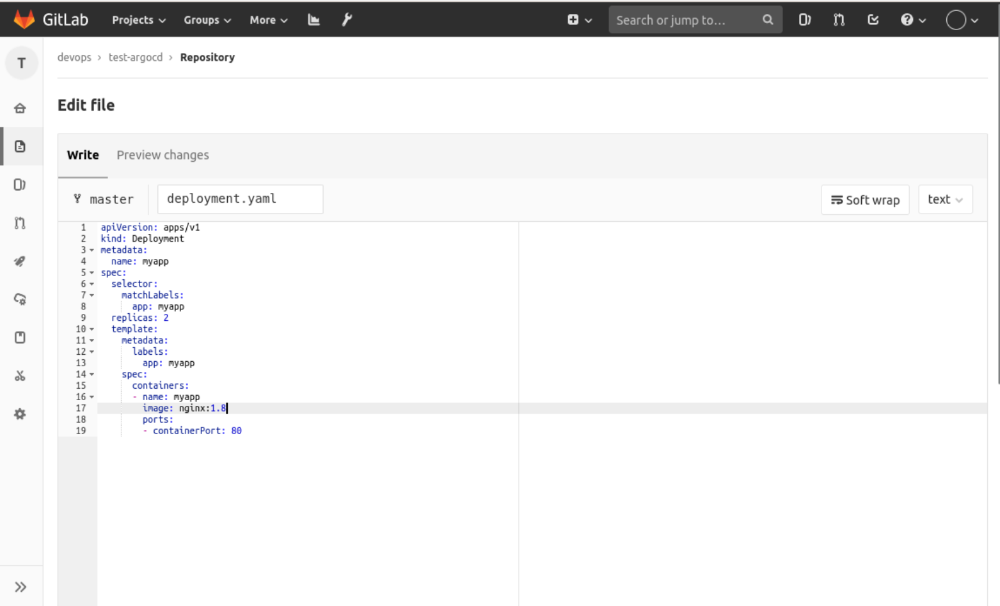
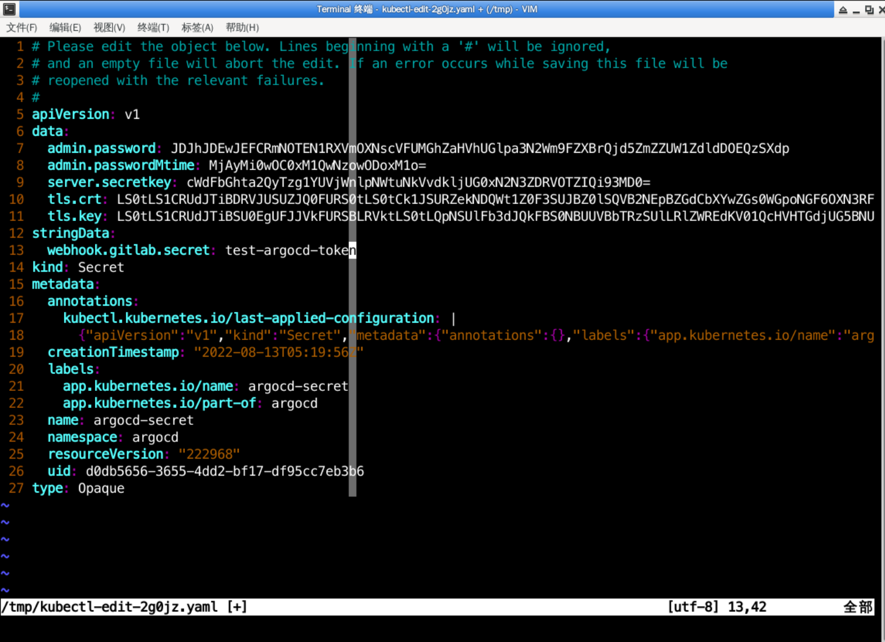
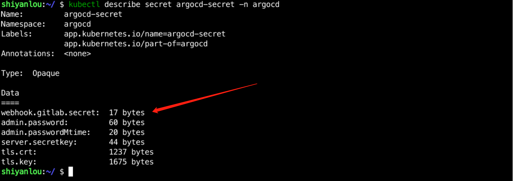

[TOC]


# 实验介绍

本次实验带你了解什么是 GitOps 以及 Argocd 是如何实现 GitOps 的，最后带你从 0 到 1 搭建好 Argocd。

#### 知识点

- GitOps
- Argocd

# 什么是 GitOps

GitOps 是一套使用 Git 来管理基础架构和应用配置的实践，而 Git 指的是一个开源版控制系统。GitOps 在运行过程中以 Git 为声明性基础架构和应用的单一事实来源。

GitOps 使用 Git 拉取请求来自动管理基础架构的置备和部署。Git 存储库包含系统的全部状态，因此系统状态的修改痕迹既可查看也可审计。


其中：

- 当开发人员将开发完成的代码推送到 git 仓库会触发 CI 制作镜像并推送到镜像仓库
- CI 处理完成后，可以手动或者自动修改应用配置，再将其推送到 git 仓库
- GitOps 会同时对比目标状态和当前状态，如果两者不一致会触发 CD 将新的配置部署到集群中

与传统的 CICD 相比，GitOps 具有以下优势：

- 以 Git 为中心，Git 作为应用的唯一来源
- 环境一致性，如果是多集群，可以确保每个集群的环境都是一致的
- 伸缩性强，可以很容器扩展管理成百上千的集群
- 更安全，不需要对额外的权限授予，比如 Kubernetes 集群管理权限

# 什么是 Argocd

Argocd 就是基于 GitOps 理念设计实现，它以 Git 为中心，随时监控 Git 的状态，如果期望状态与实际状态不符，就会同步期望状态，让期望与实际相符。


其核心概念有：

- Application：定义应用配置清单，定义应用配置来源以及要部署到的目的地
- Target state：期望状态
- Live state：实际状态
- Sync status：同步状态
- Sync：同步操作，同步 Git 中的配置
- Refresh：刷新，将实际状态和期望状态进行对比
- Health：应用健康状态，事实检测应用的情况
- Project：对应用进行分组

# 部署 Argocd

Argocd 的部署方式有两种：高可用方式以及非高可用方式。如果是生产上，建议使用高可用方式部署。如果仅仅是简单的试用、测试，可以选择非高可用方式，具体可以到 `https://github.com/argoproj/argo-cd/tree/master/manifests` 进行查看。

我们这里采用非高可用的方式部署。

（1）创建名称空间

```bash
kubectl create namespace argocd
```

（2）部署服务

```bash
kubectl apply -n argocd -f https://raw.githubusercontent.com/argoproj/argo-cd/stable/manifests/install.yaml
```

如果网络不好，就试用下面的安装方式：

```bash
kubectl apply -n argocd -f https://gitee.com/coolops/kubernetes-devops-course/raw/master/argocd/install.yaml
```

部署过后，使用 `kubectl get pod -n argocd` 查看部署情况，如下：


（3）创建目录，用于保存用户配置文件

```bash
mkdir -p /home/shiyanlou/Code/devops/sy-03-1
```


# 访问 Argocd

部署完成后，可以使用 `argocd-server` 来访问 UI 界面，使用 `kubectl get service -n argocd` 查看 Service 情况，如下：


但是，上图中 Service 都是 ClusterIP 类型，无法直接从外部进行访问，我们可以通过两种方式来访问：

- 修改 Service 类型，改成 NodePort
- 增加一个 Ingress

为了方便快捷，这里直接使用 NodePort 进行访问。

通过 `kubectl edit service -n argocd argocd-server` 进入 Service 编辑界面，如下：


然后将 Type 类型改成 `NodePort`，保存退出。

使用 `kubectl get service -n argocd argocd-server` 查看 NodePort，如下：


图中显示 NodePort 为 `30888`，我们就可以使用 `http://10.111.127.141:30888` 进行访问，如下：


登录需要用户名和密码，默认的用户名是 `admin`，密码保存在 `argocd-initial-admin-secret` 中，可以使用以下命令查看：

```bash
kubectl -n argocd get secret argocd-initial-admin-secret -o jsonpath="{.data.password}" | base64 -d; echo
```

如下：


然后使用用户名密码登录过后，会进入如下界面：


# 修改密码

初始的密码比较复杂，并不适合记忆，这时候可能就会需要修改密码。

在 UI 界面没有修改密码的地方，如果要修改密码，只能通过客户端操作。

可以在 `https://github.com/argoproj/argo-cd/releases` 页面选择合适的客户端，如果网络比较好，可以直接使用下面命令进行安装：

```bash
wget https://github.com/argoproj/argo-cd/releases/download/v2.4.9/argocd-linux-amd64
chmod +x argocd-linux-amd64
sudo mv argocd-linux-amd64 /usr/local/bin/argocd
```

如果网络条件不好，可以使用以下命令进行安装：

```bash
wget https://gitee.com/coolops/go-hello-world/releases/download/v2.4.9/argocd-linux-amd64.zip
unzip argocd-linux-amd64.zip
chmod +x argocd-linux-amd64
sudo mv argocd-linux-amd64 /usr/local/bin/argocd
```

安装完成后使用 `argocd version` 查看信息，如下：


发现查询 Argocd-Server 失败，这是因为我们需要登录，使用 `argocd login 10.111.127.141:30888` 进行登录，如下：


登录成功后，就可以使用 `argocd version` 查询信息，如下：


现在，我们可以使用 `argocd account update-password --account admin --current-password xxxx --new-password xxxx` 来修改密码，比如我这里修改成 `Argocd@123456`，完整命令如下：

```bash
argocd account update-password --account admin --current-password 04Y0P54LzoxGEYno --new-password Argocd@123456
```

修改成功输出如下：


然后 UI 界面使用新密码重新登录即可。

# 应用管理

准备好了 Argocd，现在我们创建一个应用，看看其在 Argocd 中是怎么样的。

# 应用部署

在 Gitlab 上创建一个 `test-argocd` 项目，如下：


然后在 `test-argocd` 仓库中新增一个 `deployment.yaml` 文件，写入以下内容：

```yaml
apiVersion: apps/v1
kind: Deployment
metadata:
  name: myapp
spec:
  selector:
    matchLabels:
      app: myapp
  replicas: 2
  template:
    metadata:
      labels:
        app: myapp
    spec:
      containers:
        - name: myapp
          image: nginx:latest
          ports:
            - containerPort: 80
```


再增加一个 `service.yaml` 文件，输入以下内容：

```yaml
apiVersion: v1
kind: Service
metadata:
  name: myapp
spec:
  selector:
    app: myapp
  ports:
    - port: 80
      protocol: TCP
      targetPort: 80
```


最后，我们在 `/home/shiyanlou/Code/devops/sy-03-1` 中创建一个 argo-application.yaml 文件，输入以下内容：

```yaml
apiVersion: argoproj.io/v1alpha1
kind: Application
metadata:
  name: myapp
  namespace: argocd
spec:
  project: default

  source:
    repoURL: http://10.111.127.141:30180/devops/test-argocd.git
    targetRevision: HEAD
    path: .
  destination:
    server: https://kubernetes.default.svc
    namespace: default

  syncPolicy:
    syncOptions:
      - CreateNamespace=true

    automated:
      selfHeal: true
      prune: true
```

这时候如果直接使用 `kubectl apply -f argo-application.yaml` 创建会报错，因为我们的 Git 仓库是私有仓库，需要登录验证才行。

在 UI 界面，点击 `Settings`，选择 `Repositories`，进入如下界面：


然后点击 `CONNECT REPO USING HTTPS`，输入仓库信息，如下：


然后点击上面的 `CONNECT` 创建，如下表示连接成功：


现在，我们再来执行 `kubectl apply -f argo-application.yaml` 创建应用，创建后在 UI 界面可以看到应用，如下：


点击进去可以看到更详细的信息，如下：


# 应用更新

现在，如果要更新应用，不需要在 Argocd 上进行镜像更改操作，只需要更改 `test-argocd` 仓库中 `deployment.yaml` 的镜像地址，如下我们把镜像从 `nginx:latest` 更新到 `nginx:1.8`：



然后在 Argocd 上点击 `sync`，如下：


这样，应用就会更新为最新的镜像。

我们可以查看 Gitlab 上的 commit 和 argocd 上所同步的 commit 是否一致，如下表示一致：


# 应用回滚

回滚我们也是根据 Git 来进行，我们可以查看 Git History，如下：


然后找到我们上次提交的 commit，点击进去：


找到 `options`，选择 `revert`，会创建一个新的 Merage Request，如下：


点击提交会到 `merge` 页面，如下：


然后点击 `merge`，就可以把镜像回滚了，如下：


最后再到 Argocd 上点击同步即可。


# 配置 Webhook 加速 Argocd 配置更新

当然，实际上我们配置的是自动同步，也就是更新完 Gitlab 上的镜像后，Argocd 会自动去拉配置进行更新，不过这个时间不是实时的，而是定时每 3 分钟拉取一次，为了快速验证，我们上面都是手动进行更新的。

为了消除轮询带来的延迟，可以将 API 服务器配置为接收 Webhook 事件。Argo CD 支持来自 GitHub，GitLab，Bitbucket，Bitbucket Server 和 Gogs 的 Git Webhook 通知，我们这里主要是配置 Gitlab。

#### 修改 argocd-secret，增加 Gitlab webhook token

使用 `kubectl edit secret argocd-secret -n argocd` 打开配置文件，新增以下代码：

```yaml
stringData:
  webhook.gitlab.secret: test-argocd-token
```



点击保存过后保存到 argocd-secret 中，使用 `kubectl describe secret argocd-secret -n argocd` 查看，如下：



然后在 Gitlab 上选择 `settings` -> `integrations`，配置 Webhook，如下：


由于集群内部证书是无效证书，所有要把 Enabled SSL 去掉，如下：


然后再进行应该更新测试，可以发现在 Gitlab 这边刚提交，Argocd 就开始执行更新了，大家可以自行去测试一下。

# 实验总结

本次实验主要是带大家了解什么是 GitOps 以及和传统的 CD 有何区别，然后介绍了本课程的主角之一 Argocd 以及在 Kubernetes 中安装并简单使用，并通过一个简单的示例来演示如何在 Argocd 上创建应用。Argocd 的功能比较多，而且也有不少的企业已经投入生产，后续我们会将持续交付都通过 Argocd 来完成。