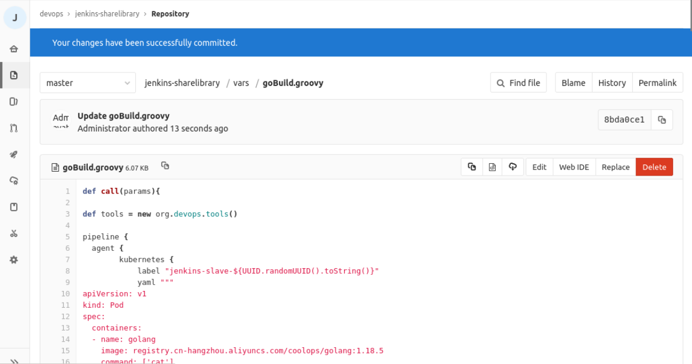

# 实验介绍

在企业中，每一个项目都会有许多分支，比如开发分支、测试分支，每个分支都对应不同的环境，比如开发分支发布开发环境，测试分支发布测试环境，如果按照《基于 Jenkins 实现应用自动发布》章节中的方式，就需要我们在不同的环境创建不同的流水线，那有没有办法只创建一条流水线就能完成不同的分支发布到不同的环境呢？今天就带大家实现如何基于 Jenkins 完成多分支发布。

#### 知识点

- 多分支发布
- Pipeline
- 插件使用
- Jenkins 共享仓库

# 环境介绍

要完成本次实验，我们需要：

- 具备可用的 Kubernetes 集群
- 安装好 Gitlab、Jenkins、Harbor

`go-hello-world` 项目的分支结构：

- dev：开发分支
- test：测试分支
- uat：联调分支
- pre：预发布分支
- prod：生产分支

如下： 

再到 kubernetes 中使用 `kubectl create namespace xxx` 创建以下名称空间：

- dev：开发环境
- test：测试环境
- uat：联调环境
- pre：预发布环境
- prod：生产环境

> PS: 实际生产可能是不同的集群部署不同的环境，由于条件有限，这里都在单集群完成，但是实现方式都一样。

在 Harbor 上也创建如下项目仓库，让不同环境的镜像推送到不同的仓库：


我们实现的目标是：

- 开发提交代码到代码仓库
- 自动触发 Jenkins 流水线
- Jenkins 流水线根据触发的信息获取分支
- 依据分支部署到不同的环境


# 安装插件

我们这里会使用 `Generic Webhook Trigger` 插件来自动获取分支，在《Jenkins 如何和 Gitlab 进行集成交互》中有对该插件做介绍。

在 **系统管理** -> **插件管理** -> **已安装** 里确定插件是否已经安装，如下：


如果没有安装，在 **可选插件** 搜索 `Generic Webhook Trigger` 进行安装，然后重启 Jenkins 即可。


# 开发 Pipeline

在之前的实验中，我们已经完成了基础的 Pipeline 开发，如下：

```groovy
@Library('sharelibrary')

def tools = new org.devops.tools()

pipeline {
  agent {
        kubernetes {
            label "jenkins-slave-${UUID.randomUUID().toString()}"
            yaml """
apiVersion: v1
kind: Pod
spec:
  containers:
  - name: golang
    image: registry.cn-hangzhou.aliyuncs.com/coolops/golang:1.18.5
    command: ['cat']
    tty: true
  - name: docker
    image: registry.cn-hangzhou.aliyuncs.com/coolops/docker:19.03.11
    command: ['cat']
    tty: true
    volumeMounts:
      - name: indocker
        mountPath: /var/run/docker.sock
  - name: helm
    image: registry.cn-hangzhou.aliyuncs.com/coolops/helm-kubectl:3.2.4
    command: ['cat']
    tty: true
    volumeMounts:
      - name: kubeconfig
        mountPath: /root/.kube
  volumes:
    - name: indocker
      hostPath:
        path: "/var/run/docker.sock"
    - name: kubeconfig
      hostPath:
        path: "/home/shiyanlou/.kube"
"""
        }
    }

  environment{
    IMAGE_REPO = "10.111.127.141:30002/dev/go-hello-world"
    IMAGE_TAG = ""
  }

  stages {
    stage('Get Code') {
        steps {
            checkout(scm)
        }
    }
    stage('Build Code') {
        steps {
            container('golang'){
                script{
                    sh '''
                        export GOPROXY=https://goproxy.cn
                        export GOOS=linux
                        export GOARCH=386
                        go mod tidy
                        go build -v -o ./go-hello-world
                    '''
                }
            }
        }
    }
    stage('Build And Push Image') {
        steps {
            container('docker'){
                script{

                    IMAGE_TAG = tools.createImageTag()
                    sh """
                        docker login 10.111.127.141:30002 -u admin -p Harbor12345
                        docker build -t ${IMAGE_REPO}:${IMAGE_TAG} -f Dockerfile .
                        docker push ${IMAGE_REPO}:${IMAGE_TAG}
                    """
                }
            }
        }
    }
    stage('Deploy'){
        steps{
            container('helm'){
                script{
                    sh """
                        helm upgrade --install go-hello-world -n default \
                        --set image.repository=${IMAGE_REPO} \
                        --set image.tag=${IMAGE_TAG} \
                        --set containers.port=8080 \
                        --set containers.healthCheak.path=/health \
                        --set ingress.enabled=true \
                        --set ingress.hosts[0].host=hello.devops.com \
                        --set ingress.hosts[0].paths[0].path=/ \
                        --set ingress.hosts[0].paths[0].pathType=ImplementationSpecific deploy/charts/
                    """
                }
            }
        }
    }
  }
}
```

我们就是基于该流水线进行进一步的调整。


# 添加触发器

我们需要在 Pipeline 中添加以下代码：

```groovy
  triggers {
    GenericTrigger(
     genericVariables: [
      [key: 'ref', value: '$.ref']
     ],
     causeString: 'Triggered on $ref',
     token: 'go-hello-world',
     printContributedVariables: true,
     printPostContent: true,
     silentResponse: false,
     regexpFilterText: '$ref',
     regexpFilterExpression: 'refs/heads/(dev|test|uat|pre|prod)'
    )
  }
```

这段代码的作用如下：

- 为流水线增加一个 Webhook
- 获取触发流水线的分支
- 匹配过滤分支

# 拼接镜像仓库

由于我们要实现不同分支的镜像推送到不同的仓库，所以我们要在镜像构建之前把镜像仓库确定好，为此，我们需要增加一个 stage，如下：

```groovy
    stage('Get Image Repo') {
        steps {
            script{
                BRANCH = ref - "refs/heads/"
                IMAGE_REPO = "10.111.127.141:30002/${BRANCH}/go-hello-world"
            }
        }
    }
```

# 增加多分支部署

多分支部署，我们通过条件判断的方式实现，即新增几个 stage，每个 stage 使用 when 来判断，如下：

```groovy
    stage('Deploy TO DEV'){
        when {
            expression { ref ==~ 'refs/heads/dev' }
            }
        steps{
            container('helm'){
                script{
                    sh """
                        helm upgrade --install go-hello-world -n dev \
                        --set image.repository=${IMAGE_REPO} \
                        --set image.tag=${IMAGE_TAG} \
                        --set containers.port=8080 \
                        --set containers.healthCheak.path=/health \
                        --set ingress.enabled=true \
                        --set ingress.hosts[0].host=hello.dev.devops.com \
                        --set ingress.hosts[0].paths[0].path=/ \
                        --set ingress.hosts[0].paths[0].pathType=ImplementationSpecific deploy/charts/
                    """
                }
            }
        }
    }
    stage('Deploy TO TEST'){
        when {
            expression { ref ==~ 'refs/heads/test' }
            }
        steps{
            container('helm'){
                script{
                    sh """
                        helm upgrade --install go-hello-world -n test \
                        --set image.repository=${IMAGE_REPO} \
                        --set image.tag=${IMAGE_TAG} \
                        --set containers.port=8080 \
                        --set containers.healthCheak.path=/health \
                        --set ingress.enabled=true \
                        --set ingress.hosts[0].host=hello.test.devops.com \
                        --set ingress.hosts[0].paths[0].path=/ \
                        --set ingress.hosts[0].paths[0].pathType=ImplementationSpecific deploy/charts/
                    """
                }
            }
        }
    }
    stage('Deploy TO UAT'){
        when {
            expression { ref ==~ 'refs/heads/uat' }
            }
        steps{
            container('helm'){
                script{
                    sh """
                        helm upgrade --install go-hello-world -n uat \
                        --set image.repository=${IMAGE_REPO} \
                        --set image.tag=${IMAGE_TAG} \
                        --set containers.port=8080 \
                        --set containers.healthCheak.path=/health \
                        --set ingress.enabled=true \
                        --set ingress.hosts[0].host=hello.uat.devops.com \
                        --set ingress.hosts[0].paths[0].path=/ \
                        --set ingress.hosts[0].paths[0].pathType=ImplementationSpecific deploy/charts/
                    """
                }
            }
        }
    }
    stage('Deploy TO PRE'){
        when {
            expression { ref ==~ 'refs/heads/pre' }
            }
        steps{
            container('helm'){
                script{
                    sh """
                        helm upgrade --install go-hello-world -n pre \
                        --set image.repository=${IMAGE_REPO} \
                        --set image.tag=${IMAGE_TAG} \
                        --set containers.port=8080 \
                        --set containers.healthCheak.path=/health \
                        --set ingress.enabled=true \
                        --set ingress.hosts[0].host=hello.pre.devops.com \
                        --set ingress.hosts[0].paths[0].path=/ \
                        --set ingress.hosts[0].paths[0].pathType=ImplementationSpecific deploy/charts/
                    """
                }
            }
        }
    }
    stage('Deploy TO PROD'){
        when {
            expression { ref ==~ 'refs/heads/prod' }
            }
        steps{
            container('helm'){
                script{
                    sh """
                        helm upgrade --install go-hello-world -n prod \
                        --set image.repository=${IMAGE_REPO} \
                        --set image.tag=${IMAGE_TAG} \
                        --set containers.port=8080 \
                        --set containers.healthCheak.path=/health \
                        --set ingress.enabled=true \
                        --set ingress.hosts[0].host=hello.prod.devops.com \
                        --set ingress.hosts[0].paths[0].path=/ \
                        --set ingress.hosts[0].paths[0].pathType=ImplementationSpecific deploy/charts/
                    """
                }
            }
        }
    }
```

这里为什么要这么多 stage？难道用一个不行么？

用一个肯定是可以的，但是不同环境应用的配置可能不一样，如果使用一个 stage 就需要做高度的抽象化，为了方便不同环境的定义，所以就为不同环境定义了不同的 stage。


# 部署应用

上面对需要的功能进行了增加。现在整个流水线整理如下：

```groovy
@Library('sharelibrary')

def tools = new org.devops.tools()

pipeline {
  agent {
        kubernetes {
            label "jenkins-slave-${UUID.randomUUID().toString()}"
            yaml """
apiVersion: v1
kind: Pod
spec:
  containers:
  - name: golang
    image: registry.cn-hangzhou.aliyuncs.com/coolops/golang:1.18.5
    command: ['cat']
    tty: true
  - name: docker
    image: registry.cn-hangzhou.aliyuncs.com/coolops/docker:19.03.11
    command: ['cat']
    tty: true
    volumeMounts:
      - name: indocker
        mountPath: /var/run/docker.sock
  - name: helm
    image: registry.cn-hangzhou.aliyuncs.com/coolops/helm-kubectl:3.2.4
    command: ['cat']
    tty: true
    volumeMounts:
      - name: kubeconfig
        mountPath: /root/.kube
  volumes:
    - name: indocker
      hostPath:
        path: "/var/run/docker.sock"
    - name: kubeconfig
      hostPath:
        path: "/home/shiyanlou/.kube"
"""
        }
    }

  environment{
    IMAGE_REPO = ""
    IMAGE_TAG = ""
  }

  triggers {
    GenericTrigger(
     genericVariables: [
      [key: 'ref', value: '$.ref']
     ],
     causeString: 'Triggered on $ref',
     token: 'go-hello-world',
     printContributedVariables: true,
     printPostContent: true,
     silentResponse: false,
     regexpFilterText: '$ref',
     regexpFilterExpression: 'refs/heads/(dev|test|uat|pre|prod)'
    )
  }

  stages {
    stage('Get Code') {
        steps {
            checkout(scm)
        }
    }

    stage('Get Image Repo') {
        steps {
            script{
                BRANCH = ref - "refs/heads/"
                IMAGE_REPO = "10.111.127.141:30002/${BRANCH}/go-hello-world"
            }
        }
    }

    stage('Build Code') {
        steps {
            container('golang'){
                script{
                    sh '''
                        export GOPROXY=https://goproxy.cn
                        export GOOS=linux
                        export GOARCH=386
                        go mod tidy
                        go build -v -o ./go-hello-world
                    '''
                }
            }
        }
    }
    stage('Build And Push Image') {
        steps {
            container('docker'){
                script{

                    IMAGE_TAG = tools.createImageTag()
                    sh """
                        docker login 10.111.127.141:30002 -u admin -p Harbor12345
                        docker build -t ${IMAGE_REPO}:${IMAGE_TAG} -f Dockerfile .
                        docker push ${IMAGE_REPO}:${IMAGE_TAG}
                    """
                }
            }
        }
    }
    stage('Deploy TO DEV'){
        when {
            expression { ref ==~ 'refs/heads/dev' }
            }
        steps{
            container('helm'){
                script{
                    sh """
                        helm upgrade --install go-hello-world -n dev \
                        --set image.repository=${IMAGE_REPO} \
                        --set image.tag=${IMAGE_TAG} \
                        --set containers.port=8080 \
                        --set containers.healthCheak.path=/health \
                        --set ingress.enabled=true \
                        --set ingress.hosts[0].host=hello.dev.devops.com \
                        --set ingress.hosts[0].paths[0].path=/ \
                        --set ingress.hosts[0].paths[0].pathType=ImplementationSpecific deploy/charts/
                    """
                }
            }
        }
    }
    stage('Deploy TO TEST'){
        when {
            expression { ref ==~ 'refs/heads/test' }
            }
        steps{
            container('helm'){
                script{
                    sh """
                        helm upgrade --install go-hello-world -n test \
                        --set image.repository=${IMAGE_REPO} \
                        --set image.tag=${IMAGE_TAG} \
                        --set containers.port=8080 \
                        --set containers.healthCheak.path=/health \
                        --set ingress.enabled=true \
                        --set ingress.hosts[0].host=hello.test.devops.com \
                        --set ingress.hosts[0].paths[0].path=/ \
                        --set ingress.hosts[0].paths[0].pathType=ImplementationSpecific deploy/charts/
                    """
                }
            }
        }
    }
    stage('Deploy TO UAT'){
        when {
            expression { ref ==~ 'refs/heads/uat' }
            }
        steps{
            container('helm'){
                script{
                    sh """
                        helm upgrade --install go-hello-world -n uat \
                        --set image.repository=${IMAGE_REPO} \
                        --set image.tag=${IMAGE_TAG} \
                        --set containers.port=8080 \
                        --set containers.healthCheak.path=/health \
                        --set ingress.enabled=true \
                        --set ingress.hosts[0].host=hello.uat.devops.com \
                        --set ingress.hosts[0].paths[0].path=/ \
                        --set ingress.hosts[0].paths[0].pathType=ImplementationSpecific deploy/charts/
                    """
                }
            }
        }
    }
    stage('Deploy TO PRE'){
        when {
            expression { ref ==~ 'refs/heads/pre' }
            }
        steps{
            container('helm'){
                script{
                    sh """
                        helm upgrade --install go-hello-world -n pre \
                        --set image.repository=${IMAGE_REPO} \
                        --set image.tag=${IMAGE_TAG} \
                        --set containers.port=8080 \
                        --set containers.healthCheak.path=/health \
                        --set ingress.enabled=true \
                        --set ingress.hosts[0].host=hello.pre.devops.com \
                        --set ingress.hosts[0].paths[0].path=/ \
                        --set ingress.hosts[0].paths[0].pathType=ImplementationSpecific deploy/charts/
                    """
                }
            }
        }
    }
    stage('Deploy TO PROD'){
        when {
            expression { ref ==~ 'refs/heads/prod' }
            }
        steps{
            container('helm'){
                script{
                    sh """
                        helm upgrade --install go-hello-world -n prod \
                        --set image.repository=${IMAGE_REPO} \
                        --set image.tag=${IMAGE_TAG} \
                        --set containers.port=8080 \
                        --set containers.healthCheak.path=/health \
                        --set ingress.enabled=true \
                        --set ingress.hosts[0].host=hello.prod.devops.com \
                        --set ingress.hosts[0].paths[0].path=/ \
                        --set ingress.hosts[0].paths[0].pathType=ImplementationSpecific deploy/charts/
                    """
                }
            }
        }
    }
  }
}
```

将上述内容同步更新到 Gitlab `go-hello-world` 仓库的 master 分支的 `Jenkinsfile` 中。

然后在 Jenkins 上创建一个 `go-hello-world` 项目，选择流水线，如下：


然后配置流水线，保存退出，如下：


第一次配置好流水线，手动点击 **立即构建**，让其加载完 Jenkinsfile 中的配置，主要是触发器的配置，如下：


在 Gitlab 的 `go-hello-world` 项目中配置 Webhook。点击 `settings` -> `integrations`，配置如下：


然后 Gitlab 上 `go-hello-world` 项目的 dev 分支中新增一个文件，随机写点东西提交，比如：


观察 Jenkins 上 `go-hello-world` 项目是否被触发，并且部署到 Dev 环境的应用是否成功，如果输出如下表示成功：


并且，可以通过 `kubectl get all -n dev` 查看应用是否部署成功，如下：


除此之外，也可以测试其他分支是否同样正常，比如我测试 test 分支依然有效：


# 优化流水线

上面已经完成了应用的多分支发布，但是只是某一个应用的，如果有同类的应用，比如基于同一个框架的应用想要配置流水线，又要把上面的内容做修改，然后全部放进代码仓库里，那有没有办法把上面的流水线做成模板？哪个应用要部署只需要传几个参数即可？

这一小节，我们就来完成这个事情。

从上面的流水线来看，如果是同框架的不同的项目，需要变化的有：

- 应用名
- 域名
- helm 命令

为此我们将环境变量定义如下：

```groovy
    environment{
        APP_NAME = "${params.APP_NAME}"
        INGRESS_HOST_PRE = "${params.INGRESS_HOST_PRE}"
        INGRESS_ENABLE = "${params.INGRESS_ENABLE? params.INGRESS_ENABLE :false}"
        IMAGE_REPO = ""
        IMAGE_TAG = ""
        HELM_COMMON_ARGS= "--set ingress.enabled=$INGRESS_ENABLE \
                           --set containers.port=8080 \
                           --set containers.healthCheak.path=/health \
                           --set ingress.hosts[0].paths[0].path=/ \
                           --set ingress.hosts[0].paths[0].pathType=ImplementationSpecific deploy/charts/ "
    }
```

其中：

- APP_NAME：表示应用名
- INGRESS_HOST_PRE：表示域名前缀，统一格式为"${INGRESS_HOST_PRE}.dev.devops.com"，其他环境类推，如果 INGRESS_ENABLE 为 false 则不需要传递该参数
- INGRESS_ENABLE：表示是否要用 Ingress
- IMAGE_REPO：仓库地址，组织形式为："10.111.127.141:30002/������/*B**R**A**N**C**H*/{APP_NAME}"
- IMAGE_TAG：镜像 Tag
- HELM_COMMON_ARGS：Helm 部署参数，将一些参数抽离出来

然后在 Gitlab 的 `jenkins-sharelibrary` 项目中增加 `vars/setupHelm.groovy` 文件，内容如下：

```groovy
def call(){
    sh "helm upgrade --install $APP_NAME -n $NAMESPACE $HELM_COMMON_ARGS"
}
```


然后我们部署的 stage，可以变成如下：

```groovy
stage('Deploy TO DEV'){
        when {
            expression { ref ==~ 'refs/heads/dev' }
            }
        environment{
            NAMESPACE = 'dev'
            INGRESS_HOST="${INGRESS_HOST_PRE}.dev.devops.com"
            HELM_COMMON_ARGS = "${HELM_COMMON_ARGS} --set ingress.hosts[0].host=$INGRESS_HOST --set image.repository=$IMAGE_REPO --set image.tag=$IMAGE_TAG"
        }
        steps{
            container('helm'){
                script{
                    setupHelm()
                }
            }
        }
    }
    stage('Deploy TO TEST'){
        when {
            expression { ref ==~ 'refs/heads/test' }
            }
        environment{
            NAMESPACE = 'test'
            INGRESS_HOST="${INGRESS_HOST_PRE}.test.devops.com"
            HELM_COMMON_ARGS = "${HELM_COMMON_ARGS} --set ingress.hosts[0].host=$INGRESS_HOST --set image.repository=$IMAGE_REPO --set image.tag=$IMAGE_TAG"
        }
        steps{
            container('helm'){
                script{
                    setupHelm()
                }
            }
        }
    }
    stage('Deploy TO UAT'){
        when {
            expression { ref ==~ 'refs/heads/uat' }
            }
        environment{
            NAMESPACE = 'uat'
            INGRESS_HOST="${INGRESS_HOST_PRE}.uat.devops.com"
            HELM_COMMON_ARGS = "${HELM_COMMON_ARGS} --set ingress.hosts[0].host=$INGRESS_HOST --set image.repository=$IMAGE_REPO --set image.tag=$IMAGE_TAG"
        }
        steps{
            container('helm'){
                script{
                    setupHelm()
                }
            }
        }
    }
    stage('Deploy TO PRE'){
        when {
            expression { ref ==~ 'refs/heads/pre' }
            }
        environment{
            NAMESPACE = 'pre'
            INGRESS_HOST="${INGRESS_HOST_PRE}.pre.devops.com"
            HELM_COMMON_ARGS = "${HELM_COMMON_ARGS} --set ingress.hosts[0].host=$INGRESS_HOST --set image.repository=$IMAGE_REPO --set image.tag=$IMAGE_TAG"
        }
        steps{
            container('helm'){
                script{
                    setupHelm()
                }
            }
        }
    }
    stage('Deploy TO PROD'){
        when {
            expression { ref ==~ 'refs/heads/prod' }
            }
        environment{
            NAMESPACE = 'prod'
            INGRESS_HOST="${INGRESS_HOST_PRE}.devops.com"
            HELM_COMMON_ARGS = "${HELM_COMMON_ARGS} --set ingress.hosts[0].host=$INGRESS_HOST --set image.repository=$IMAGE_REPO --set image.tag=$IMAGE_TAG"
        }
        steps{
            container('helm'){
                script{
                    setupHelm()
                }
            }
        }
    }
```

这样，我们就将流水线模板参数化了。整体修改过后的流水线模板如下：

```groovy
def call(params){

def tools = new org.devops.tools()

pipeline {
  agent {
        kubernetes {
            label "jenkins-slave-${UUID.randomUUID().toString()}"
            yaml """
apiVersion: v1
kind: Pod
spec:
  containers:
  - name: golang
    image: registry.cn-hangzhou.aliyuncs.com/coolops/golang:1.18.5
    command: ['cat']
    tty: true
  - name: docker
    image: registry.cn-hangzhou.aliyuncs.com/coolops/docker:19.03.11
    command: ['cat']
    tty: true
    volumeMounts:
      - name: indocker
        mountPath: /var/run/docker.sock
  - name: helm
    image: registry.cn-hangzhou.aliyuncs.com/coolops/helm-kubectl:3.2.4
    command: ['cat']
    tty: true
    volumeMounts:
      - name: kubeconfig
        mountPath: /root/.kube
  volumes:
    - name: indocker
      hostPath:
        path: "/var/run/docker.sock"
    - name: kubeconfig
      hostPath:
        path: "/home/shiyanlou/.kube"
"""
        }
    }

    environment{
        APP_NAME = "${params.APP_NAME}"
        INGRESS_HOST_PRE = "${params.INGRESS_HOST_PRE}"
        INGRESS_ENABLE = "${params.INGRESS_ENABLE? params.INGRESS_ENABLE :false}"
        IMAGE_REPO = ""
        IMAGE_TAG = ""
        HELM_COMMON_ARGS= "--set ingress.enabled=$INGRESS_ENABLE \
                           --set containers.port=8080 \
                           --set containers.healthCheak.path=/health \
                           --set ingress.hosts[0].paths[0].path=/ \
                           --set ingress.hosts[0].paths[0].pathType=ImplementationSpecific deploy/charts/ "
    }

    triggers {
        GenericTrigger(
        genericVariables: [
        [key: 'ref', value: '$.ref']
        ],
        causeString: 'Triggered on $ref',
        token: 'go-hello-world',
        printContributedVariables: true,
        printPostContent: true,
        silentResponse: false,
        regexpFilterText: '$ref',
        regexpFilterExpression: 'refs/heads/(dev|test|uat|pre|prod)'
        )
    }

    stages {
        stage('Get Code') {
            steps {
                checkout(scm)
            }
        }

        stage('Get Image Repo') {
            steps {
                script{
                    BRANCH = ref - "refs/heads/"
                    IMAGE_REPO = "10.111.127.141:30002/${BRANCH}/${APP_NAME}"
                }
            }
        }

        stage('Build Code') {
            steps {
                container('golang'){
                    script{
                        sh '''
                            export GOPROXY=https://goproxy.cn
                            export GOOS=linux
                            export GOARCH=386
                            go mod tidy
                            go build -v -o ./${APP_NAME}
                        '''
                    }
                }
            }
        }
        stage('Build And Push Image') {
            steps {
                container('docker'){
                    script{

                        IMAGE_TAG = tools.createImageTag()
                        sh """
                            docker login 10.111.127.141:30002 -u admin -p Harbor12345
                            docker build -t ${IMAGE_REPO}:${IMAGE_TAG} -f Dockerfile .
                            docker push ${IMAGE_REPO}:${IMAGE_TAG}
                        """
                    }
                }
            }
        }
        stage('Deploy TO DEV'){
            when {
                expression { ref ==~ 'refs/heads/dev' }
                }
            environment{
                NAMESPACE = 'dev'
                INGRESS_HOST="${INGRESS_HOST_PRE}.dev.devops.com"
                HELM_COMMON_ARGS = "${HELM_COMMON_ARGS} --set ingress.hosts[0].host=$INGRESS_HOST --set image.repository=$IMAGE_REPO --set image.tag=$IMAGE_TAG"
            }
            steps{
                container('helm'){
                    script{
                        setupHelm()
                    }
                }
            }
        }
        stage('Deploy TO TEST'){
            when {
                expression { ref ==~ 'refs/heads/test' }
                }
            environment{
                NAMESPACE = 'test'
                INGRESS_HOST="${INGRESS_HOST_PRE}.test.devops.com"
                HELM_COMMON_ARGS = "${HELM_COMMON_ARGS} --set ingress.hosts[0].host=$INGRESS_HOST --set image.repository=$IMAGE_REPO --set image.tag=$IMAGE_TAG"
            }
            steps{
                container('helm'){
                    script{
                        setupHelm()
                    }
                }
            }
        }
        stage('Deploy TO UAT'){
            when {
                expression { ref ==~ 'refs/heads/uat' }
                }
            environment{
                NAMESPACE = 'uat'
                INGRESS_HOST="${INGRESS_HOST_PRE}.uat.devops.com"
                HELM_COMMON_ARGS = "${HELM_COMMON_ARGS} --set ingress.hosts[0].host=$INGRESS_HOST --set image.repository=$IMAGE_REPO --set image.tag=$IMAGE_TAG"
            }
            steps{
                container('helm'){
                    script{
                        setupHelm()
                    }
                }
            }
        }
        stage('Deploy TO PRE'){
            when {
                expression { ref ==~ 'refs/heads/pre' }
                }
            environment{
                NAMESPACE = 'pre'
                INGRESS_HOST="${INGRESS_HOST_PRE}.pre.devops.com"
                HELM_COMMON_ARGS = "${HELM_COMMON_ARGS} --set ingress.hosts[0].host=$INGRESS_HOST --set image.repository=$IMAGE_REPO --set image.tag=$IMAGE_TAG"
            }
            steps{
                container('helm'){
                    script{
                        setupHelm()
                    }
                }
            }
        }
        stage('Deploy TO PROD'){
            when {
                expression { ref ==~ 'refs/heads/prod' }
                }
            environment{
                NAMESPACE = 'prod'
                INGRESS_HOST="${INGRESS_HOST_PRE}.devops.com"
                HELM_COMMON_ARGS = "${HELM_COMMON_ARGS} --set ingress.hosts[0].host=$INGRESS_HOST --set image.repository=$IMAGE_REPO --set image.tag=$IMAGE_TAG"
            }
            steps{
                container('helm'){
                    script{
                        setupHelm()
                    }
                }
            }
        }
    }
}
}
```

然后将其保存到 `jenkins-sharelibrary` 的 `vars/goBuild.groovy` 文件中，如下：



然后，我们将 `go-hello-world` 项目中的 Jenkinsfile 改成如下：

```groovy
@Library('sharelibrary') _
def BuildEnv = [APP_NAME:"go-hello-world",INGRESS_HOST_PRE:"hello",INGRESS_ENABLE:true]
goBuild(BuildEnv)
```


然后再修改 `go-hello-world` 的一些代码，看流水线是否能正常工作。

# 实验总结

现在，我们已经完成应用多分支自动流水线发布，并且将流水线模板化，以后遇到同类的应用，只需要像 `go-hello-world` 项目一样写几行简单的 Jenkinsfile 就可以了，避免重复造轮子，也降低了项目的维护难度。