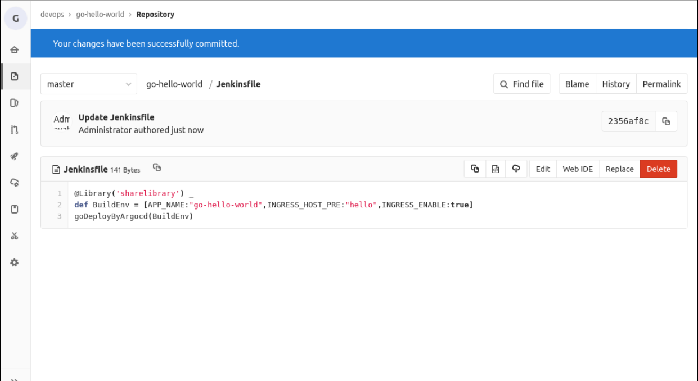

# 实验介绍

我们在前面的章节里介绍了 Argocd，但是我们现在完成的流水线全都是基于 Jenkins 实现的。本次实验就带大家如何将 Jenkins 和 Argocd 结合起来，实现基于 GitOps 的持续部署。

#### 知识点

- Argocd
- Jenkins Pipeline
- Jenkins 共享库

# 整理 Helm Chart

在前面的实验中我们其实已经整理好了 Helm Charts，这里为什么还需要重新整理呢？

主要是因为之前我们都是把 Helm Charts 直接放到代码仓库的，而我们每次构建镜像都需要在代码仓库中修改镜像信息，如果继续把 Helm Charts 放到代码仓库中，就会让代码的版本发生变化，也就是 commit id 会变化，不利于维护代码仓库的原子性。

在 Gitlab 的 devops 组里创建一个 `argocd-charts` 仓库，如下：


我们在该项目下的代码存放规则是：**项目名/charts**

我们先把 `go-hello-world` 项目的 charts 放到该仓库来。

打开终端，使用以下命令操作：

```bash
cd /home/shiyanlou/Code
# 拉取 go-hello-world 代码
git clone http://10.111.127.141:30180/devops/go-hello-world.git
# 拉取 argocd-charts 代码
git clone http://10.111.127.141:30180/devops/argocd-charts.git
# 进入argocd-charts目录
cd argocd-charts
# 创建 go-hello-world/charts 目录
mkdir go-hello-world/charts -p
# 拷贝 go-hello-world 项目中的charts目录代码到 argocd-charts中
cd /home/shiyanlou/Code
cp -r go-hello-world/deploy/charts/* argocd-charts/go-hello-world/charts
# 将argocd-charts中更新的代码推送到Gitlab
cd argocd-charts
git add .
git commit -m "add go-hello-world helm charts"
git push
```

然后在 `argocd-charts` 项目中创建 `go-hello-world/charts/dev.values.yaml` 文件，写入以下内容：

```yaml
image:
  repository: "10.111.127.141:30002/dev/go-hello-world"
  tag: "20220815150523_8"
containers:
  port: 8080
  healthCheck:
    enabled: true
    path: /health
ingress:
  enabled: true
  hosts:
    - host: hello.dev.devops.com
      paths:
        - path: /
          pathType: ImplementationSpecific
```

这是开发环境的 `go-hello-world` 应用的 values 配置。

> PS: 镜像地址和镜像 Tag 根据实际情况调整。

# 开发 Pipeline

我们在之前的实验中已经开发完多分支版本自动发布，今天的实验我们在此基础上进行修改，先看看原来的流水线代码，如下：

```groovy
def call(params){

def tools = new org.devops.tools()

pipeline {
  agent {
        kubernetes {
            label "jenkins-slave-${UUID.randomUUID().toString()}"
            yaml """
apiVersion: v1
kind: Pod
spec:
  containers:
  - name: golang
    image: registry.cn-hangzhou.aliyuncs.com/coolops/golang:1.18.5
    command: ['cat']
    tty: true
  - name: docker
    image: registry.cn-hangzhou.aliyuncs.com/coolops/docker:19.03.11
    command: ['cat']
    tty: true
    volumeMounts:
      - name: indocker
        mountPath: /var/run/docker.sock
  - name: helm
    image: registry.cn-hangzhou.aliyuncs.com/coolops/helm-kubectl:3.2.4
    command: ['cat']
    tty: true
    volumeMounts:
      - name: kubeconfig
        mountPath: /root/.kube
  volumes:
    - name: indocker
      hostPath:
        path: "/var/run/docker.sock"
    - name: kubeconfig
      hostPath:
        path: "/home/shiyanlou/.kube"
"""
        }
    }

    environment{
        APP_NAME = "${params.APP_NAME}"
        INGRESS_HOST_PRE = "${params.INGRESS_HOST_PRE}"
        INGRESS_ENABLE = "${params.INGRESS_ENABLE? params.INGRESS_ENABLE :false}"
        IMAGE_REPO = ""
        IMAGE_TAG = ""
        HELM_COMMON_ARGS= "--set ingress.enabled=$INGRESS_ENABLE \
                           --set containers.port=8080 \
                           --set containers.healthCheak.path=/health \
                           --set ingress.hosts[0].paths[0].path=/ \
                           --set ingress.hosts[0].paths[0].pathType=ImplementationSpecific deploy/charts/ "
    }

    triggers {
        GenericTrigger(
        genericVariables: [
        [key: 'ref', value: '$.ref']
        ],
        causeString: 'Triggered on $ref',
        token: 'go-hello-world',
        printContributedVariables: true,
        printPostContent: true,
        silentResponse: false,
        regexpFilterText: '$ref',
        regexpFilterExpression: 'refs/heads/(dev|test|uat|pre|prod)'
        )
    }

    stages {
        stage('Get Code') {
            steps {
                checkout(scm)
            }
        }

        stage('Get Image Repo') {
            steps {
                script{
                    BRANCH = ref - "refs/heads/"
                    IMAGE_REPO = "10.111.127.141:30002/${BRANCH}/${APP_NAME}"
                }
            }
        }

        stage('Build Code') {
            steps {
                container('golang'){
                    script{
                        sh '''
                            export GOPROXY=https://goproxy.cn
                            export GOOS=linux
                            export GOARCH=386
                            go mod tidy
                            go build -v -o ./${APP_NAME}
                        '''
                    }
                }
            }
        }
        stage('Build And Push Image') {
            steps {
                container('docker'){
                    script{

                        IMAGE_TAG = tools.createImageTag()
                        sh """
                            docker login 10.111.127.141:30002 -u admin -p Harbor12345
                            docker build -t ${IMAGE_REPO}:${IMAGE_TAG} -f Dockerfile .
                            docker push ${IMAGE_REPO}:${IMAGE_TAG}
                        """
                    }
                }
            }
        }
        stage('Deploy TO DEV'){
            when {
                expression { ref ==~ 'refs/heads/dev' }
                }
            environment{
                NAMESPACE = 'dev'
                INGRESS_HOST="${INGRESS_HOST_PRE}.dev.devops.com"
                HELM_COMMON_ARGS = "${HELM_COMMON_ARGS} --set ingress.hosts[0].host=$INGRESS_HOST --set image.repository=$IMAGE_REPO --set image.tag=$IMAGE_TAG"
            }
            steps{
                container('helm'){
                    script{
                        setupHelm()
                    }
                }
            }
        }
        stage('Deploy TO TEST'){
            when {
                expression { ref ==~ 'refs/heads/test' }
                }
            environment{
                NAMESPACE = 'test'
                INGRESS_HOST="${INGRESS_HOST_PRE}.test.devops.com"
                HELM_COMMON_ARGS = "${HELM_COMMON_ARGS} --set ingress.hosts[0].host=$INGRESS_HOST --set image.repository=$IMAGE_REPO --set image.tag=$IMAGE_TAG"
            }
            steps{
                container('helm'){
                    script{
                        setupHelm()
                    }
                }
            }
        }
        stage('Deploy TO UAT'){
            when {
                expression { ref ==~ 'refs/heads/uat' }
                }
            environment{
                NAMESPACE = 'uat'
                INGRESS_HOST="${INGRESS_HOST_PRE}.uat.devops.com"
                HELM_COMMON_ARGS = "${HELM_COMMON_ARGS} --set ingress.hosts[0].host=$INGRESS_HOST --set image.repository=$IMAGE_REPO --set image.tag=$IMAGE_TAG"
            }
            steps{
                container('helm'){
                    script{
                        setupHelm()
                    }
                }
            }
        }
        stage('Deploy TO PRE'){
            when {
                expression { ref ==~ 'refs/heads/pre' }
                }
            environment{
                NAMESPACE = 'pre'
                INGRESS_HOST="${INGRESS_HOST_PRE}.pre.devops.com"
                HELM_COMMON_ARGS = "${HELM_COMMON_ARGS} --set ingress.hosts[0].host=$INGRESS_HOST --set image.repository=$IMAGE_REPO --set image.tag=$IMAGE_TAG"
            }
            steps{
                container('helm'){
                    script{
                        setupHelm()
                    }
                }
            }
        }
        stage('Deploy TO PROD'){
            when {
                expression { ref ==~ 'refs/heads/prod' }
                }
            environment{
                NAMESPACE = 'prod'
                INGRESS_HOST="${INGRESS_HOST_PRE}.devops.com"
                HELM_COMMON_ARGS = "${HELM_COMMON_ARGS} --set ingress.hosts[0].host=$INGRESS_HOST --set image.repository=$IMAGE_REPO --set image.tag=$IMAGE_TAG"
            }
            steps{
                container('helm'){
                    script{
                        setupHelm()
                    }
                }
            }
        }
    }
}
}
```

整个流水线的流程是：拉代码->编译->构建->部署，如果要用 Argocd，我们要改变的只有最后一步 `部署`，我们不再把它直接部署到 Kubernetes 中，而是修改 Gitlab 中 `argocd-charts` 项目中的配置，然后由 Argocd 同步该仓库的配置进行部署。

那我们整个流程就变成如下：


- 拉代码
- 编译构建，构建镜像并推送
- 更改 helm chart 的 value.yaml 中的镜像信息，推送到仓库
- argocd 监控到 chart 仓库变化，更新应用

我们的 values.yaml 文件中都 YAML 格式的，我们可以直接使用 `yq` 命令来进行修改。所以我们部署的 stage 可以变成如下：

```groovy
        stage('Deploy TO DEV'){
            when {
                expression { ref ==~ 'refs/heads/dev' }
                }
            steps{
                container('yq'){
                    script{
                        sh """
                        git remote set-url origin http://${GIT_USERNAME}:${GIT_PASSWORD}@${ARGOCD_CHARTS_URL}
                        git config --global user.name "${GIT_NAME}"
                        git config --global user.email "${GIT_EMAIL}"
                        git clone http://${GIT_USERNAME}:${GIT_PASSWORD}@${ARGOCD_CHARTS_URL} /opt/devops-cd
                        cd /opt/devops-cd/${APP_NAME}/charts
                        git pull
                        yq w --inplace dev.values.yaml 'image.repository' "${IMAGE_REPO}"
                        yq w --inplace dev.values.yaml 'image.tag' "${IMAGE_TAG}"
                        git commit -am '${APP_NAME} image update'
                        git push
                        """
                    }
                }
            }
        }
        stage('Deploy TO TEST'){
            when {
                expression { ref ==~ 'refs/heads/test' }
                }
            steps{
                container('yq'){
                    script{
                        sh """
                        git remote set-url origin http://${GIT_USERNAME}:${GIT_PASSWORD}@${ARGOCD_CHARTS_URL}
                        git config --global user.name "${GIT_NAME}"
                        git config --global user.email "${GIT_EMAIL}"
                        git clone http://${GIT_USERNAME}:${GIT_PASSWORD}@${ARGOCD_CHARTS_URL} /opt/devops-cd
                        cd /opt/devops-cd/${APP_NAME}/charts
                        git pull
                        yq w --inplace test.values.yaml 'image.repository' "${IMAGE_REPO}"
                        yq w --inplace test.values.yaml 'image.tag' "${IMAGE_TAG}"
                        git commit -am '${APP_NAME} image update'
                        git push
                        """
                    }
                }
            }
        }
        stage('Deploy TO UAT'){
            when {
                expression { ref ==~ 'refs/heads/uat' }
                }
            steps{
                container('yq'){
                    script{
                        sh """
                        git remote set-url origin http://${GIT_USERNAME}:${GIT_PASSWORD}@${ARGOCD_CHARTS_URL}
                        git config --global user.name "${GIT_NAME}"
                        git config --global user.email "${GIT_EMAIL}"
                        git clone http://${GIT_USERNAME}:${GIT_PASSWORD}@${ARGOCD_CHARTS_URL} /opt/devops-cd
                        cd /opt/devops-cd/${APP_NAME}/charts
                        git pull
                        yq w --inplace uat.values.yaml 'image.repository' "${IMAGE_REPO}"
                        yq w --inplace uat.values.yaml 'image.tag' "${IMAGE_TAG}"
                        git commit -am '${APP_NAME} image update'
                        git push
                        """
                    }
                }
            }
        }
        stage('Deploy TO PRE'){
            when {
                expression { ref ==~ 'refs/heads/pre' }
                }
            steps{
                container('yq'){
                    script{
                        sh """
                        git remote set-url origin http://${GIT_USERNAME}:${GIT_PASSWORD}@${ARGOCD_CHARTS_URL}
                        git config --global user.name "${GIT_NAME}"
                        git config --global user.email "${GIT_EMAIL}"
                        git clone http://${GIT_USERNAME}:${GIT_PASSWORD}@${ARGOCD_CHARTS_URL} /opt/devops-cd
                        cd /opt/devops-cd/${APP_NAME}/charts
                        git pull
                        yq w --inplace pre.values.yaml 'image.repository' "${IMAGE_REPO}"
                        yq w --inplace pre.values.yaml 'image.tag' "${IMAGE_TAG}"
                        git commit -am '${APP_NAME} image update'
                        git push
                        """
                    }
                }
            }
        }
        stage('Deploy TO PROD'){
            when {
                expression { ref ==~ 'refs/heads/prod' }
                }
            steps{
                container('yq'){
                    script{
                        sh """
                        git remote set-url origin http://${GIT_USERNAME}:${GIT_PASSWORD}@${ARGOCD_CHARTS_URL}
                        git config --global user.name "${GIT_NAME}"
                        git config --global user.email "${GIT_EMAIL}"
                        git clone http://${GIT_USERNAME}:${GIT_PASSWORD}@${ARGOCD_CHARTS_URL} /opt/devops-cd
                        cd /opt/devops-cd/${APP_NAME}/charts
                        git pull
                        yq w --inplace prod.values.yaml 'image.repository' "${IMAGE_REPO}"
                        yq w --inplace prod.values.yaml 'image.tag' "${IMAGE_TAG}"
                        git commit -am '${APP_NAME} image update'
                        git push
                        """
                    }
                }
            }
        }
```

但是，这个代码是不是糟糕透了，每个 stage 都有大量重复的代码，这会导致我们的流水线冗长、臃肿。

为此，我们就要把重复的代码给整合放到共享仓库里。在 Gitlab 的 `jenkins-sharelibrary` 共享仓库中创建 `vars/setupArgocd.groovy` 文件，内容如下：

```groovy
def call(){
    sh """
        git remote set-url origin http://${GIT_USERNAME}:${GIT_PASSWORD}@${ARGOCD_CHARTS_URL}
        git config --global user.name "${GIT_NAME}"
        git config --global user.email "${GIT_EMAIL}"
        git clone http://${GIT_USERNAME}:${GIT_PASSWORD}@${ARGOCD_CHARTS_URL} /opt/devops-cd
        cd /opt/devops-cd/${APP_NAME}/charts
        git pull
        yq w --inplace ${HELM_VALUES_NAME} 'image.repository' "${IMAGE_REPO}"
        yq w --inplace ${HELM_VALUES_NAME} 'image.tag' "${IMAGE_TAG}"
        git commit -am "${APP_NAME} image update"
        git push
    """
}
```


然后我们的部署 stage 就变成如下：

```groovy
        stage('Deploy TO DEV'){
            when {
                expression { ref ==~ 'refs/heads/dev' }
                }
            environment {
                HELM_VALUES_NAME = "dev.values.yaml"
            }
            steps{
                container('yq'){
                    script{
                        setupArgocd()
                    }
                }
            }
        }
        stage('Deploy TO TEST'){
            when {
                expression { ref ==~ 'refs/heads/test' }
                }
            environment {
                HELM_VALUES_NAME = "test.values.yaml"
            }
            steps{
                container('yq'){
                    script{
                        setupArgocd()
                    }
                }
            }
        }
        stage('Deploy TO UAT'){
            when {
                expression { ref ==~ 'refs/heads/uat' }
                }
            environment {
                HELM_VALUES_NAME = "uat.values.yaml"
            }
            steps{
                container('yq'){
                    script{
                        setupArgocd()
                    }
                }
            }
        }
        stage('Deploy TO PRE'){
            when {
                expression { ref ==~ 'refs/heads/pre' }
                }
            environment {
                HELM_VALUES_NAME = "pre.values.yaml"
            }
            steps{
                container('yq'){
                    script{
                        setupArgocd()
                    }
                }
            }
        }
        stage('Deploy TO PROD'){
            when {
                expression { ref ==~ 'refs/heads/prod' }
                }
            environment {
                HELM_VALUES_NAME = "prod.values.yaml"
            }
            steps{
                container('yq'){
                    script{
                        setupArgocd()
                    }
                }
            }
        }
```

最后，我们整个流水线如下：

```groovy
def call(params){

def tools = new org.devops.tools()

pipeline {
  agent {
        kubernetes {
            label "jenkins-slave-${UUID.randomUUID().toString()}"
            yaml """
apiVersion: v1
kind: Pod
spec:
  containers:
  - name: golang
    image: registry.cn-hangzhou.aliyuncs.com/coolops/golang:1.18.5
    command: ['cat']
    tty: true
  - name: docker
    image: registry.cn-hangzhou.aliyuncs.com/coolops/docker:19.03.11
    command: ['cat']
    tty: true
    volumeMounts:
      - name: indocker
        mountPath: /var/run/docker.sock
  - name: yq
    image: registry.cn-hangzhou.aliyuncs.com/coolops/helm-kubectl-curl-git-jq-yq:latest
    command: ['cat']
    tty: true
  volumes:
    - name: indocker
      hostPath:
        path: "/var/run/docker.sock"
"""
        }
    }

    environment{
        APP_NAME = "${params.APP_NAME}"
        INGRESS_HOST_PRE = "${params.INGRESS_HOST_PRE}"
        INGRESS_ENABLE = "${params.INGRESS_ENABLE? params.INGRESS_ENABLE :false}"
        IMAGE_REPO = ""
        IMAGE_TAG = ""
        GIT_USERNAME = "root"
        GIT_PASSWORD = "admin321"
        GIT_NAME = "joker"
        GIT_EMAIL = "joker@devops.com"
        ARGOCD_CHARTS_URL = "10.111.127.141:30180/devops/argocd-charts.git"

        // 镜像仓库配置
        REGISTRY_URL = "10.111.127.141:30002"
        REGISTRY_USERNAME = "admin"
        REGISTRY_PASSWORD = "Harbor12345"

        HELM_COMMON_ARGS= "--set ingress.enabled=$INGRESS_ENABLE \
                           --set containers.port=8080 \
                           --set containers.healthCheak.path=/health \
                           --set ingress.hosts[0].paths[0].path=/ \
                           --set ingress.hosts[0].paths[0].pathType=ImplementationSpecific deploy/charts/ "
    }

    triggers {
        GenericTrigger(
        genericVariables: [
        [key: 'ref', value: '$.ref']
        ],
        causeString: 'Triggered on $ref',
        token: 'go-hello-world',
        printContributedVariables: true,
        printPostContent: true,
        silentResponse: false,
        regexpFilterText: '$ref',
        regexpFilterExpression: 'refs/heads/(dev|test|uat|pre|prod)'
        )
    }

    stages {
        stage('Get Code') {
            steps {
                checkout(scm)
            }
        }

        stage('Get Image Repo') {
            steps {
                script{
                    BRANCH = ref - "refs/heads/"
                    IMAGE_REPO = "${REGISTRY_URL}/${BRANCH}/${APP_NAME}"
                }
            }
        }

        stage('Build Code') {
            steps {
                container('golang'){
                    script{
                        sh '''
                            export GOPROXY=https://goproxy.cn
                            export GOOS=linux
                            export GOARCH=386
                            go mod tidy
                            go build -v -o ./${APP_NAME}
                        '''
                    }
                }
            }
        }
        stage('Build And Push Image') {
            steps {
                container('docker'){
                    script{

                        IMAGE_TAG = tools.createImageTag()
                        sh """
                            docker login ${REGISTRY_URL} -u ${REGISTRY_USERNAME} -p ${REGISTRY_PASSWORD}
                            docker build -t ${IMAGE_REPO}:${IMAGE_TAG} -f Dockerfile .
                            docker push ${IMAGE_REPO}:${IMAGE_TAG}
                        """
                    }
                }
            }
        }
        stage('Deploy TO DEV'){
            when {
                expression { ref ==~ 'refs/heads/dev' }
                }
            environment {
                HELM_VALUES_NAME = "dev.values.yaml"
                IMAGE_REPO = "${IMAGE_REPO}"
                IMAGE_TAG = "${IMAGE_TAG}"
            }
            steps{
                container('yq'){
                    script{
                        setupArgocd()
                    }
                }
            }
        }
        stage('Deploy TO TEST'){
            when {
                expression { ref ==~ 'refs/heads/test' }
                }
            environment {
                HELM_VALUES_NAME = "test.values.yaml"
                IMAGE_REPO = "${IMAGE_REPO}"
                IMAGE_TAG = "${IMAGE_TAG}"
            }
            steps{
                container('yq'){
                    script{
                        setupArgocd()
                    }
                }
            }
        }
        stage('Deploy TO UAT'){
            when {
                expression { ref ==~ 'refs/heads/uat' }
                }
            environment {
                HELM_VALUES_NAME = "uat.values.yaml"
                IMAGE_REPO = "${IMAGE_REPO}"
                IMAGE_TAG = "${IMAGE_TAG}"
            }
            steps{
                container('yq'){
                    script{
                        setupArgocd()
                    }
                }
            }
        }
        stage('Deploy TO PRE'){
            when {
                expression { ref ==~ 'refs/heads/pre' }
                }
            environment {
                HELM_VALUES_NAME = "pre.values.yaml"
                IMAGE_REPO = "${IMAGE_REPO}"
                IMAGE_TAG = "${IMAGE_TAG}"
            }
            steps{
                container('yq'){
                    script{
                        setupArgocd()
                    }
                }
            }
        }
        stage('Deploy TO PROD'){
            when {
                expression { ref ==~ 'refs/heads/prod' }
                }
            environment {
                HELM_VALUES_NAME = "prod.values.yaml"
                IMAGE_REPO = "${IMAGE_REPO}"
                IMAGE_TAG = "${IMAGE_TAG}"
            }
            steps{
                container('yq'){
                    script{
                        setupArgocd()
                    }
                }
            }
        }
    }
}
}
```

然后把上面的内容保存到 Gitlab 的 `jenkins-sharelibrary` 共享仓库的 `vars/goDeployByArgocd.groovy` 文件中，如下：


然后把 `go-hello-world` 项目中的 Jenkinsfile 改成如下：

```groovy
@Library('sharelibrary') _
def BuildEnv = [APP_NAME:"go-hello-world",INGRESS_HOST_PRE:"hello",INGRESS_ENABLE:true]
goDeployByArgocd(BuildEnv)
```




# 在Argocd上部署应用

首先，在 Argocd 的 `settings` -> `repositories` 中增加仓库，如下：


配置 `argocd-charts` 代码仓库信息，如下：


然后创建应用，我们直接在 Argocd UI 上进行创建。

- 点击 `New APP` 创建应用


- 输入配置信息


然后点击保存。


# 测试

测试之前，先把 `jenkins-sharelibrary` 中 的 `tools.groovy` 的 Tag 生成标准改一下，如下：


在后面加一个 `_devops` 字符串，如果全是数字，推送到 Gitlab 上过后会变成 Long int 类型，改变了 Tag 本身。

然后再到 `go-hello-world` 项目的 dev 分支随便修改点内容提交，观察 Jenkins 上流水线运行是否正常，如下表示正常：


在 Argocd 上观察应用部署也是正常，如下：


> PS: 在 Argocd 上看到应用一直有转圈，这是因为咱们有 Ingress，而且这个 Ingress 的 status 状态的 IP 是空的，Argocd 校验不通过，但是并不影响使用。


# 实验总结

本次实验带大家从以 Jenkins 为中心的 CICD 拆分成以 Jenkins+argocd 为中心的 CICD，做完本次实验，你将知道应该在什么位置进行拆分，在什么情况下使用 Jenkins 共享库。

不过，上面的流水线还不是最优的，比如我们大量的使用明文信息，这将是非常不安全的，有没有什么办法规避呢？大家可以思考一下。

