# 实验介绍


我们在上一章节中已经完成以 Jenkins 和 Argocd 为中心的持续交付，但是现在整个应用的发布还只是滚动更新，那如何进行灰度发布呢？

比较直白的方式是手动去维护另外一套应用，包括 Ingress、Service 以及 Deployment，然后通过切换的方式完成灰度发布，我们这里不采用这种方式，而是用在之前介绍的 Argo rollouts 来实现灰度发布。

#### 知识点

- argo rollouts
- argocd
- jenkins pipeline
- helm charts

# 开发 Helm Charts


我们已经知道，如果要使用 Argo rollouts 就需要使用 Rollout controller，而不是 Deployment Controller，所以我们需要重新开发 Helm Charts。

在 `/home/shiyanlou/Code/devops` 下创建一个 `sy-04-3` 目录，命令如下：

```bash
mkdir /home/shiyanlou/Code/devops/sy-04-3
cd /home/shiyanlou/Code/devops/sy-04-3
```

使用 `helm create argocd-rollout-charts`，如下：


进入 `templates` 目录创建一个 `rollout.yaml` 文件，写入以下内容：

```yaml
apiVersion: argoproj.io/v1alpha1
kind: Rollout
metadata:
  name: {{ .Release.Name }}
spec:
  replicas: {{ .Values.replicaCount }}
  strategy:
    canary:
      {{- if .Values.rollout.canary.nginx.enabled }}
        canaryService: {{ .Release.Name }}-canary
        stableService: {{ .Release.Name }}-stable
        trafficRouting:
          nginx:
            stableIngress: {{ .Release.Name }}-stable
      {{- end}}
        steps:
        - setWeight: 20
        - pause: {}
        - setWeight: 40
        - pause: { duration: 10 }
        - setWeight: 80
        - pause: { duration: 10 }
  revisionHistoryLimit: {{ .Values.rollout.revisionHistoryLimit }}
  selector:
    matchLabels:
      {{- include "argocd-rollout-charts.selectorLabels" . | nindent 6 }}
  template:
    metadata:
      {{- with .Values.podAnnotations }}
      annotations:
        {{- toYaml .Values.podAnnotations }}
      {{- end }}
      labels:
        {{- include "argocd-rollout-charts.selectorLabels" . | nindent 8 }}
    spec:
      {{- with .Values.imagePullSecrets }}
      imagePullSecrets:
        {{- toYaml . | nindent 8 }}
      {{- end}}
      serviceAccountName: {{ include "argocd-rollout-charts.serviceAccountName" . }}
      securityContext:
        {{- toYaml .Values.podSecurityContext | nindent 8 }}
      containers:
        - name: {{ .Release.Name }}
          securityContext:
            {{- toYaml .Values.podSecurityContext | nindent 12 }}
          image: "{{ .Values.image.repository }}:{{ .Values.image.tag | default .Chart.AppVersion }}"
          imagePullPolicy: {{ .Values.image.pullPolicy }}
          ports:
            - name: http
              containerPort: {{ .Values.containers.port }}
              protocol: TCP
          {{- if .Values.containers.healthCheck.enabled}}
          livenessProbe:
            httpGet:
              path: {{ .Values.containers.healthCheck.path }}
              port: http
          readinessProbe:
            httpGet:
              path: {{ .Values.containers.healthCheck.path }}
              port: http
          {{- end}}
          resources:
            {{- toYaml .Values.resources | nindent 12 }}
      {{- with .Values.nodeSelector }}
      nodeSelector:
        {{- toYaml . | nindent 8 }}
      {{- end }}
      {{- with .Values.affinity }}
      affinity:
        {{- toYaml . | nindent 8 }}
      {{- end }}
      {{- with .Values.tolerations }}
      tolerations:
        {{- toYaml . | nindent 8 }}
      {{- end }}
```

删除该目录下的 `deploymeny.yaml`，命令如下：

```bash
rm -f deployment.yaml
```

再将下面的内容覆盖原来 `service.yaml` 里的内容：

```yaml
apiVersion: v1
kind: Service
metadata:
  name: {{ .Release.Name }}-canary
  labels:
    {{- include "argocd-rollout-charts.labels" . | nindent 4 }}
spec:
  type: {{ .Values.service.type }}
  ports:
    - port: {{ .Values.service.port }}
      targetPort: http
      protocol: TCP
      name: http
  selector:
    {{- include "argocd-rollout-charts.selectorLabels" . | nindent 4 }}
---
apiVersion: v1
kind: Service
metadata:
  name: {{ .Release.Name }}-stable
  labels:
    {{- include "argocd-rollout-charts.labels" . | nindent 4 }}
spec:
  type: {{ .Values.service.type }}
  ports:
    - port: {{ .Values.service.port }}
      targetPort: http
      protocol: TCP
      name: http
  selector:
    {{- include "argocd-rollout-charts.selectorLabels" . | nindent 4 }}
```

再将下面的内容覆盖原来 `ingress.yaml` 里的内容：

```yaml
{{- if .Values.ingress.enabled -}}
{{- $fullName := .Release.Name -}}
{{- $svcPort := .Values.service.port -}}
{{- if and .Values.ingress.className (not (semverCompare ">=1.18-0" .Capabilities.KubeVersion.GitVersion)) }}
  {{- if not (hasKey .Values.ingress.annotations "kubernetes.io/ingress.class") }}
  {{- $_ := set .Values.ingress.annotations "kubernetes.io/ingress.class" .Values.ingress.className}}
  {{- end }}
{{- end }}
{{- if semverCompare ">=1.19-0" .Capabilities.KubeVersion.GitVersion -}}
apiVersion: networking.k8s.io/v1
{{- else if semverCompare ">=1.14-0" .Capabilities.KubeVersion.GitVersion -}}
apiVersion: networking.k8s.io/v1beta1
{{- else -}}
apiVersion: extensions/v1beta1
{{- end }}
kind: Ingress
metadata:
  name: {{ $fullName }}-stable
  labels:
    {{- include "argocd-rollout-charts.labels" . | nindent 4 }}
  {{- with .Values.ingress.annotations }}
  annotations:
    {{- toYaml . | nindent 4 }}
  {{- end }}
spec:
  {{- if and .Values.ingress.className (semverCompare ">=1.18-0" .Capabilities.KubeVersion.GitVersion) }}
  ingressClassName: {{ .Values.ingress.className }}
  {{- end }}
  {{- if .Values.ingress.tls }}
  tls:
    {{- range .Values.ingress.tls }}
    - hosts:
        {{- range .hosts }}
        - {{ . | quote }}
        {{- end }}
      secretName: {{ .secretName }}
    {{- end }}
  {{- end }}
  rules:
    {{- range .Values.ingress.hosts }}
    - host: {{ .host | quote }}
      http:
        paths:
          {{- range .paths }}
          - path: {{ .path }}
            {{- if and .pathType (semverCompare ">=1.18-0" $.Capabilities.KubeVersion.GitVersion) }}
            pathType: {{ .pathType }}
            {{- end }}
            backend:
              {{- if semverCompare ">=1.19-0" $.Capabilities.KubeVersion.GitVersion }}
              service:
                name: {{ $fullName }}-stable
                port:
                  number: {{ $svcPort }}
              {{- else }}
              serviceName: {{ $fullName }}-stable
              servicePort: {{ $svcPort }}
              {{- end }}
          {{- end }}
    {{- end }}
{{- end }}
```

最后在 `values.yaml` 里增加以下内容：

```yaml
rollout:
  canary:
    nginx:
      enabled: true
  revisionHistoryLimit: 3
containers:
  port: 80
  healthCheck:
    enabled: true
    path: /
```

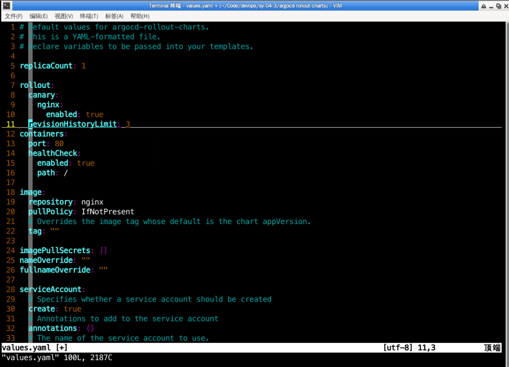

先使用该 Helm Charts 安装测试，看看开发的 Helm Charts 是否有问题，命令如下：

```bash
cd /home/shiyanlou/Code/devops/sy-04-3/argocd-rollout-charts
helm upgrade --install nginx-rollout --set ingress.enabled=true --set replicaCount=4 .
```


然后看看 Service、Ingress、Pod 是否正常启动，如下：

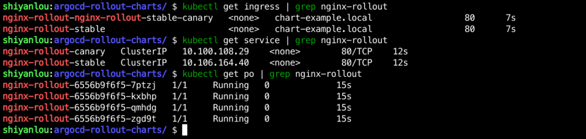

使用 `kubectl argo rollouts get rollout nginx-rollout` 查看状态，如下：

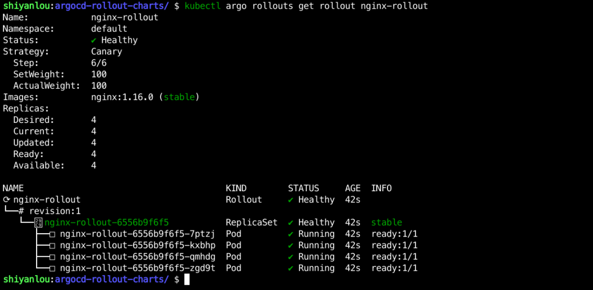

然后使用 `kubectl argo rollouts set image nginx-rollout nginx-rollout=nginx:1.8` 更新应用，从下图可以看到能够正常更新：

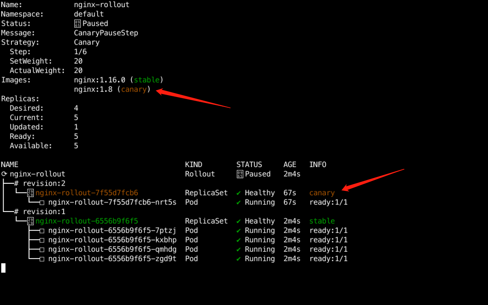

然后将其放到 Gitlab `argocd-charts` 的 `argocd-rollous-charts/go-hello-world/charts` 目录中，如下：

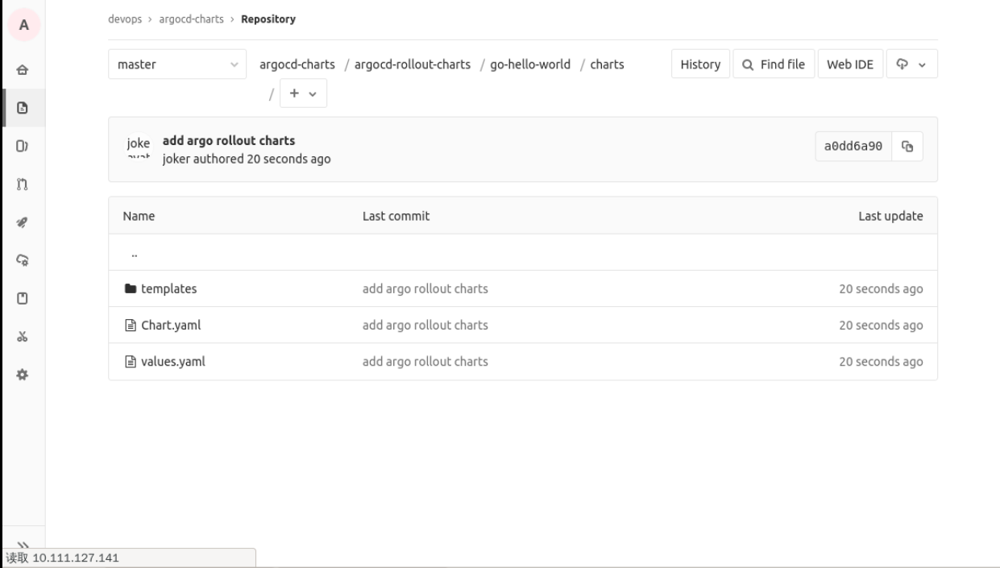

然后在该目录下创建 `dev.values.yaml`，内容如下：

```yaml
replicaCount: 4
image:
  repository: "10.111.127.141:30002/dev/go-hello-world"
  tag: "20220815150523_8"
rollout:
  canary:
    nginx:
      enabled: true
  revisionHistoryLimit: 3
containers:
  port: 8080
  healthCheck:
    enabled: true
    path: /health
ingress:
  enabled: true
  hosts:
    - host: hello-rollout.dev.devops.com
      paths:
        - path: /
          pathType: ImplementationSpecific
```

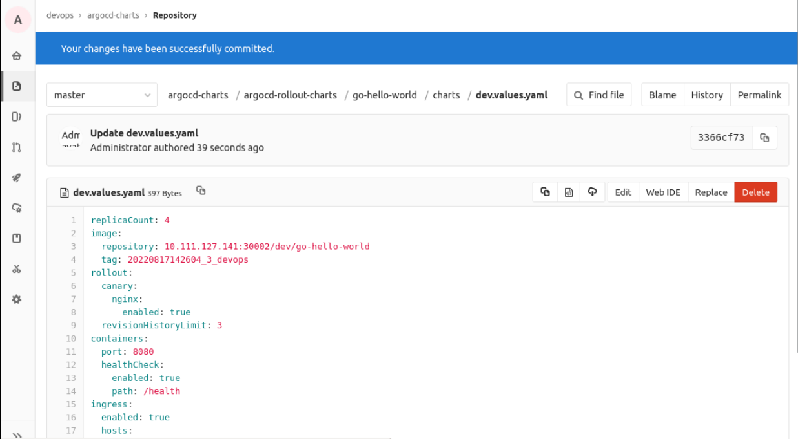

> PS: 镜像仓库地址和镜像 Tag 根据实际情况调整。


# 在 Argocd 上创建应用


- 添加仓库信息，如下：

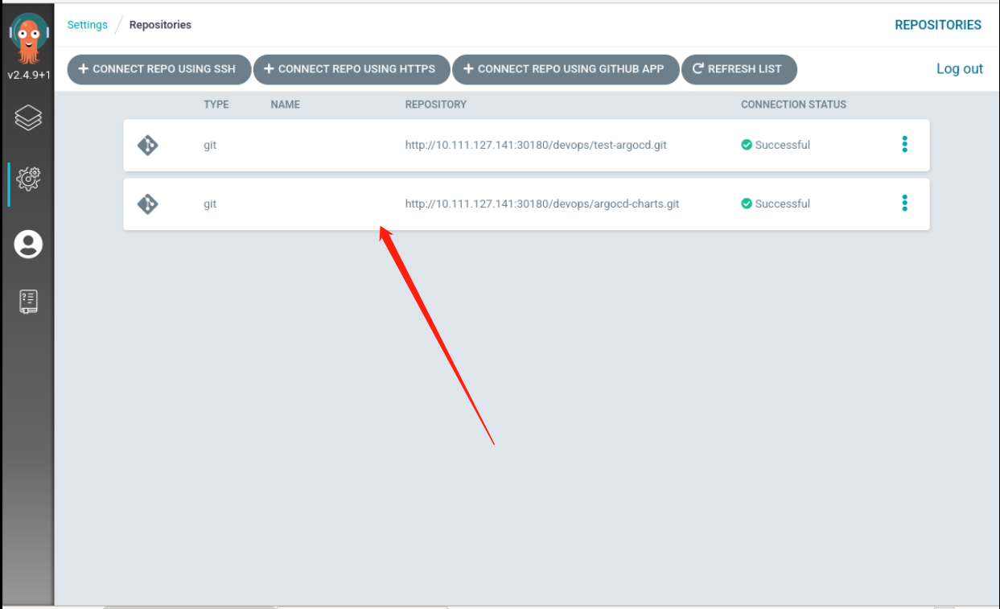

- 创建应用

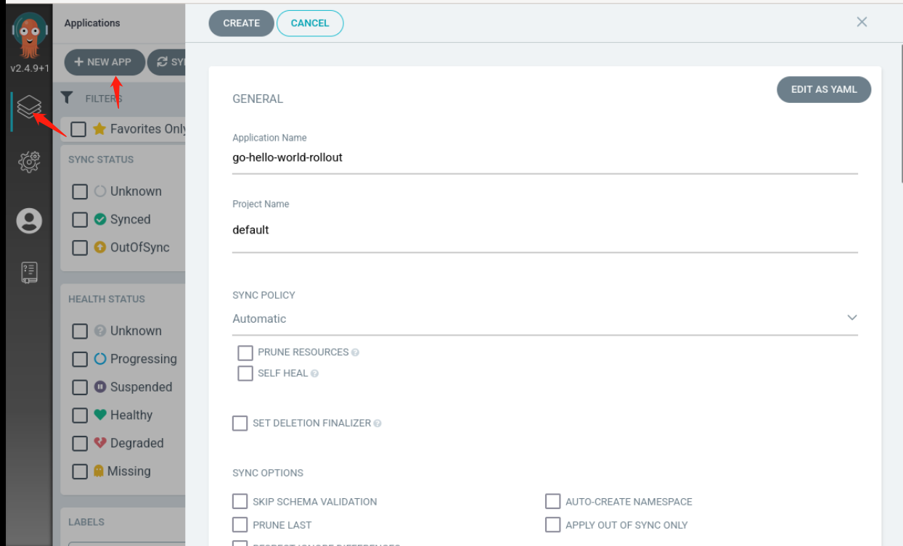

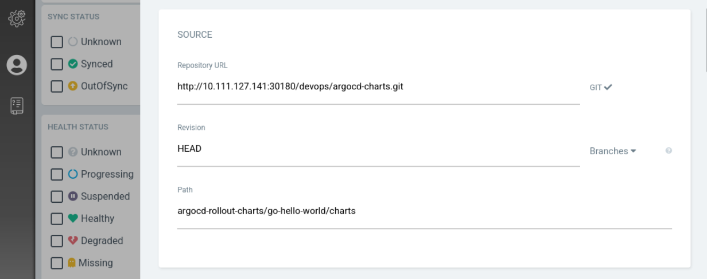

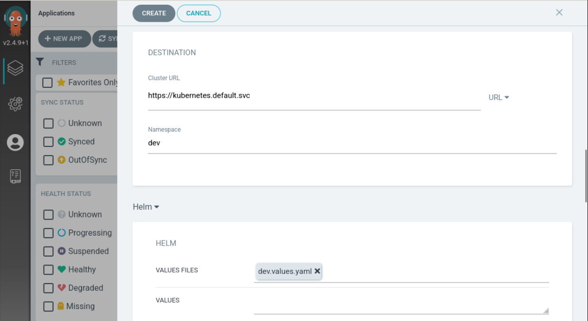

然后点击创建，即完成应用的创建。可以看到部署的信息 如下：

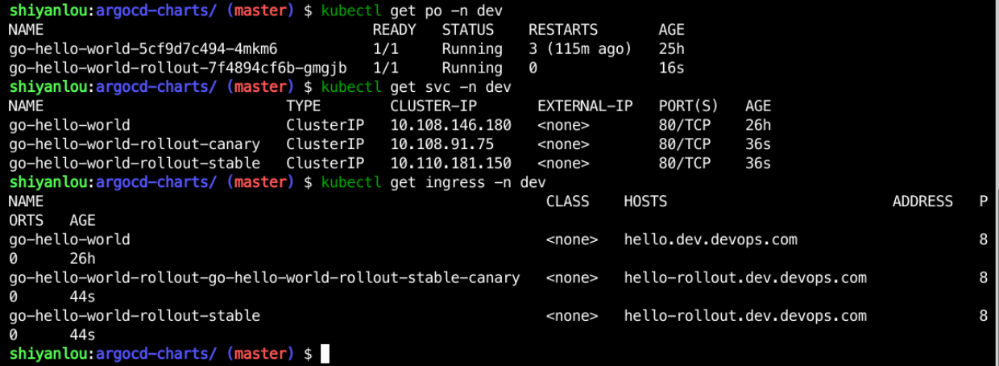

在 Argocd 上看到的信息如下：


# 在 Jenkins 上创建流水线


我们在上一个章节中使用的是自动触发流水线进行构建，在本次实验我们改一下，改成手动选择分支进行构建，为此我们需要对流水线进行改造：

- 需要传入分支参数
- 拉取的代码要按分支进行拉取

分支通过参数传递进去，代码如下：

```groovy
    parameters {
        choice(description: '请选择分支',  name: 'branch', choices: ['dev', 'test','uat','pre','prod'])
    }
```

拉取代码按分支进行拉取，代码如下：

```groovy
 checkout([$class: 'GitSCM', branches: [[name: "${branch}"]], doGenerateSubmoduleConfigurations: false, extensions: [], submoduleCfg: [], userRemoteConfigs: [[credentialsId: 'gitlab', url: "${GITLAB_URL}"]]])
```

所以我们整个流水线改成如下：

```groovy
def call(params){

def tools = new org.devops.tools()

pipeline {
  agent {
        kubernetes {
            label "jenkins-slave-${UUID.randomUUID().toString()}"
            yaml """
apiVersion: v1
kind: Pod
spec:
  containers:
  - name: golang
    image: registry.cn-hangzhou.aliyuncs.com/coolops/golang:1.18.5
    command: ['cat']
    tty: true
  - name: docker
    image: registry.cn-hangzhou.aliyuncs.com/coolops/docker:19.03.11
    command: ['cat']
    tty: true
    volumeMounts:
      - name: indocker
        mountPath: /var/run/docker.sock
  - name: yq
    image: registry.cn-hangzhou.aliyuncs.com/coolops/helm-kubectl-curl-git-jq-yq:latest
    command: ['cat']
    tty: true
  volumes:
    - name: indocker
      hostPath:
        path: "/var/run/docker.sock"
"""
        }
    }

    environment{
        APP_NAME = "${params.APP_NAME}"
        GITLAB_URL = "${params.GITLAB_URL}"
        INGRESS_HOST_PRE = "${params.INGRESS_HOST_PRE}"
        INGRESS_ENABLE = "${params.INGRESS_ENABLE? params.INGRESS_ENABLE :false}"
        IMAGE_REPO = ""
        IMAGE_TAG = ""
        GIT_USERNAME = "root"
        GIT_PASSWORD = "admin321"
        GIT_NAME = "joker"
        GIT_EMAIL = "joker@devops.com"
        ARGOCD_CHARTS_URL = "10.111.127.141:30180/devops/argocd-charts.git"

        // 镜像仓库配置
        REGISTRY_URL = "10.111.127.141:30002"
        REGISTRY_USERNAME = "admin"
        REGISTRY_PASSWORD = "Harbor12345"

        HELM_COMMON_ARGS= "--set ingress.enabled=$INGRESS_ENABLE \
                           --set containers.port=8080 \
                           --set containers.healthCheak.path=/health \
                           --set ingress.hosts[0].paths[0].path=/ \
                           --set ingress.hosts[0].paths[0].pathType=ImplementationSpecific deploy/charts/ "
    }

    parameters {
        choice(description: '请选择分支',  name: 'branch', choices: ['dev', 'test','uat','pre','prod'])
    }

    stages {
        stage('Get Code') {
            steps {
                checkout([$class: 'GitSCM', branches: [[name: "${branch}"]], doGenerateSubmoduleConfigurations: false, extensions: [], submoduleCfg: [], userRemoteConfigs: [[credentialsId: 'gitlab', url: "${GITLAB_URL}"]]])
            }
        }

        stage('Get Image Repo') {
            steps {
                script{
                    BRANCH = "${branch}"
                    IMAGE_REPO = "${REGISTRY_URL}/${BRANCH}/${APP_NAME}"
                }
            }
        }

        stage('Build Code') {
            steps {
                container('golang'){
                    script{
                        sh '''
                            export GOPROXY=https://goproxy.cn
                            export GOOS=linux
                            export GOARCH=386
                            go mod tidy
                            go build -v -o ./${APP_NAME}
                        '''
                    }
                }
            }
        }
        stage('Build And Push Image') {
            steps {
                container('docker'){
                    script{

                        IMAGE_TAG = tools.createImageTag()
                        sh """
                            docker login ${REGISTRY_URL} -u ${REGISTRY_USERNAME} -p ${REGISTRY_PASSWORD}
                            docker build -t ${IMAGE_REPO}:${IMAGE_TAG} -f Dockerfile .
                            docker push ${IMAGE_REPO}:${IMAGE_TAG}
                        """
                    }
                }
            }
        }
        stage('Deploy TO DEV'){
            when {
                expression { branch ==~ 'dev' }
                }
            environment {
                HELM_VALUES_NAME = "dev.values.yaml"
                IMAGE_REPO = "${IMAGE_REPO}"
                IMAGE_TAG = "${IMAGE_TAG}"
            }
            steps{
                container('yq'){
                    script{
                        setupRolloutArgocd()
                    }
                }
            }
        }
        stage('Deploy TO TEST'){
            when {
                expression { branch ==~ 'test' }
                }
            environment {
                HELM_VALUES_NAME = "test.values.yaml"
                IMAGE_REPO = "${IMAGE_REPO}"
                IMAGE_TAG = "${IMAGE_TAG}"
            }
            steps{
                container('yq'){
                    script{
                        setupRolloutArgocd()
                    }
                }
            }
        }
        stage('Deploy TO UAT'){
            when {
                expression { branch ==~ 'uat' }
                }
            environment {
                HELM_VALUES_NAME = "uat.values.yaml"
                IMAGE_REPO = "${IMAGE_REPO}"
                IMAGE_TAG = "${IMAGE_TAG}"
            }
            steps{
                container('yq'){
                    script{
                        setupRolloutArgocd()
                    }
                }
            }
        }
        stage('Deploy TO PRE'){
            when {
                expression { branch ==~ 'pre' }
                }
            environment {
                HELM_VALUES_NAME = "pre.values.yaml"
                IMAGE_REPO = "${IMAGE_REPO}"
                IMAGE_TAG = "${IMAGE_TAG}"
            }
            steps{
                container('yq'){
                    script{
                        setupRolloutArgocd()
                    }
                }
            }
        }
        stage('Deploy TO PROD'){
            when {
                expression { branch ==~ 'prod' }
                }
            environment {
                HELM_VALUES_NAME = "prod.values.yaml"
                IMAGE_REPO = "${IMAGE_REPO}"
                IMAGE_TAG = "${IMAGE_TAG}"
            }
            steps{
                container('yq'){
                    script{
                        setupRolloutArgocd()
                    }
                }
            }
        }
    }
}
}
```

然后将其保存到 Jenkins 共享库 `jenkins-sharelibrary` 的 `vars/goDeployByArgoRollout.groovy` 文件中，如下：

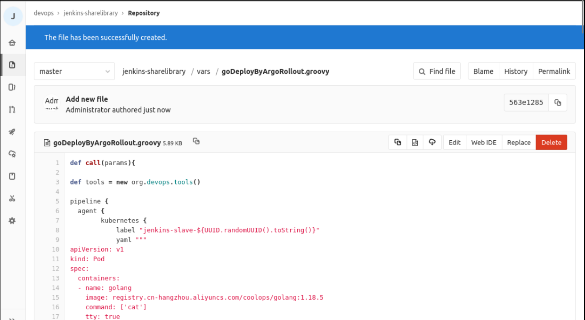

再在共享库中创建 `vars/setupRolloutArgocd.groovy`，保存以下内容：

```groovy
def call(){
    sh """
        git remote set-url origin http://${GIT_USERNAME}:${GIT_PASSWORD}@${ARGOCD_CHARTS_URL}
        git config --global user.name "${GIT_NAME}"
        git config --global user.email "${GIT_EMAIL}"
        git clone http://${GIT_USERNAME}:${GIT_PASSWORD}@${ARGOCD_CHARTS_URL} /opt/devops-cd
        cd /opt/devops-cd/argocd-rollout-charts/${APP_NAME}/charts
        git pull
        yq w --inplace ${HELM_VALUES_NAME} 'image.repository' "${IMAGE_REPO}"
        yq w --inplace ${HELM_VALUES_NAME} 'image.tag' "${IMAGE_TAG}"
        git commit -am "${APP_NAME} image update"
        git push
    """
}
```

> PS: setupRolloutArgocd 和 setupArgocd 两个方法里的内容简直一模一样，只有一个小的路径差别，其实完全可以合成一个，我这里为了方便就重新创建了一个，你们可以考虑下怎么整合成一个方法。

在 Gitlab 的 `go-hello-world` 项目的 master 分支中创建一个 `rollout.Jenkinsfile`，写入以下内容：

```groovy
@Library('sharelibrary') _
def BuildEnv = [APP_NAME:"go-hello-world",INGRESS_HOST_PRE:"hello",INGRESS_ENABLE:true,GITLAB_URL:"http://10.111.127.141:30180/devops/go-hello-world.git"]
goDeployByArgoRollout(BuildEnv)
```

在 Jenkins 上创建 `go-hello-world-rollout` 项目，配置如下：

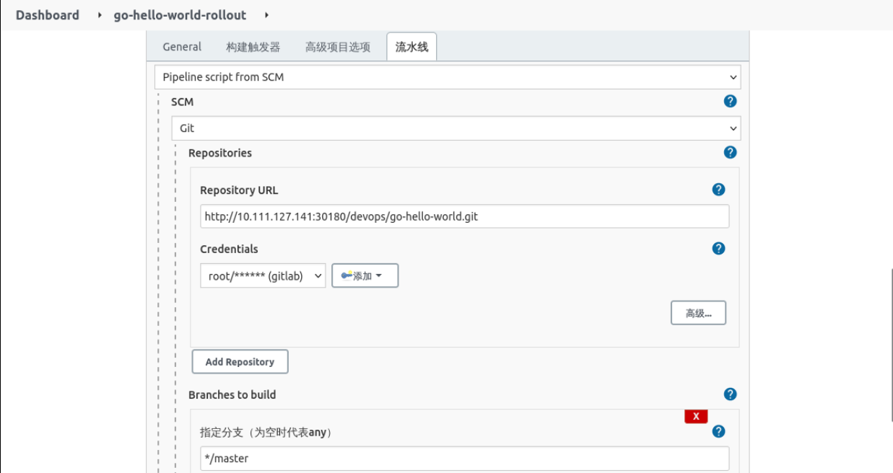


> PS: 注意脚本路径不再是 Jenkinsfile，而是 rollout.Jenkinsfile。

然后保存退出，先执行一次，让 Jenkins 完成配置参数的加载，如下：

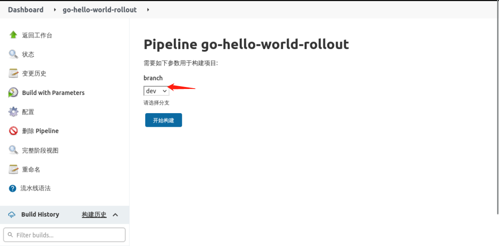

然后再执行流水线，选择 `dev` 分支，查看 Jenkins 日志是否正确。

- 首先查看是否拉取的是 `dev` 分支的代码

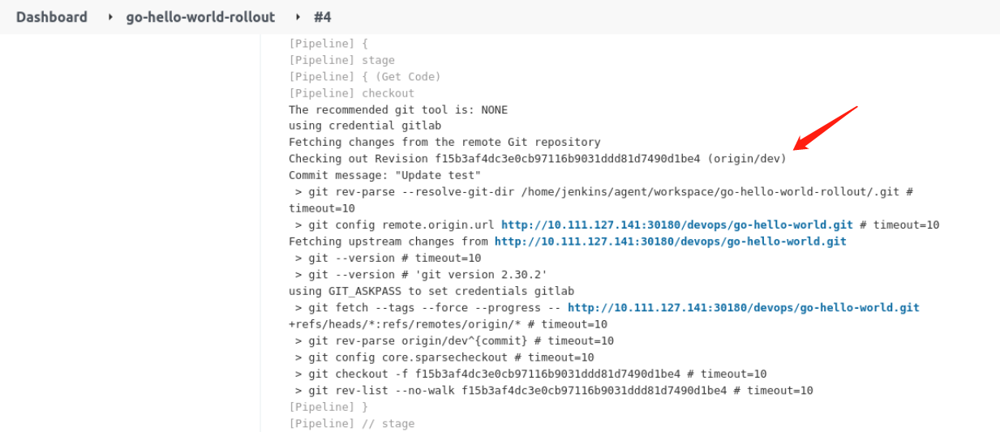

- 查看是否部署到 `dev` 环境

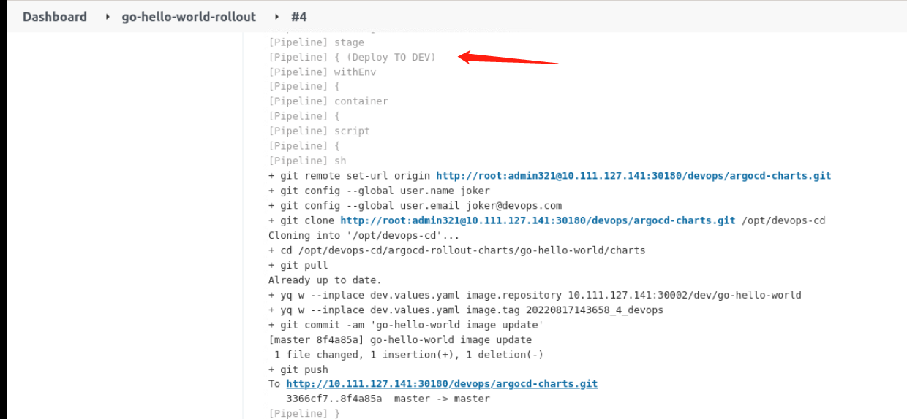

如上表示流水线没有问题。

然后到 Argocd 上检查应用是否能正常更新，点击项目进入详情界面，我们可以看到 rollout 处于 pause 阶段，如下：

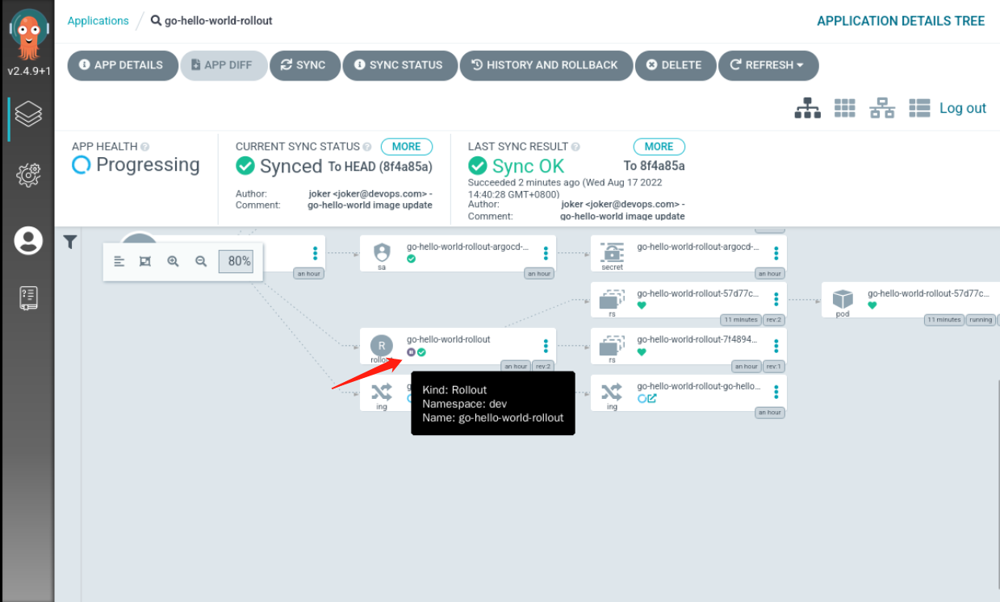

正常情况下，如果该版本没问题，我们需要在命令行执行 `kubectl argo rollouts promote go-hello-world-rollout` 才会继续更新，不过在 Argocd 上提供了按钮，如下：

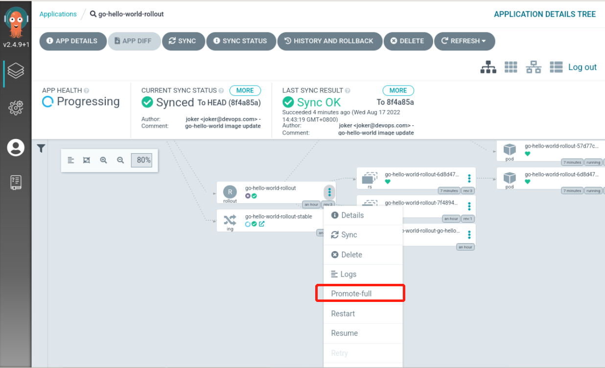

我们只需要点击这个按钮就可以继续更新了，然后整个应用都变成最新版本了，如下：

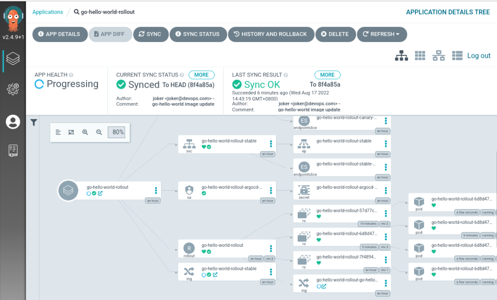


# 实验总结


到此，我们基于 Jenkins+Argo rollouts+Argocd 的持续交付已经完成。先来回顾一下整个过程：

- 首先我们对 Helm Charts 进行了改造，让其能适配 Argo rollouts 的 CRD 进行应用管理
- 其次我们对流水线进行改造，去掉了自动触发流水线改成手动选择分支发布
- 最后我们校验了整个流程，从构建到灰度部署，再到全部更新，确保每个环节都能正常进行

其实，不论是常用的滚动更新，还是灰度发布，我们都可以基于这些模板进行改造，在实际工作中，大家可以酌情处理，灵活性还是比较大。