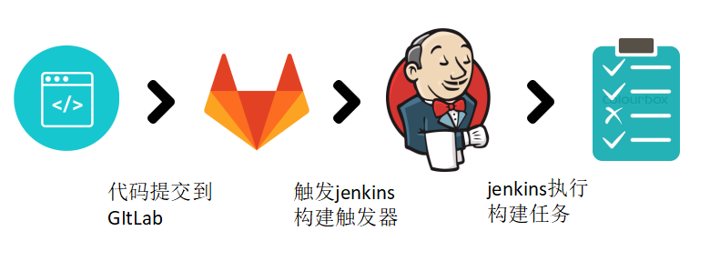
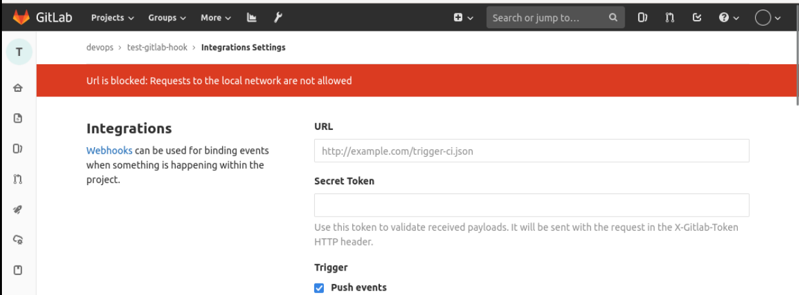
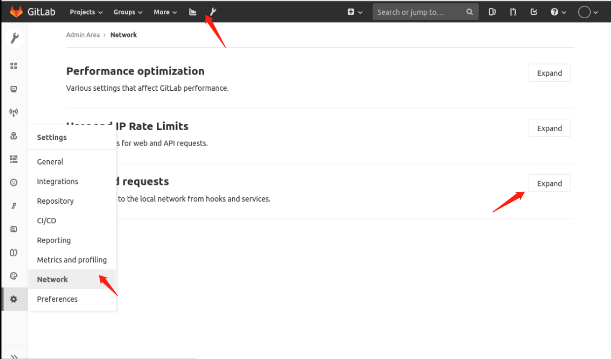
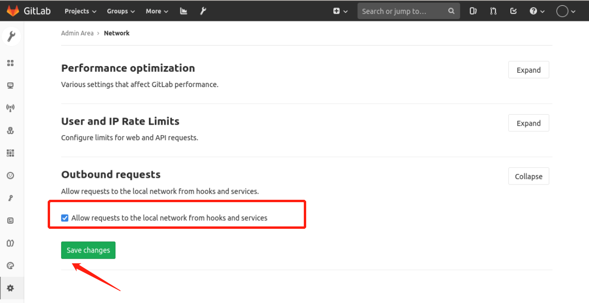
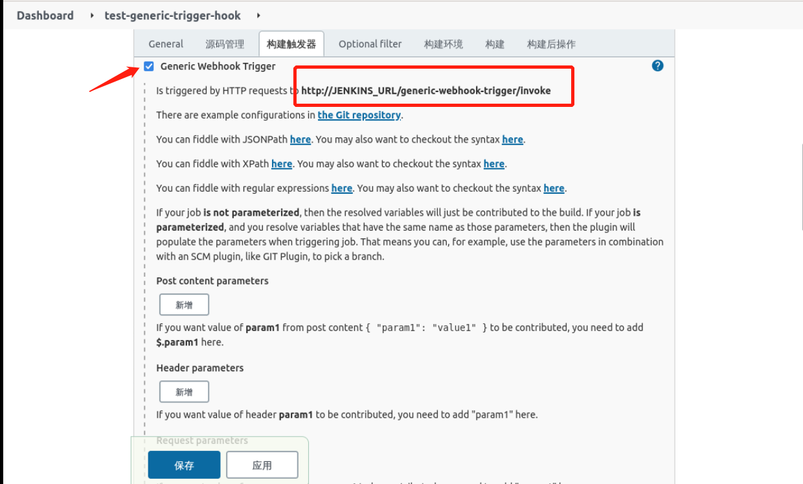
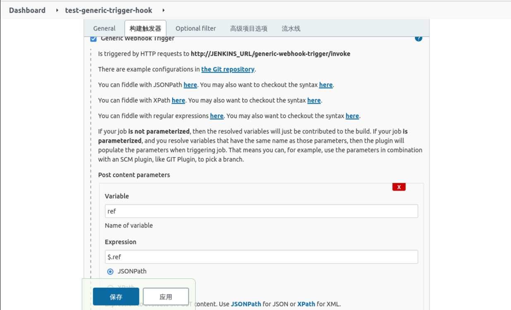
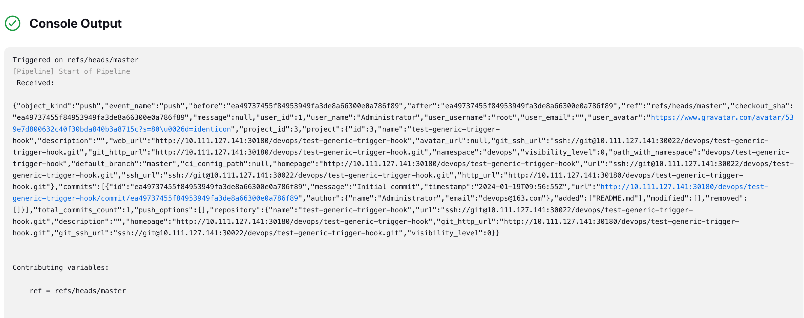
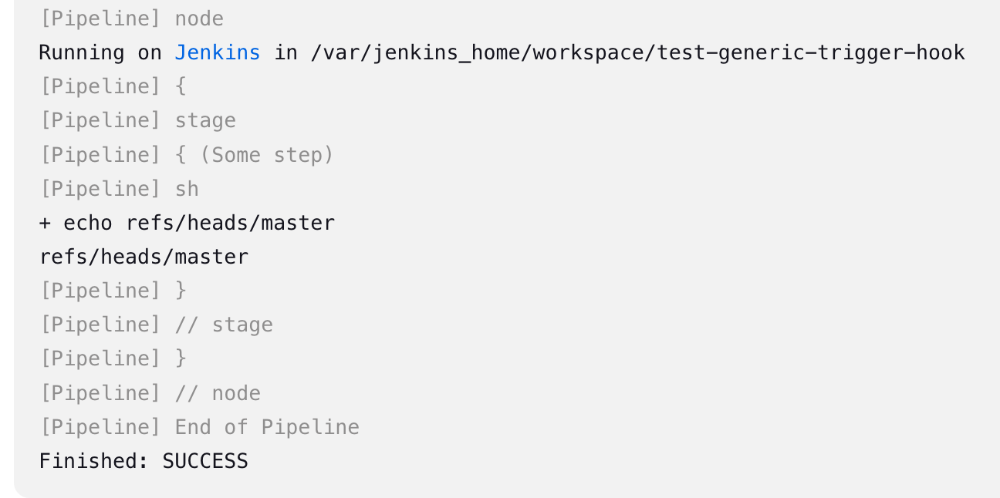

# 实验介绍

GitLab 是一个代码仓库，用来管理代码。Jenkins 是一个自动化服务器，可以运行各种自动化构建、测试或部署任务。所以，如果把这两者友好的结合起来，这样更能提高团队的工作效率。

我们本次实验的目标是实现开发提交代码到 Gitlab，然后自动触发 Jenkins 流水线进行构建、部署。



#### 知识点

- gitlab webhook
- Generic Webhook Trigger

# 安装插件

在 Jenkins 中，选择 **系统配置** -> **插件管理**，搜索 `Gitlab`，选择插件进行安装，如下：

安装完重启 Jenkins。

# 在 Gitlab 上创建项目

在 Gitlab 上创建一个测试项目 `dev-test-gitlab-hook`，

在创建项目的时候选择初始化 README 文件。

# 在 Jenkins 上创建并配置项目

选择 **新建任务**，输入任务名，选择 **自由风格项目** 如下：

然后在 **构建触发器** 处选择 `Build when a change is pushed to Gitlab`，如下：

其中 `Gitlab webhook URL` 是该项目的 Webhook 地址。

其他配置选择默认，然后选择 **高级**，如下：

在 `Secret token` 处选择 `Generate` 会生成一个 Token，如下：


选择 `构建` -> `执行shell` ，输入以下内容：

```shell
echo "auto build"
```

在 **源码管理** 填写源代码，配置如下：

仓库地址：http://192.168.3.125:30180/devops/test-gitlab-hook.git

配置完后，保存退出。

# 在 Gitlab 上配置 Webhook

找到 `test-gitlab-hook` 项目，选择 `settings` -> `integrations`，进入如下界面：

> PS：在新版本的 Gitlab 中，是叫 `webhooks`。

然后填写 `Webhook url` 和 `token`，如下：

其中 `Webhook url` 和 `token` 都是在 Jenkins 项目里能找到的。

拉到下方，取消 SSL 校验并添加。

但是，由于 Gitlab 和 Jenkins 在同一网络，默认是报错，信息如下：



选择 **系统设置** -> **网络** -> **outbound requests**，选择展开，如下：



然后选择 **允许本地网络请求**，点击保存，如下：



现在再来添加 Webhook 就没问题了，如下表示添加成功。

我们选择 `Test` -> `Push Events` 来测试 Webhook 是否工作正常，在 Jenkins 上看到流水线被自动触发了，如下：

# 使用 Generic Webhook Trigger

上面已经介绍并 Gitlab hook，为啥还要介绍 Generic Webhook Trigger？

相比 Gitlab Hook，Generic Webhook Trigger 在使用中可以更灵活，而且除了支持 Gitlab Webhook 之外，还支持 Github，Bitbucket，Jira 等，功能非常强大，后面在构建多分支流水线的时候主要就使用该插件。

# 安装 Generic Webhook 插件

在 Jenkins 上选择 **系统配置** -> **插件管理**，在 **可选插件** 处搜索 `Generic Webhook Trigger` 并安装，如下：

安装完成后，重启 Jenkins。

新建jenkins任务：test-generic-trigger-hook

插件安装完成后，会在任务配置页面多一个 `Generic Webhook Trigger`，如下：



其中 `http://JENKINS_URL/generic-webhook-trigger/invoke` 是触发 Webhook 的固定格式，后面还需要跟上 Token，比如 `http://localhost:8080/generic-webhook-trigger/invoke?token=abc123`。

# 在 Gitlab 创建测试项目

在 Gitlab 上创建一个 `test-generic-trigger-hook` 项目，初始化 README 文件，如下：

# 在 Jenkins 上创建流水线

这次我们不再创建 **自由风格的流水线**，而是直接使用 Pipeline。

选择 **新建任务**，填写任务名:test-generic-trigger-hook，选择 **流水线**，如下：

在 **流水线** 配置处写入如下内容：

```groovy
pipeline {
  agent any
  triggers {
    GenericTrigger(
     genericVariables: [
      [key: 'ref', value: '$.ref']
     ],
     causeString: 'Triggered on $ref',
     token: 'test-generic-trigger-hook-123',
     printContributedVariables: true,
     printPostContent: true,
     silentResponse: false,
     regexpFilterText: '$ref',
     regexpFilterExpression: 'refs/heads/(dev|test|master)'
    )
  }
  stages {
    stage('Some step') {
      steps {
        sh "echo $ref"
      }
    }
  }
}
```

其中：

- token：是用来区分不同任务的 trigger，在命名的时候最好以应用名开头，比如这里的 `test-generic-trigger-hook-123`。
- genericVariables：从 JSONPath 中获取值赋值给变量，比如上面获取`$.ref` 给 `ref` 变量。除此之外还有很多数据，当我们开启 `printPostContent`，就可以在流水线执行的时候在日志里看到更多的数据，到时候需要什么数据就获取什么数据。
- regexpFilterExpression：正则表达式，可以用来过滤需要的数据，我们上面的 Pipeline 中就是用来过滤分支。
- regexpFilterText：这个字段跟上面的 regexpFilterExpression 是成对使用的，正则表达式过滤的就是该字段的内容。

配置好过后，点击保存退出。

由于我们是通过 Pipeline 来配置的 Generic ，所以需要手动执行一次构建，才能真正配置上，如下是手动执行过后的配置：



# Gitlab Webhook 配置

进入项目的 `Settings` -> `Integrations` 界面，新增一个 webhook，如下：

http://192.168.3.125:30880/generic-webhook-trigger/invoke?token=test-generic-trigger-hook-123

然后点击测试，观察流水线日志是否正常，我这流水线日志输出如下：





可以看到，我们正常获取到了 `ref`。

现在我们就可以将流水线改造成如下多分支模式：

```groovy
pipeline {
  agent any
  triggers {
    GenericTrigger(
     genericVariables: [
      [key: 'ref', value: '$.ref']
     ],
     causeString: 'Triggered on $ref',
     token: 'test-generic-trigger-hook-123',
     printContributedVariables: true,
     printPostContent: true,
     silentResponse: false,
     regexpFilterText: '$ref',
     regexpFilterExpression: 'refs/heads/(dev|test|master)'
    )
  }
  stages {
    stage('deploy dev') {
        when {
            expression { ref ==~ 'refs/heads/dev' }
        }
        steps {
            sh "echo $ref"
            print('deploy dev env')
        }
    }
    stage('deploy test') {
        when {
            expression { ref ==~ 'refs/heads/test' }
        }
        steps {
            sh "echo $ref"
            print('deploy test env')
        }
    }
    stage('deploy prod') {
        when {
            expression { ref ==~ 'refs/heads/master' }
        }
        steps {
            sh "echo $ref"
            print('deploy prod env')
        }
    }
  }
}
```

在流水线中，我们加入了 `when` 关键字来进行条件判断，`when` 指令允许管道根据给定条件确定是否应执行该阶段。`when` 指令必须至少包含一个条件。如果 `when` 指令包含多个条件，则所有子条件必须返回 `true` 才能执行该阶段。

流水线代码修改完成后，在 Gitlab 上再次点击测试，流水线的日志输出如下：

```
[Pipeline] { (deploy prod)
[Pipeline] sh
+ echo refs/heads/master
refs/heads/master
[Pipeline] echo
deploy prod env
```

由于我们现在代码里只有 master 分支，所以在测试的时候也是 master 触发的流水线，上面日志显示也只有 master 分支代码执行了操作。

# 实验总结

本次实验主要是操作 Gitlab hook 和 Generic webhook trigger 两个插件，它们都是打通 Jenkins 和 Gitlab 的重要工具，在实际场景中使用也比较广泛。