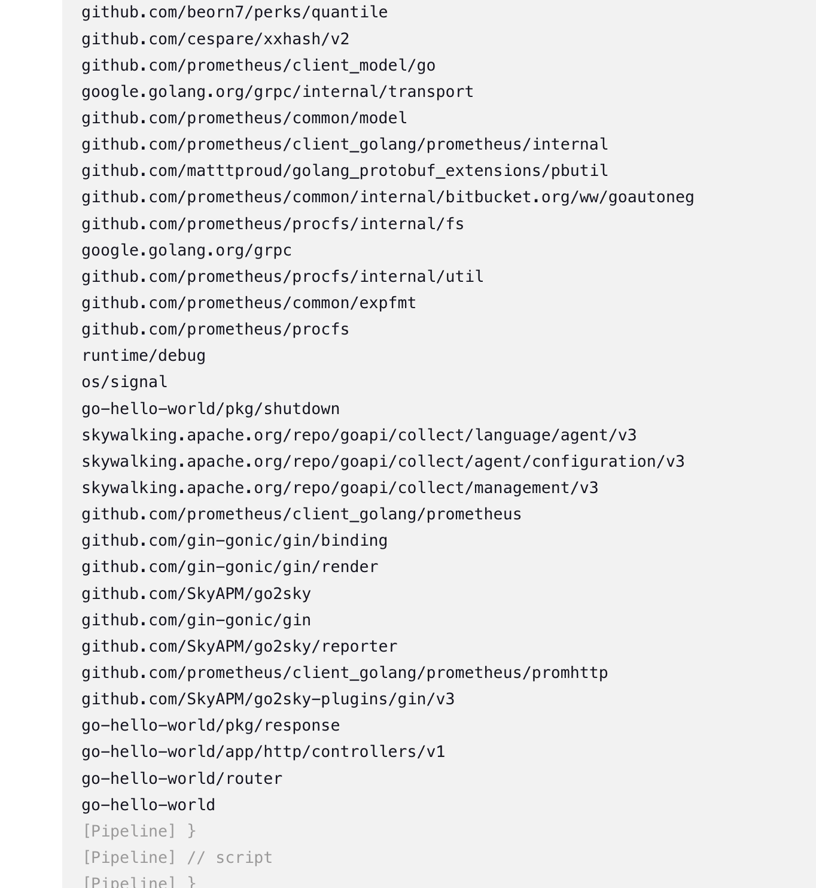

[TOC]


# 实验介绍

本次实验我们将实现 `go-hello-world` 项目通过 Jenkins 实现 CICD。

**知识点**

- Pipeline 开发
- CICD 流程

# 前置准备

- Kubernetes 集群
- Gitlab 仓库
- 镜像仓库
- Jenkins

# 开发 Pipeline

在开发之前，我们先整理清楚流程：

- 拉代码
- 编译代码
- 构建镜像并推送
- 部署应用

这样，我们整个 Pipeline 的模板就可以定义如下：

```groovy
pipeline {
  agent any
  stages {
    stage('Get Code') {
        steps {
            print('Get Code')
        }
    }
    stage('Build Code') {
        steps {
            print('Build Code')
        }
    }
    stage('Build And Push Image') {
        steps {
            print('Build And Push Image')
        }
    }
    stage('Deploy'){
        steps{
            print('Deploy Application')
        }
    }
  }
}
```

在之前的章节中我们已经制作好 `go-hello-world` 项目的 Helm Chart，但是我们之前配置的动态 Jenkins Slave 里没有 Helm 命令，所以如果要使用配置好的 Pod 模板，就需要重新制作镜像，把 Helm 命令集成进去。

不过我们这里不用这么麻烦的方式，而是直接在 Pipeline 中定义模板，如下：

```groovy
pipeline {
  agent {
        kubernetes {
            label "jenkins-slave-${UUID.randomUUID().toString()}"
            yaml """
apiVersion: v1
kind: Pod
spec:
  containers:
  - name: golang
    image: registry.cn-hangzhou.aliyuncs.com/coolops/golang:1.18.5
    command: ['cat']
    tty: true
  - name: docker
    image: registry.cn-hangzhou.aliyuncs.com/coolops/docker:19.03.11
    command: ['cat']
    tty: true
    volumeMounts:
      - name: indocker
        mountPath: /var/run/docker.sock
  - name: helm
    image: registry.cn-hangzhou.aliyuncs.com/coolops/helm-kubectl:3.2.4
    command: ['cat']
    tty: true
    volumeMounts:
      - name: kubeconfig
        mountPath: /root/.kube
  volumes:
    - name: indocker
      hostPath:
        path: "/var/run/docker.sock"
    - name: kubeconfig
      hostPath:
        path: "/home/shiyanlou/.kube"
"""
        }
    }

  stages {
    stage('Get Code') {
        steps {
            print('Get Code')
        }
    }
    stage('Build Code') {
        steps {
            container('golang'){
                script{
                    print('Build Code')
                }
            }
        }
    }
    stage('Build And Push Image') {
        steps {
            container('docker'){
                script{
                    print('Build And Push Image')
                }
            }
        }
    }
    stage('Deploy'){
        steps{
            container('helm'){
                script{
                    print('Deploy Application')
                }
            }
        }
    }
  }
}
```

注意：

- 我们要使用哪个容器需要在 stage.steps 中使用 `container` 来指定。
- 执行的步骤脚本统一放到 `script` 下

这样我们就可以随意定制自己需要的模板，可以和其他项目互不干扰，也不必要在 Jenkins 上配置。

然后在 `go-hello-world` 项目里创建一个 `Jenkinsfile`，输入以上内容，如下：

在创建一个 `Dockerfile` 文件，输入以下内容：

```dockerfile
FROM alpine
COPY ./go-hello-world /usr/local/bin/go-hello-world
EXPOSE 8080
CMD [ "go-hello-world" ]
```

在 Jenkins 上创建一个 `dev-go-hello-world` 项目，在 `流水线` 处配置 `go-hello-world` 代码仓库信息，如下：

定义：选择`Pipeline script from SCM`

​	SCM: Git

​	Repository URL: http://192.168.3.125:30180/devops/go-hello-world.git

​	凭证：选择之前配置好的凭证

后面面的信息默认即可。不过，如果在代码仓库里 Pipeline 文件的名字不叫 `Jenkinsfile`，则需要在流水线配置处更改 **脚本路径**，如下：

现在，运行流水线，观察是否正常，如下表示没问题：

# 拉取代码

拉代码，我们使用 `checkout`，可以使用 **流水线语法** 来生成代码，如下：


然后点击下面的 **生成流水线脚本**，即可生成代码，如下：


不过，我这里是准备把 `Jenkinsfile` 直接放到代码仓库里，所以 **拉取代码** 只需要按如下配置：

```groovy
pipeline {
  agent {
        kubernetes {
            label "jenkins-slave-${UUID.randomUUID().toString()}"
            yaml """
apiVersion: v1
kind: Pod
spec:
  containers:
  - name: golang
    image: registry.cn-hangzhou.aliyuncs.com/coolops/golang:1.18.5
    command: ['cat']
    tty: true
  - name: docker
    image: registry.cn-hangzhou.aliyuncs.com/coolops/docker:19.03.11
    command: ['cat']
    tty: true
    volumeMounts:
      - name: indocker
        mountPath: /var/run/docker.sock
  - name: helm
    image: registry.cn-hangzhou.aliyuncs.com/coolops/helm-kubectl:3.2.4
    command: ['cat']
    tty: true
    volumeMounts:
      - name: kubeconfig
        mountPath: /root/.kube
  volumes:
    - name: indocker
      hostPath:
        path: "/var/run/docker.sock"
    - name: kubeconfig
      hostPath:
        path: "/home/shiyanlou/.kube"
"""
        }
    }

  stages {
    stage('Get Code') {
        steps {
            checkout(scm)
        }
    }
    stage('Build Code') {
        steps {
            container('golang'){
                script{
                    print('Build Code')
                }
            }
        }
    }
    stage('Build And Push Image') {
        steps {
            container('docker'){
                script{
                    print('Build And Push Image')
                }
            }
        }
    }
    stage('Deploy'){
        steps{
            container('helm'){
                script{
                    print('Deploy Application')
                }
            }
        }
    }
  }
}
```

然后将上述内容保存到 `go-hello-world` 项目的 `Jenkinsfile` 中，替换掉以前的内容，再到 Jenkins 上执行构建，构建成功并且日志输出如下表示正常：


这表示拉取应用代码没问题。

# 构建应用

构建应用也就是应用打包，由于我们的 `go-hello-world` 是 Golang 项目，逻辑也比较简单，可以直接使用 `go build main.go` 即可完成构建。

所以，我们的代码如下：

```groovy
pipeline {
  agent {
        kubernetes {
            label "jenkins-slave-${UUID.randomUUID().toString()}"
            yaml """
apiVersion: v1
kind: Pod
spec:
  containers:
  - name: golang
    image: registry.cn-hangzhou.aliyuncs.com/coolops/golang:1.18.5
    command: ['cat']
    tty: true
  - name: docker
    image: registry.cn-hangzhou.aliyuncs.com/coolops/docker:19.03.11
    command: ['cat']
    tty: true
    volumeMounts:
      - name: indocker
        mountPath: /var/run/docker.sock
  - name: helm
    image: registry.cn-hangzhou.aliyuncs.com/coolops/helm-kubectl:3.2.4
    command: ['cat']
    tty: true
    volumeMounts:
      - name: kubeconfig
        mountPath: /root/.kube
  volumes:
    - name: indocker
      hostPath:
        path: "/var/run/docker.sock"
    - name: kubeconfig
      hostPath:
        path: "/root/.kube"
"""
        }
    }

  stages {
    stage('Get Code') {
        steps {
            checkout(scm)
        }
    }
    stage('Build Code') {
        steps {
            container('golang'){
                script{
                    sh '''
                        export GOPROXY=https://goproxy.cn
                        export GOOS=linux
                        export GOARCH=386
                        go mod tidy
                        go build -v -o ./go-hello-world
                    '''
                }
            }
        }
    }
    stage('Build And Push Image') {
        steps {
            container('docker'){
                script{
                    print('Build And Push Image')
                }
            }
        }
    }
    stage('Deploy'){
        steps{
            container('helm'){
                script{
                    print('Deploy Application')
                }
            }
        }
    }
  }
}
```

其中：

- `export GOPROXY=https://goproxy.cn` 使用国内代理，加速拉取依赖
- `export GOOS=linux` 指定平台
- `export GOARCH=386` 指定处理器架构

将上述内容覆盖 `go-hello-world` 中的 Jenkinsfile，然后在 Jenkins 上点击构建，观察构建是否成功并且输出日志表示代码正常：



# 构建镜像并推送

构建和推送镜像都需要使用 docker 命令，我们这里使用的 `Docker in Docker`，所以直接使用命令即可，脚本代码如下：

```groovy
@Library('sharelibrary')

def tools = new org.devops.tools()

pipeline {
  agent {
        kubernetes {
            label "jenkins-slave-${UUID.randomUUID().toString()}"
            yaml """
apiVersion: v1
kind: Pod
spec:
  containers:
  - name: golang
    image: registry.cn-hangzhou.aliyuncs.com/coolops/golang:1.18.5
    command: ['cat']
    tty: true
  - name: docker
    image: registry.cn-hangzhou.aliyuncs.com/coolops/docker:19.03.11
    command: ['cat']
    tty: true
    volumeMounts:
      - name: indocker
        mountPath: /var/run/docker.sock
  - name: helm
    image: registry.cn-hangzhou.aliyuncs.com/coolops/helm-kubectl:3.2.4
    command: ['cat']
    tty: true
    volumeMounts:
      - name: kubeconfig
        mountPath: /root/.kube
  volumes:
    - name: indocker
      hostPath:
        path: "/var/run/docker.sock"
    - name: kubeconfig
      hostPath:
        path: "/home/shiyanlou/.kube"
"""
        }
    }

  stages {
    stage('Get Code') {
        steps {
            checkout(scm)
        }
    }
    stage('Build Code') {
        steps {
            container('golang'){
                script{
                    sh '''
                        export GOPROXY=https://goproxy.cn
                        export GOOS=linux
                        export GOARCH=386
                        go mod tidy
                        go build -v -o ./go-hello-world
                    '''
                }
            }
        }
    }
    stage('Build And Push Image') {
        steps {
            container('docker'){
                script{
                    IMAGE_REPO="192.168.3.175/dev/go-hello-world"
                    IMAGE_TAG=tools.createImageTag()
                    sh """
                        docker login 192.168.3.175 -u admin -p Harbor12345
                        docker build -t ${IMAGE_REPO}:${IMAGE_TAG} -f Dockerfile .
                        docker push ${IMAGE_REPO}:${IMAGE_TAG}
                    """
                }
            }
        }
    }
    stage('Deploy'){
        steps{
            container('helm'){
                script{
                    print('Deploy Application')
                }
            }
        }
    }
  }
}
```

我们上面使用到 `tools.createImageTag` 用来创建镜像的 Tag，这个方法定义到共享库中，所以需要在共享库 `jenkins-sharelibrary` 的 `src/org/devops/tools.groovy` 中添加如下代码：

```groovy
// 获取镜像版本
def createImageTag() {
    return new Date().format('yyyyMMddHHmmss') + "_${env.BUILD_ID}"
}
```

并且需要引用 `共享库`，所以在 Pipeline 的最前面加入了以下代码：

```groovy
@Library('sharelibrary')

def tools = new org.devops.tools()
```

然后推送镜像需要进行登录，这里为了方便直接使用 `docker login`。

注意：docker login 会报错

```
# Error response from daemon: Get https://harbor.dev/v2/: x509: certificate signed by unknown authority
# https://blog.csdn.net/tom_fans/article/details/107620248
# 请求的机器上执行
mkdir -p /etc/docker/certs.d/192.168.3.175

# 将crt文件拷贝到请求机器上
scp /data/cert/192.168.3.175.crt root@192.168.3.125:/etc/docker/certs.d/192.168.3.175

jenkinsfile 的 kubernetes中添加
  - name: docker
    image: registry.cn-hangzhou.aliyuncs.com/coolops/docker:19.03.11
    command: ['cat']
    tty: true
    volumeMounts:
      - name: indocker
        mountPath: /var/run/docker.sock
      - name: harbor-crt
        mountPath: /etc/docker/certs.d/
  volumes:
    ...
    - name: harbor-crt
      hostPath:
        path: "/etc/docker/certs.d/"

```


最后使用上面的 Pipeline 覆盖 `go-hello-world` 项目中的 Jenkinsfile，构建项目并观察日志，构建成功并且日志输出如下表示正常：

# 部署应用

在代码仓库里我们已经准备好了 `Helm Chart`，放到 `deploy/charts` 目录下，所以这里直接使用 `helm` 命令部署即可，如下：

```groovy
@Library('sharelibrary')

def tools = new org.devops.tools()

pipeline {
  agent {
        kubernetes {
            label "jenkins-slave-${UUID.randomUUID().toString()}"
            yaml """
apiVersion: v1
kind: Pod
spec:
  containers:
  - name: golang
    image: registry.cn-hangzhou.aliyuncs.com/coolops/golang:1.18.5
    command: ['cat']
    tty: true
  - name: docker
    image: registry.cn-hangzhou.aliyuncs.com/coolops/docker:19.03.11
    command: ['cat']
    tty: true
    volumeMounts:
      - name: indocker
        mountPath: /var/run/docker.sock
  - name: helm
    image: registry.cn-hangzhou.aliyuncs.com/coolops/helm-kubectl:3.2.4
    command: ['cat']
    tty: true
    volumeMounts:
      - name: kubeconfig
        mountPath: /root/.kube
  volumes:
    - name: indocker
      hostPath:
        path: "/var/run/docker.sock"
    - name: kubeconfig
      hostPath:
        path: "/home/shiyanlou/.kube"
"""
        }
    }

  environment{
    # IMAGE_REPO = "10.111.127.141:30002/dev/go-hello-world"
    IMAGE_REPO = "192.168.3.175/dev/go-hello-world"
    IMAGE_TAG = ""
  }

  stages {
    stage('Get Code') {
        steps {
            checkout(scm)
        }
    }
    stage('Build Code') {
        steps {
            container('golang'){
                script{
                    sh '''
                        export GOPROXY=https://goproxy.cn
                        export GOOS=linux
                        export GOARCH=386
                        go mod tidy
                        go build -v -o ./go-hello-world
                    '''
                }
            }
        }
    }
    stage('Build And Push Image') {
        steps {
            container('docker'){
                script{

                    IMAGE_TAG = tools.createImageTag()
                    sh """
                        docker login 10.111.127.141:30002 -u admin -p Harbor12345
                        docker build -t ${IMAGE_REPO}:${IMAGE_TAG} -f Dockerfile .
                        docker push ${IMAGE_REPO}:${IMAGE_TAG}
                    """
                }
            }
        }
    }
    stage('Deploy'){
        steps{
            container('helm'){
                script{
                    sh """
                        helm upgrade --install go-hello-world -n default \
                        --set image.repository=${IMAGE_REPO} \
                        --set image.tag=${IMAGE_TAG} \
                        --set containers.port=8080 \
                        --set containers.healthCheak.path=/health \
                        --set ingress.enabled=true \
                        --set ingress.hosts[0].host=hello.devops.com \
                        --set ingress.hosts[0].paths[0].path=/ \
                        --set ingress.hosts[0].paths[0].pathType=ImplementationSpecific deploy/charts/
                    """
                }
            }
        }
    }
  }
}
```

由于在 `Build And Push Image` 和 `Deploy` 阶段都需要用到镜像，所以我们将 `IMAGE_REPO` 和 `IMAGE_TAG` 设置成全局变量，在 Pipeline 的 `stages` 同级加入如下代码：

```groovy
environment{
    IMAGE_REPO = "10.111.127.141:30002/dev/go-hello-world"
    IMAGE_TAG = ""
  }
```

这样在所有步骤都能使用这两个变量。

最后，我们使用 `helm upgrage --install` 来部署应用，如果应用存在于 Kubernetes 中，则会更新应用，如果没有则会安装。

我们使用上面的内容替换 `go-hello-world` 中的 `Jenkinsfile`，然后执行流水线，日志输出如下表示流水线运行成功：


然后在 Kubernetes 中观察应用部署正常，如下：

```
kubectl get all
```

# 实验总结

现在我们已经完成 `go-hello-world` 项目使用 Jenkins 进行发版了，我们再来回顾一下整个过程：

- 首先，我们先定义了整个流程步骤
- 然后，根据每个步骤进行代码开发
- 最后，把所有的步骤整合成一个 Pipeline，进行测试发版

每个步骤都不难，主要是掌握开发 Pipeline 的逻辑，而且，在这中间可能会出现很多问题，需要慢慢调试。
