# 使用argo rollouts 完成灰度发布示例

## 实验介绍

灰度发布是企业选择比较多的版本发布方式，它可以尽可能的保证线上服务的稳定性，本次实验就是带大家了解什么是灰度发布以及如何使用 Argo rollouts 实现灰度发布。

#### 知识点

- 灰度发布
- Argo rollouts

## 灰度发布简介

灰度发布又叫金丝雀发布。它是指在黑与白之间平滑过渡的一种方式。

在企业中，很多公司都会采用灰度发布的方式进行版本更新，其原理是在生产环境同时有 A 和 B 两个版本，其中 A 是老版本，B 是新版本，让一部分用户继续使用 A，让少部分用户来使用 B，如果这少部分用户没有反馈什么问题，就慢慢增大访问 B 的数量直至所有用户都使用 B。


使用灰度发布的主要作用如下：

- 降低发布带来的影响，虽然功能都在测试环境测过，但毕竟没有发布到生产环境，如果先让少部分用户先使用新版本，提前发现 bug，或者性能问题，提前做好修复，就可以降低新版本带来的影响；
- 通过对新老版本的对比，观察新版本带来的效果。

## Argo rollouts

Argo rollouts 是一个 Kubernetes Controller 和对应一系列的 CRD，提供更强大的 Deployment 能力。包括灰度发布、蓝绿部署、更新测试(experimentation)、渐进式交付(progressive delivery)等特性。

支持特性如下： ● 蓝绿色更新策略 ● 金丝雀更新策略 ● 细粒度，加权流量转移 ● 自动回 rollback 和 promotion ● 手动判断 ● 可定制的指标查询和业务 KPI 分析 ● 入口控制器集成：NGINX，ALB ● 服务网格集成：Istio，Linkerd，SMI ● Metric provider 集成：Prometheus，Wavefront，Kayenta，Web，Kubernetes Jobs

Argo rollouts 的原理和 Deployment 差不多，只是加强 rollout 的策略和流量控制。当 spec.template 发送变化时，Argo rollouts 就会根据 spec.strategy 进行 rollout，通常会产生一个新的 ReplicaSet，逐步 scale down 之前的 ReplicaSet 的 pod 数量。

## 安装 Aro rollouts


Argo rollouts 分为服务端和客户端安装，服务端也就是安装一系列的自定义 CRD 和 Controller，客户端就是一个 kubectl 插件，可以用来查看并管理 Argo rollouts 应用。

首先创建 `argo-rollouts` 名称空间，命令如下：

```bash
kubectl create namespace argo-rollouts
```

直接使用以下命令安装：

```bash
kubectl apply -n argo-rollouts -f https://github.com/argoproj/argo-rollouts/releases/download/v1.2.2/install.yaml
```

安装完成过后，使用 `kubectl get pod -n argo-rollouts` 查看 Pod 启动情况，如下：


Controller 安装完成过后，现在来安装 kubectl 插件。

直接在 `https://github.com/argoproj/argo-rollouts/releases` 选择对应的版本，比如我这里是 `v1.2.2`，如下：

然后选择对应的版本下载即可：

```bash
curl -LO https://github.com/argoproj/argo-rollouts/releases/download/v1.2.2/kubectl-argo-rollouts-linux-amd64
chmod +x ./kubectl-argo-rollouts-linux-amd64
sudo mv ./kubectl-argo-rollouts-linux-amd64 /usr/local/bin/kubectl-argo-rollouts

# 查看是否成功
kubectl argo rollouts version
```

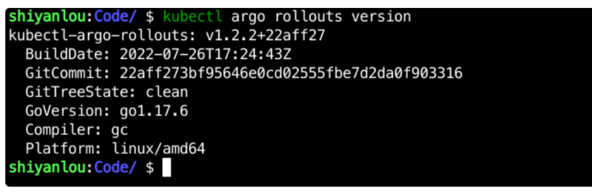

到此安装步骤完成。

## 灰度发布测试

在 Argo rollouts 中，灰度发布分为 Replica Shifting 和 Traffic Shifting 两个过程：

- Replica Shifting：版本替换
- Traffic Shifting：流量接入

我们分别对这两个过程进行实验。

首先在 `/home/shiyanlou/Code/devops` 下创建一个 `sy-03-2` 目录，命令如下：

```bash
mkdir /home/shiyanlou/Code/devops/sy-03-2
```

这节课的实验代码会放到改目录下。

## 版本替换（Replica Shifting）

#### 部署应用

在 `/home/shiyanlou/Code/devops/sy-03-2` 下创建一个 `rollout.yaml` 文件，写入以下内容：

```yaml
apiVersion: argoproj.io/v1alpha1
kind: Rollout
metadata:
  name: rollouts-demo
spec:
  replicas: 5
  strategy:
    canary:
      steps:
        - setWeight: 20
        - pause: {}
        - setWeight: 40
        - pause: { duration: 10 }
        - setWeight: 60
        - pause: { duration: 10 }
        - setWeight: 80
        - pause: { duration: 10 }
  revisionHistoryLimit: 2
  selector:
    matchLabels:
      app: rollouts-demo
  template:
    metadata:
      labels:
        app: rollouts-demo
    spec:
      containers:
        - name: rollouts-demo
          image: argoproj/rollouts-demo:blue
          ports:
            - name: http
              containerPort: 8080
              protocol: TCP
          resources:
            requests:
              memory: 32Mi
              cpu: 5m
```

可以看到除了 `apiVersion`，`kind` 以及 `strategy` 之外，其他和 Deployment 无异。 strategy 字段定义的是发布策略，其中：

- setWeight：设置流量的权重
- pause：暂停，如果里面没有跟 duration: 10 则表示需要手动更新，如果跟了表示等待多长时间会自动跟新。

再在该目录下创建一个 `service.yaml` 文件，写入如下内容：

```yaml
apiVersion: v1
kind: Service
metadata:
  name: rollouts-demo
spec:
  ports:
    - port: 80
      targetPort: http
      protocol: TCP
      name: http
  selector:
    app: rollouts-demo
```

然后使用 `kubectl apply -f rollout.yaml` 和 `kubectk apply -f service.yaml` 创建应用，执行过后会在 `default` 名称空间下创建 5 个 `rollout-demo` 的 Pod，如下


待 Pod 都 `Running` 的时候使用 `kubectl argo rollouts get rollout rollouts-demo` 来查看 rollouts 应用状态：

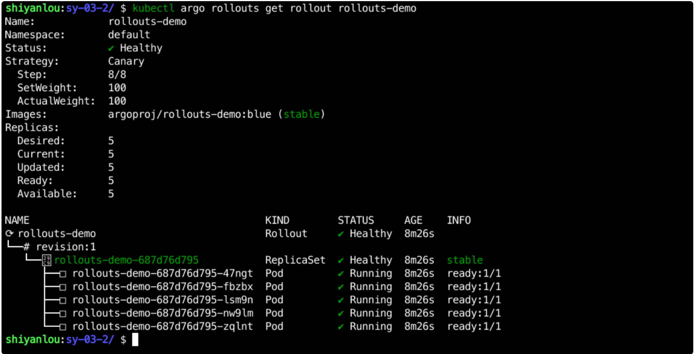

可以看到该版本被标记为 stable，而且 STATUS 为 healthy。还可以在命令后面加一个--watch 来实时监控服务状态，完整命令为 `kubectl argo rollouts get rollout rollouts-demo --watch`。

#### 更新应用

新开一个终端，输入 `kubectl argo rollouts get rollout rollouts-demo --watch` 命令监听服务状态。

在另一个终端输入 `kubectl argo rollouts set image rollouts-demo rollouts-demo=argoproj/rollouts-demo:yellow` 来更新应用镜像。

在监听终端可以看到如下信息：

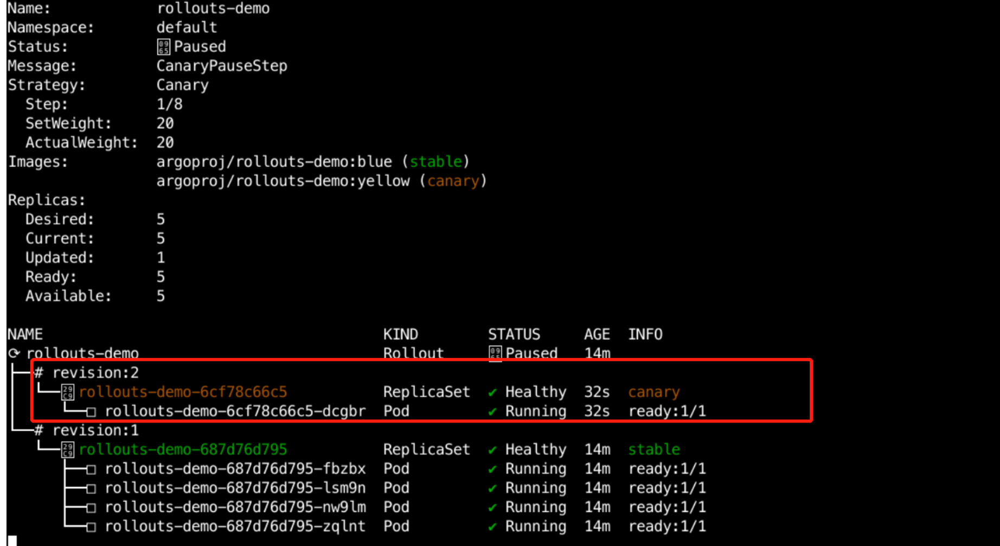

多了一个 revision:2，而且该版本被标记为 canary，而且状态是 Status: Paused，canary 接入流量为 20%。

部署之所以处于 `Paused`，是因为我们在 rollout.yaml 中定义了发布第一个版本后会暂停，这时候需要手动接入接下来的更新。

argo rollouts 提供了 promote 来进行后续的更新，命令如下：

```bash
kubectl argo rollouts promote rollouts-demo
```

执行过后，在监听终端可以看到不断有 canary 应用被部署，如下：

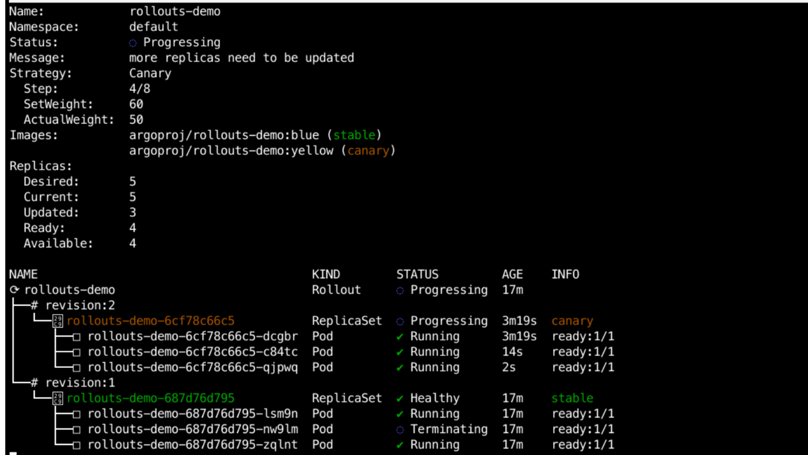

当所有 canary 版本更新完成后，会从 `canary` 版本变成 `stable` 版本，如下：

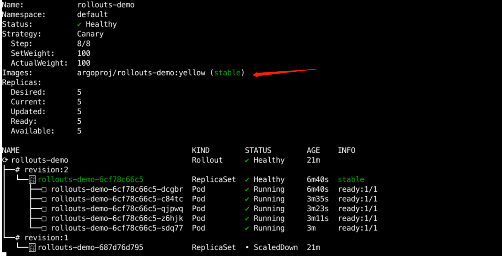

#### 终止更新

如果在更新应用的过程中，最新的应用有问题，需要终止更新需要怎么做呢？

我们先使用下面命令发布新版本应用，如下：

```bash
kubectl argo rollouts set image rollouts-demo rollouts-demo=argoproj/rollouts-demo:red
```

在监听终端看到应用已经更新部分，如下：

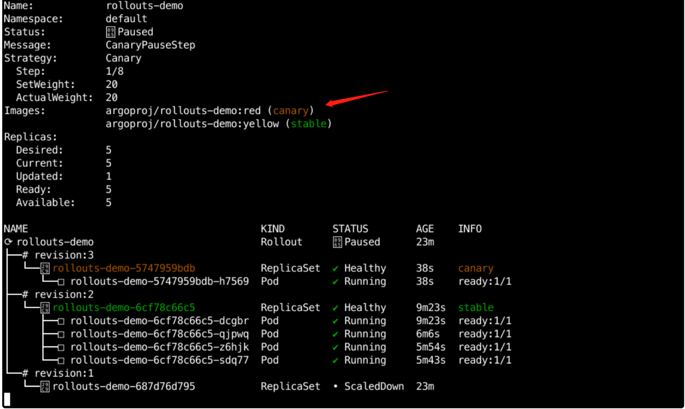

如果这时候不想发布了，可以使用如下命令来终止发布：

```bash
kubectl argo rollouts abort rollouts-demo
```

命令执行过后，在监听终端可以看到应用已经终止，回归到原有状态，如下：


但是状态并不是 `Healthy`，而是 `Degraded`。如果要将其变成 `Healthy`，则需要执行一下镜像更新命令，如下：

```bash
kubectl argo rollouts set image rollouts-demo rollouts-demo=argoproj/rollouts-demo:yellow
```

#### 回滚应用

有时候在应用上线过后，有些 BUG 并没有发现，这时候要回退怎么办呢？argo rollouts 有一个 undo 命令，可以进行回退。

比如我们要将版本回退到第一个版本，则执行一下命令：

```bash
kubectl-argo-rollouts undo  rollouts-demo --to-revision=1
```

然后在监听终端可以看到应用正在进行回滚，如下：

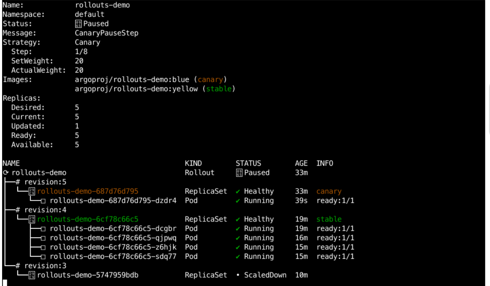

再使用以下命令完成最终的回滚：

```bash
kubectl argo rollouts promote rollouts-demo
```

最终应用镜像从 `yellow` 变成 `blue`，如下：

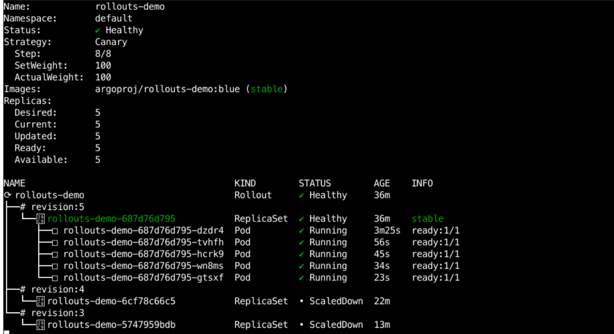

测试完成后删除该应用，命令如下：

```bash
kubectl delete -f rollout.yaml
kubectl delete -f service.yaml
```

## 流量接入（Traffic Shifting）

上面我们并没有接入外部流量，仅仅是在内部使用展示了金丝雀部署过程，下面我们接入外部流量进行测试。

Argo-Rollout 主要集成了 Ingress 和 ServiceMesh 两种流量控制方法。

目前 Ingress 支持 ALB 和 NGINX ingress。这里我使用的是 NGINX ingress。

#### 部署服务

在 `/home/shiyanlou/Code/devops/sy-03-2` 目录下新建一个 `nginx-ingress` 目录，命令如下：

```bash
mkdir /home/shiyanlou/Code/devops/sy-03-2/nginx-ingress -p
cd /home/shiyanlou/Code/devops/sy-03-2/nginx-ingress
```

然后在该目录下创建一个 `rollout.yaml` 文件，写入以下内容：

后在该目录下创建一个 `rollout.yaml` 文件，写入以下内容：

```yaml
apiVersion: argoproj.io/v1alpha1
kind: Rollout
metadata:
  name: rollouts-demo
spec:
  replicas: 1
  strategy:
    canary:
      canaryService: rollouts-demo-canary
      stableService: rollouts-demo-stable
      trafficRouting:
        nginx:
          stableIngress: rollouts-demo-stable
      steps:
        - setWeight: 20
        - pause: {}
  revisionHistoryLimit: 2
  selector:
    matchLabels:
      app: rollouts-demo
  template:
    metadata:
      labels:
        app: rollouts-demo
    spec:
      containers:
        - name: rollouts-demo
          image: argoproj/rollouts-demo:blue
          ports:
            - name: http
              containerPort: 8080
              protocol: TCP
          resources:
            requests:
              memory: 32Mi
              cpu: 5m
```

其中，在 `spec.strategy.canary` 中新增了 `canaryService` 、 `stableService` 以及 `trafficRouting` 字段，用来指明哪个是 `stable` 版本，哪个是 `canary` 版本。

然后再在该目录下创建 `service.yaml` 并写入以下内容：

```yaml
apiVersion: v1
kind: Service
metadata:
  name: rollouts-demo-canary
spec:
  ports:
    - port: 80
      targetPort: http
      protocol: TCP
      name: http
  selector:
    app: rollouts-demo

---
apiVersion: v1
kind: Service
metadata:
  name: rollouts-demo-stable
spec:
  ports:
    - port: 80
      targetPort: http
      protocol: TCP
      name: http
  selector:
    app: rollouts-demo
```

该文件中定义了 `stable` 和 `canary` 版本的 Service，实际上它们指定的后端都是同一类。

最后，再创建一个 `ingress.yaml` 文件，写入以下内容：

```yaml
apiVersion: networking.k8s.io/v1
kind: Ingress
metadata:
  name: rollouts-demo-stable
  annotations:
    kubernetes.io/ingress.class: "nginx"
spec:
  rules:
    - host: rollouts-demo.devops.com
      http:
        paths:
          - path: /
            backend:
              service:
                name: rollouts-demo-stable
                port:
                  number: 80
            pathType: Prefix
```


```shell
# 在该目录下执行以下命令部署应用。
kubectl apply -f rollout.yaml
kubectl apply -f service.yaml
kubectl apply -f ingress.yaml

# 创建完成过后查看 Pod 运行状态
kubectl get pod | grep rollouts-demo
# rollouts-demo-687d76d795-hvchw                      1/1     Running   0          105s

# 查看 Service 状态
kubectl get service | grep rollouts-demo
# rollouts-demo-canary                      ClusterIP   172.20.73.29     <none>        80/TCP                       3m45s
# rollouts-demo-stable                      ClusterIP   172.20.227.82    <none>        80/TCP                       3m45s

# 查看 Ingress 状态
kubectl get ingress | grep rollouts-demo
# rollouts-demo-rollouts-demo-stable-canary   <none>   rollouts-demo.devops.com   80        4m36s
# rollouts-demo-stable                        <none>   rollouts-demo.devops.com   80        4m36s
```

我们发现在 Ingress 状态中，多了一个 `rollouts-demo-rollouts-demo-stable-canary` 的 Ingress，它是通过 Rollouts Controller 根据 `rollouts-demo-stable` 的内容自动创建的一个 Ingress，其内容如下：

```yaml
apiVersion: networking.k8s.io/v1
kind: Ingress
metadata:
  annotations:
    kubernetes.io/ingress.class: nginx
    nginx.ingress.kubernetes.io/canary: "true"
    nginx.ingress.kubernetes.io/canary-weight: "0"
  creationTimestamp: "2022-08-15T01:50:13Z"
  generation: 1
  managedFields:
    - apiVersion: networking.k8s.io/v1
      fieldsType: FieldsV1
      fieldsV1:
        f:metadata:
          f:annotations:
            .: {}
            f:kubernetes.io/ingress.class: {}
            f:nginx.ingress.kubernetes.io/canary: {}
            f:nginx.ingress.kubernetes.io/canary-weight: {}
          f:ownerReferences:
            .: {}
            k:{"uid":"8c0496cf-73f9-438f-8cdb-1efca359b81e"}: {}
        f:spec:
          f:rules: {}
      manager: Go-http-client
      operation: Update
      time: "2022-08-15T01:50:13Z"
  name: rollouts-demo-rollouts-demo-stable-canary
  namespace: default
  ownerReferences:
    - apiVersion: argoproj.io/v1alpha1
      blockOwnerDeletion: true
      controller: true
      kind: Rollout
      name: rollouts-demo
      uid: 8c0496cf-73f9-438f-8cdb-1efca359b81e
  resourceVersion: "257534"
  uid: 40fa8139-a6a8-42f8-b769-2e2f36bcedd4
spec:
  rules:
    - host: rollouts-demo.devops.com
      http:
        paths:
          - backend:
              service:
                name: rollouts-demo-canary
                port:
                  number: 80
            path: /
            pathType: Prefix
status:
  loadBalancer: {}
```

在 `annotations` 处新增了两个配置，如下：

- nginx.ingress.kubernetes.io/canary: "true"，用来标记为 canary 版本
- nginx.ingress.kubernetes.io/canary-weight: "0"，用来配置流量的权重，它会根据我们在 rollouts 中配置的权重来调整。

现在，我们使用 `sudo vim /etc/hosts` ，在 hosts 文件中增加以下配置：

```bash
10.111.127.141 rollouts-demo.devops.com
```

> PS: IP 地址根据实际情况调整。

然后使用 `http://rollouts-demo.devops.com:30080` 访问，如下：

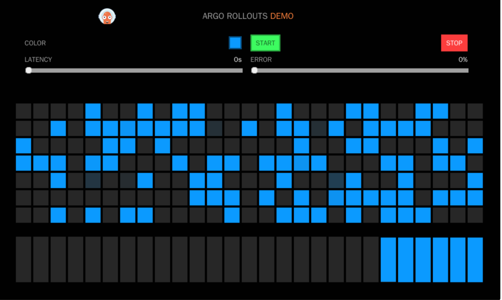

#### 更新服务

现在，我们使用以下命令来更新应用：

```bash
kubectl argo rollouts set image rollouts-demo rollouts-demo=argoproj/rollouts-demo:yellow
```

部署后，使用 `kubectl-argo-rollouts get rollout rollouts-demo` 来查看部署状态，如下：

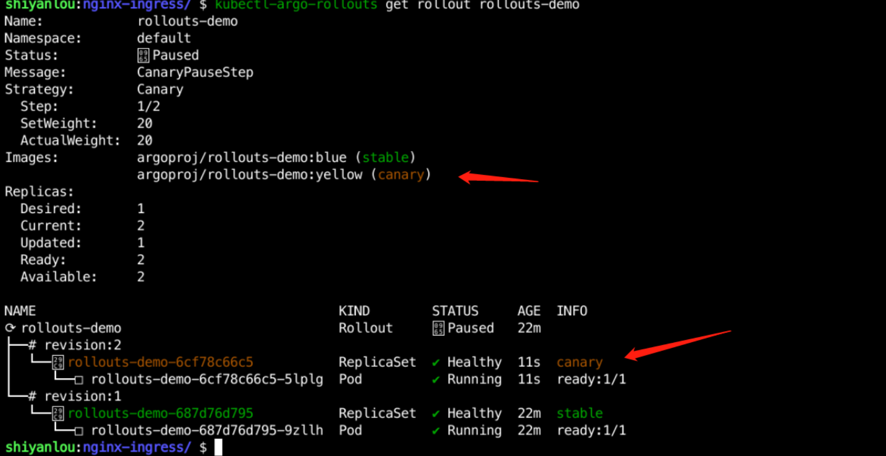

然后使用 `kubectl get ingress rollouts-demo-rollouts-demo-stable-canary -o yaml | more` 可以看到 annotations 中 `nginx.ingress.kubernetes.io/canary-weight` 的值已经变成 20，如下：

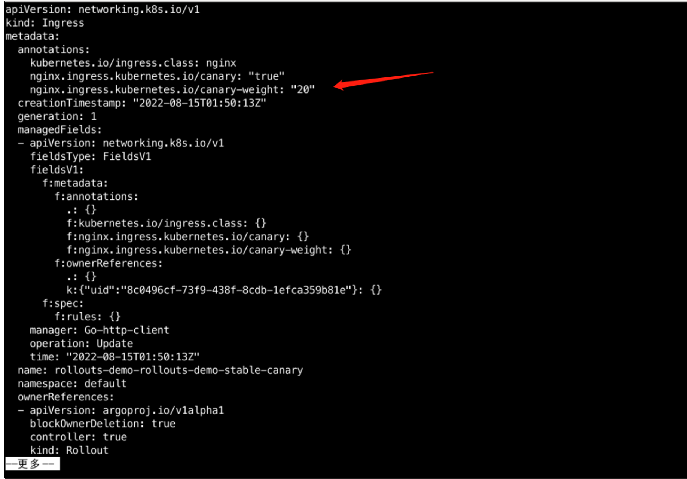

在 `http://rollouts-demo.devops.com:30080` 页面也能看到 `yellow` 的服务已经使用了，如下：

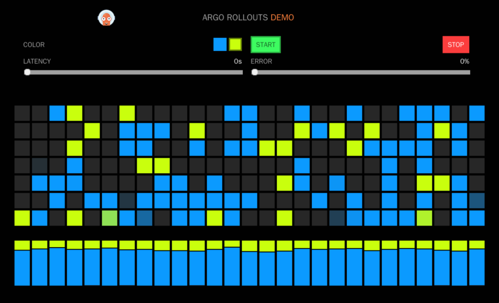

再使用 `kubectl argo rollouts promote rollouts-demo` 继续更新服务，可以在 `http://rollouts-demo.devops.com:30080` 页面发现 `yellow` 替换完成，最终所有流量都走 `yellow`：

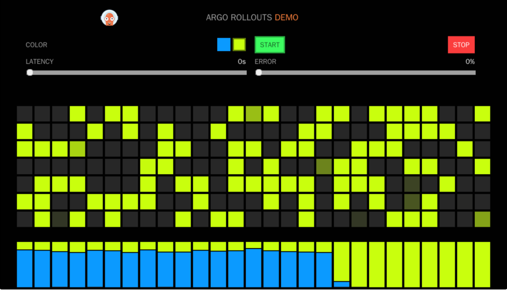

当 `canary` 版本变成 `stable` 版本过后，会接收所有的流量，`rollouts-demo-rollouts-demo-stable-canary` ingress 中的 `nginx.ingress.kubernetes.io/canary-weight` 又会重新变成 0。

## 实验总结

整个实验我们介绍了什么是灰度发布，以及使用 argo rollouts 完成两个灰度发布的测试，灰度发布是一个很常见的需求，而且做法是多种多样，比如有的公司会做前端灰度、后端灰度，甚至数据库灰度等，在流量策略上也各有选择，比如最简单的就是权重，然后复杂点的可以基于 Header、地域、IP 等，这些方式方法大家可以下来自行研究。