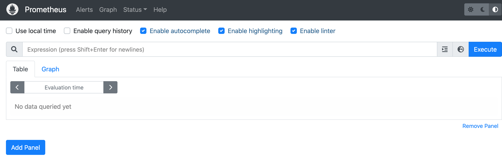
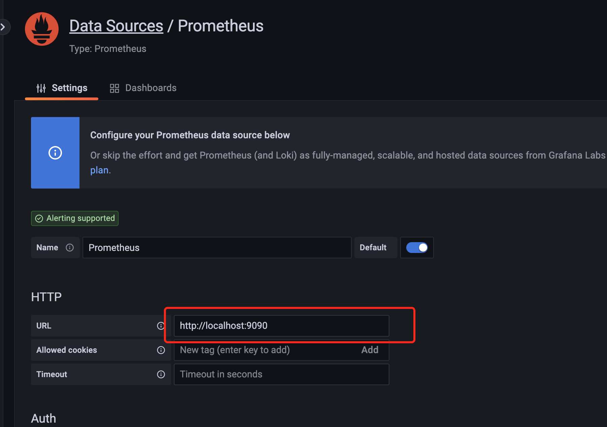
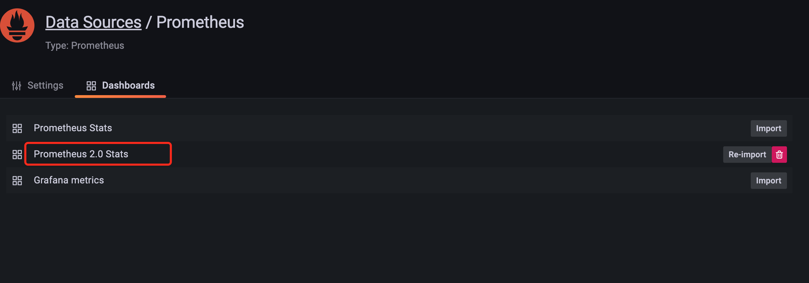
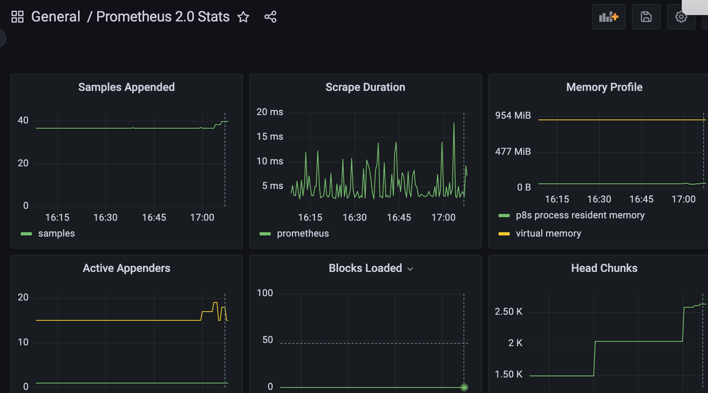
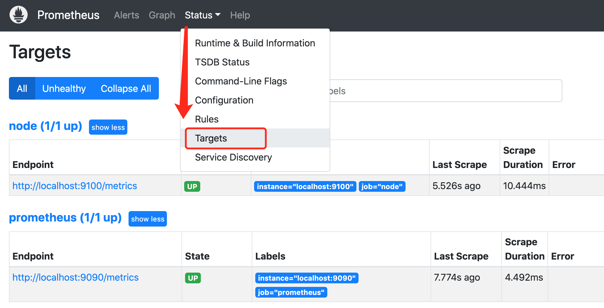
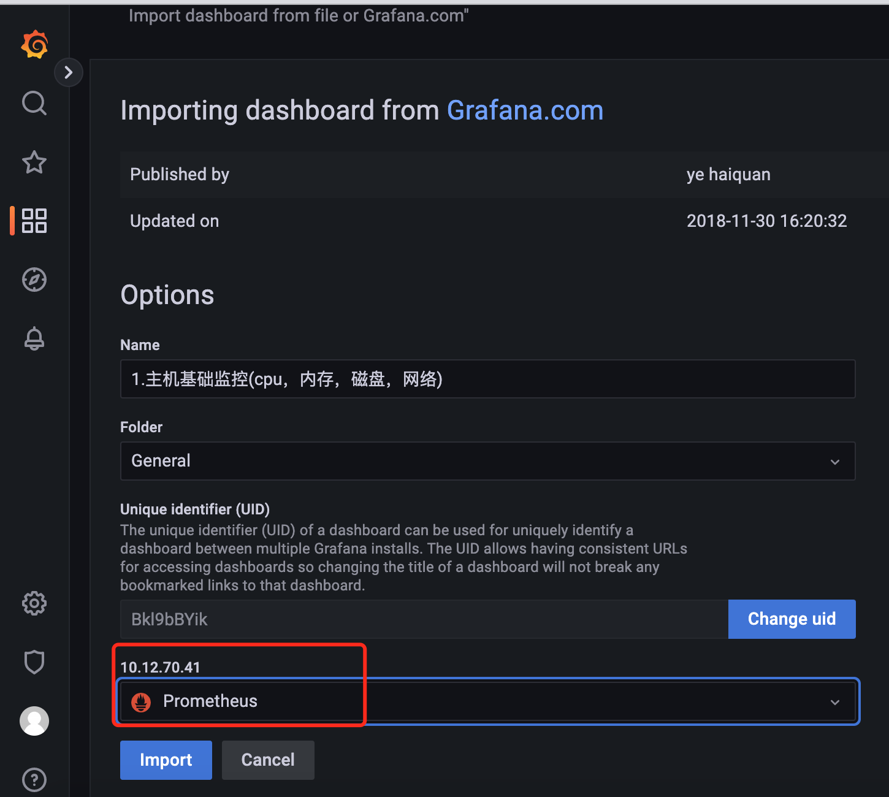
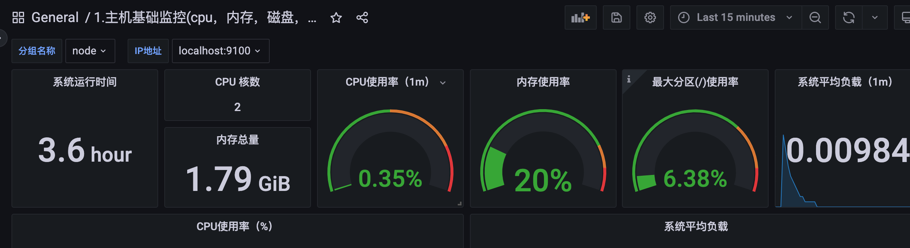

# CentOS7安装部署Prometheus+Grafana

作为监控系统的后起之秀，prometheus的安装可谓非常简单，不需要第三方的依赖（数据库、缓存、PHP之类的）。下面演示如何二进制安装prometheus、使用 Node Exporter 采集主机信息并使用Grafana来进行图形化的展示。


# 1. 安装Prometheus Server

Prometheus基于Golang编写，编译后的软件包，不依赖于任何的第三方依赖。用户只需要下载对应平台的二进制包，解压并且添加基本的配置即可正常启Prometheus Server。

## 1.1 下载并解压二进制安装包

通过prometheus的[官网](https://links.jianshu.com/go?to=https%3A%2F%2Fprometheus.io%2Fdownload%2F)，我们下载最新版本的prometheus，目前看到的最新版本是 2.40.5，这是在2022-12-01日的版本。

```shell
#下载、解压、创建软链接
wget https://github.com/prometheus/prometheus/releases/download/v2.40.5/prometheus-2.40.5.darwin-amd64.tar.gz
tar -xf prometheus-2.40.5.darwin-amd64.tar.gz
mv prometheus-2.40.5.linux-amd64 /usr/local/
ln -s /usr/local/prometheus-2.40.5.linux-amd64/ /usr/local/prometheus
```

## 1.2 配置说明

解压后当前目录会包含默认的Prometheus配置文件promethes.yml，下面配置文件做下简略的解析：

```
# 全局配置
global:
  scrape_interval:     15s # 设置抓取间隔，默认为1分钟
  evaluation_interval: 15s #估算规则的默认周期，每15秒计算一次规则。默认1分钟
  # scrape_timeout  #默认抓取超时，默认为10s

# Alertmanager相关配置
alerting:
  alertmanagers:
  - static_configs:
    - targets:
      # - alertmanager:9093

# 规则文件列表，使用'evaluation_interval' 参数去抓取
rule_files:
  # - "first_rules.yml"
  # - "second_rules.yml"

#  抓取配置列表
scrape_configs:
  - job_name: 'prometheus'
    static_configs:
    - targets: ['localhost:9090']
```

## 1.3 创建prometheus的用户及数据存储目录

为了安全，我们使用普通用户来启动prometheus服务。作为一个时序型的数据库产品，prometheus的数据默认会存放在应用所在目录下，我们需要修改为 /data/prometheus下。

```shell
useradd  -s /sbin/nologin -M prometheus 
mkdir  /data/prometheus -p
#修改目录属主
chown -R prometheus:prometheus /usr/local/prometheus/
chown -R prometheus:prometheus /data/prometheus/
```

## 1.4 创建Systemd服务启动prometheus

prometheus的启动很简单，只需要直接启动解压目录的二进制文件prometheus即可，但是为了更加方便对prometheus进行管理，这里使用systemd来启停prometheus。

```shell
 vim /etc/systemd/system/prometheus.service

[Unit]
Description=Prometheus
Documentation=https://prometheus.io/
After=network.target
[Service]
Type=simple
User=prometheus
ExecStart=/usr/local/prometheus/prometheus --config.file=/usr/local/prometheus/prometheus.yml --storage.tsdb.path=/data/prometheus
Restart=on-failure
[Install]
WantedBy=multi-user.target
```

备注：在service文件里面，我们定义了启动的命令，定义了数据存储在/data/prometheus路径下，否则默认会在prometheus二进制的目录的data下。

```shell
systemctl start prometheus
systemctl status prometheus
systemctl enable prometheus
```

## 1.5 打开prometheus的web页面

到这里，prometheus就已经安装好了，是不是比zabbix要简单多了呢。prometheus启动后默认会启动9090端口，我们通过浏览器打开该端口页面看下吧，后续的学习会在这个页面上进行的。

```shell
# 无法访问时，开启防火墙端口
firewall-cmd --zone=public --add-port=9090/tcp --permanent
firewall-cmd --reload
```



# 2. Grafana的安装

虽然说prometheus能展示一些图表，但对比Grafana，那只是个过家家。接下来我们需要在同一个服务器上安装Grafana服务，用来展示prometheus收集到的数据。

## 2.1 下载并解压二进制包

这里演示的Grafana的版本为9.3.1，要下载其他的版本可以到Grafana的[官网](https://links.jianshu.com/go?to=https%3A%2F%2Fgrafana.com%2Fgrafana%2Fdownload)进行下载。


```bash
wget https://dl.grafana.com/oss/release/grafana-9.3.1.linux-amd64.tar.gz
tar -zxvf grafana-9.3.1.linux-amd64.tar.gz
mv grafana-9.3.1  /usr/local/
ln -s /usr/local/grafana-9.3.1/ /usr/local/grafana
```

## 2.2 创建grafana用户及数据存放目录

```kotlin
useradd -s /sbin/nologin -M grafana
mkdir /data/grafana
chown -R grafana:grafana /usr/local/grafana/ 
chown -R grafana:grafana  /data/grafana/
```

## 2.3 修改配置文件

修改 /usr/local/grafana/conf/defaults.ini 文件，配置为上面新建的数据目录。


```kotlin
data = /data/grafana/data
logs = /data/grafana/log
plugins = /data/grafana/plugins
provisioning = /data/grafana/conf/provisioning
```

## 2.4 把grafana-server添加到systemd中

新增 grafana-server.service 文件，使用systemd来管理grafana服务


```shell
vim /etc/systemd/system/grafana-server.service

[Unit]
Description=Grafana
After=network.target

[Service]
User=grafana
Group=grafana
Type=notify
ExecStart=/usr/local/grafana/bin/grafana-server -homepath /usr/local/grafana
Restart=on-failure

[Install]
WantedBy=multi-user.target
```

启停并设置开机启动


```bash
systemctl start  grafana-server
systemctl status  grafana-server
systemctl enable  grafana-server
```

## 2.5 打开grafana的web页面

到这里，grafana已经安装完毕。默认情况下，grafana-server会启动3000端口，我们使用浏览器打开grafana页面，然后输入默认的账号密码 admin/admin登录。

```shell
# 无法访问时，开启防火墙端口
firewall-cmd --zone=public --add-port=3000/tcp --permanent
firewall-cmd --reload
```


## 2.6 添加数据源

grafana虽然已经安装好了，但是这个时候还没有数据，没办法作图。下面我们把grafana和prometheus关联起来，也就是在grafana中添加添加数据源。
 在配置页面点击添加数据源，然后选择prometheus，输入prometheus服务的参数即可。



按照上图示例添加数据源之后，点击save & test就可以了。

## 2.7 添加自带的示例图表

按照上面的指导添加数据源之后，我们就可以针对这些数据来绘制图表了。grafana最人性化的一点就是拥有大量的图表模板，我们只需要导入模板即可，从而省去了大量的制作图表的时间。
 目前我们的prometheus还没有什么监控数据，只有prometheus本身的数据，我们看下这些prometheus本身数据图表是怎样的。
 在添加数据源的位置上，右边的选项有个Dashboards的菜单选项，我们点击进去，然后导入prometheus2.0.




最后我们在左上角的位置上选择这个图表查看下，是不是很酷炫呢。这是个简单的示例，后续我们使用node-exporter来收集主机的性能信息，然后在grafana中展示。



# 3. 使用Node Exporter采集主机运行数据

与传统的监控zabbix来对比的话，prometheus-server就像是mysql，负责存储数据。只不过这是时序数据库而不是关系型的数据库。数据的收集还需要其他的客户端，在prometheus中叫做exporter。针对不同的服务，有各种各样的exporter，就好比zabbix的zabbix-agent一样。

这里为了能够采集到主机的运行指标如CPU, 内存，磁盘等信息。我们可以使用[Node Exporter](https://links.jianshu.com/go?to=https%3A%2F%2Fgithub.com%2Fprometheus%2Fnode_exporter)。Node Exporter同样采用Golang编写，并且不存在任何的第三方依赖，只需要下载，解压即可运行。可以从[https://prometheus.io/download/](https://links.jianshu.com/go?to=https%3A%2F%2Fprometheus.io%2Fdownload%2F)获取最新的node exporter版本的二进制包。

## 3.1 下载node exporter


```bash
wget https://github.com/prometheus/node_exporter/releases/download/v1.5.0/node_exporter-1.5.0.linux-amd64.tar.gz
tar -xf node_exporter-1.5.0.linux-amd64.tar.gz
#新建一个目录专门安装各种exporter
mkdir -p /usr/local/prometheus_exporter
mv node_exporter-1.5.0.linux-amd64 /usr/local/prometheus_exporter/
cd /usr/local/prometheus_exporter/
ln -s node_exporter-1.5.0.linux-amd64/ node_exporter
```

## 3.2 启动node exporter

直接打开node_exporter的可执行文件即可启动 node export，默认会启动9100端口。建议使用nohup来启动


```bash
/usr/local/prometheus_exporter/node_exporter/node_exporter
#建议使用nohup
nohup /usr/local/prometheus_exporter/node_exporter/node_exporter >/dev/null 2>&1 &
```

## 3.4 配置Prometheus，收集node exporter的数据

可以看到node exporter启动后也就是暴露了9100端口，并没有把数据传到prometheus，我们还需要在prometheus中配置，让prometheus去pull这个接口的数据。
 编辑prometheus.yml文件，增加后面4行.


```bash
scrape_configs:
  - job_name: 'prometheus'
    static_configs:
    - targets: ['localhost:9090']

   #采集node exporter监控数据
  - job_name: 'node'
    static_configs:
    - targets: ['localhost:9100'] # 添加其他监控节点机器，例'192.168.3.25:9100'
```

然后重启prometheus，打开prometheus页面查看是不是有对应的数据了。



在prometheus的web界面看到这个节点是up的状态了，接下来我们在grafana中添加对应的模板。

## 3.5 导入grafana模板，数据展示

在导入界面，我们输入模板的编号，这里我使用的是9276号模板，如要使用其他的模板，请到grafana的官网去查找 [https://grafana.com/dashboards](https://links.jianshu.com/go?to=https%3A%2F%2Fgrafana.com%2Fdashboards)


选择数据源，然后点击导入



然后你就可以看到下面一个这么形象具体好看的界面了。



到这里，Prometheus+Grafana的安装就完毕了。


[^参考文档]: https://www.jianshu.com/p/967cb76cd5ca

